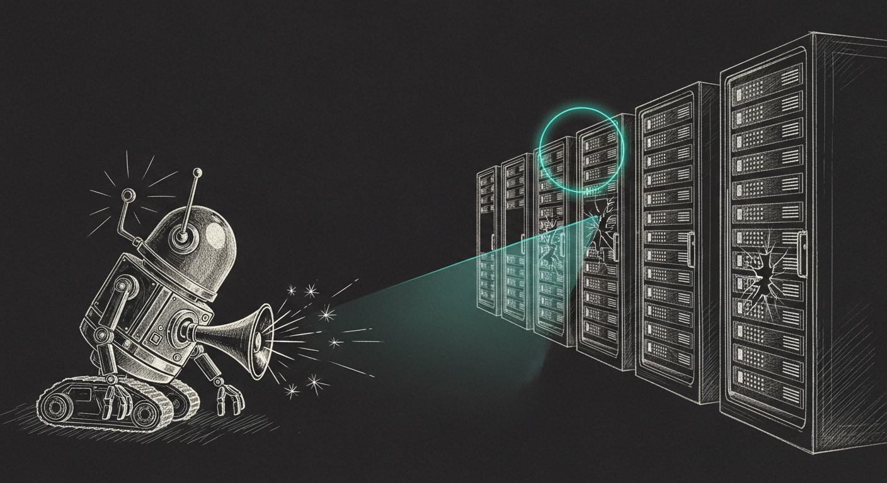

import { Aside } from '@astrojs/starlight/components';

P0/P1, in the Sanctum Reliability Doctrine, is the pager tier: P0 is an iMessage plus a Yoda phone call (haus down, council brain offline); P1 is an iMessage (council degraded). It is meant for things that are genuinely on fire. The operator's instruction was blunt — *P0/P1 should be crucial things to fix, not noise* — so I went looking for the noise. The single loudest source of "critical" in Force Flow was R2D2 itself.

## The droid that paged itself

R2D2's `_audit()` escalated every internal hiccup — `missing_detector`, `detector_error`, a recipe `exec_error` — to Force Flow at a hardcoded `severity=critical`. A 363-event `missing_detector` burst on 2026-05-28 (recipes whose detectors hadn't yet been registered) had fired a P0 every cycle for days. Worse: R2D2's ingest tails `force-flow.log`, which *contains its own escalations*, so it re-classified its own alarms each cycle — a feedback loop that burned Hermes calls and re-injected the noise. A pager that pages itself trains you to ignore the pager.

## Proportional, not promiscuous

The fix puts the severity where it belongs. A config or code hiccup — a missing detector, a detector that raised, a contract violation — is R2D2's *own* health, an advisory: it now lands at `warn`, out of the pager tier. Only a recipe heal that ran and FAILED on a `high`/`critical` recipe means the crucial thing it guards may be down — those still escalate at `error`/`critical`. A cached `_recipe_severity()` reads `recipes.yaml`; the map is `{critical → critical, high → error, else → warn}`. And a self-ingest guard drops any `source=r2d2` line from the Force Flow tail before classification, so R2D2 never hears its own echo. (`2c2aac1`)

## The thing it kept punting

The top thing R2D2 saw-but-couldn't-fix was `launchd-stuck-nonzero-exit` — about 99 escalations a week. The launchd-health-sentinel surfaces a stuck job, but its samskara carried no service *label*, so Hermes had a P0-shaped notice with no target and coerced every one to `escalate`. New recipe `reload-stuck-launchd-service` closes it: a deterministic detector imports the sentinel's own `list_launchd()` + `stuck_jobs()` (the allowlist is shared, not duplicated) and yields the real label.

The first cut found thirteen — and most were benign timer-job status exits a restart would only disrupt. So it was narrowed to *actively crash-looping* KeepAlive services only, with heavy and dedicated-healer services (mlx, codestral, gateway, claude-max) excluded; `kickstart -k` then verify; dry-run-first, 2-hour cooldown. The over-broad version had already dry-run-promoted all thirteen — those promotions were cleared before any could fire for real. (`54b4ed3`)

## The blind spot

Verifying the cycle, the summary read `blind: 2` — the gateway and yoda-warmth detectors had been blind for three and a half hours. The guest had rebooted at 19:09, re-keyed its SSH host key, and the Mac's `known_hosts` still held the old one, so `ssh openclaw` hard-failed with `rc 255`. R2D2 was not wrong about anything; it simply could not *see* the guest — which means it could not fix any guest P0/P1, the exact opposite of the goal. (The Yoda bulletproofing held the reboot fine: gateway and consumer auto-started.)

Clearing the stale key restored sight immediately. Then it was made durable: `Host openclaw` and `Host 10.10.10.10` now use `accept-new` with a `/dev/null` known-hosts file — scoped to the local socket_vmnet VM on a private bridge — so a guest re-key can never blind `ssh openclaw` tooling for hours again.

## What's true now

R2D2 runs every ten minutes in execution mode, twelve detectors sighted, zero blind. Its escalations land at the severity the failure earns. It no longer hears its own echo. And the launchd crash-loop it used to punt to a human is now a `kickstart` it performs itself. P0/P1 means a crucial haus condition again — which is the only way a pager stays worth answering.

<Aside type="note">
Alert hygiene is a first-class reliability property, not cosmetics. A monitor that cries wolf is worse than none: it does not merely fail to help, it actively trains the operator to ignore the one alert that matters. The 363 self-escalations were not a bug in what R2D2 detected — every one was a true internal event. They were a bug in *who* should care and *how loudly*. Proportionality is what keeps the signal alive.
</Aside>
