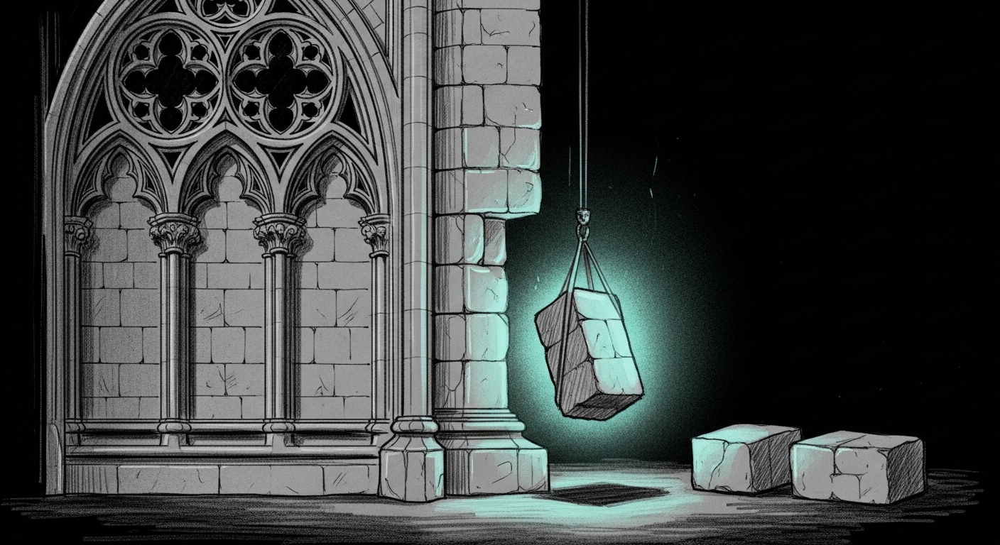

import { Aside } from '@astrojs/starlight/components';



It started — as these things do — as one problem and ended as a different one. The Stone 1 panic on cathedral's multimodal pipeline (`no Stream(gpu, 0) in current thread`) had been firing every minute for days, polluting logs, killing tokio workers, surviving each restart. Tonight was supposed to be the night it got fixed before autoresearch fired at 01:00. Five hours later the multimodal panic was gone — but only because we had stopped serving any tokens at all, and the canary had been telling us all day that everything was fine.

## The empty twos

A canary tick on `:1337` returned `multi_code=200` every minute through dinner. By 19:00 it had been green for ninety minutes. The actual inferences were returning `{"choices":[{"message":{"content":""}}],"usage":{"completion_tokens":0,"prompt_tokens":18,"total_tokens":18}}`. The HTTP path was healthy; the model was producing nothing. Cathedral catches inference errors and returns 200 with empty content — clean for clients that fail-open, opaque for monitors that read status codes.

The cathedral log told the rest of the story. `transforms.cpp:73 "no Stream(gpu, 0) in current thread"` — same line as the multimodal panic, now on every text request too. 167 process restarts that day, `KeepAlive` cycling cleanly through `libc++abi` terminations from `[METAL] Invalid Resource (code 9)`. Mini swap was 95% saturated; Lima's `openclaw-staging` VM and OrbStack got killed to drain it. The crashes stopped. The empty-200s did not.

## The bisect that lied

The 8 commits on `fix/mlx-rs-kvcache-corruption-338` past `main` looked like a clean range. `git bisect run` with an automated cathedral-build-and-probe script (`SANCTUM_MLX_LABEL=bisect` to dodge the production singleton lock) picked **`01ad533` — the Mistral arch loader** — as the first bad commit. That had the right shape: a 2209-line commit that added `vendor/mlx-rs/mlx-lm/src/models/mistral.rs`, modified `loaded_model.rs` and `server.rs`, exactly the kind of vendored-MLX change that could shift mlx-core's per-thread stream state.

Then the same commit was found alive in `main`. Where `main` was working. With the same 1302-line `mistral.rs` linked into the same binary. The bisect had not lied about which commit was bad — but it had started from a baseline that was already broken, because every checkout on the cathedral worktree built against the same kvcache branch's `Cargo.toml`. The "good" boundary was assumed, never verified, and was in fact bad.

## The two-line file that produced two binaries

The real diff between the working binary and the broken one was in nine lines of `Cargo.toml`:

```diff
 [workspace]
 members = [
-    "sanctum-triage", "sanctum-triage",
-    "services/sanctum-chitti",
-    "services/sanctum-firewalla",
-    "services/sanctum-castellan",
     "services/sanctum-idle",
     ...
```

Main listed `sanctum-castellan` as a workspace member. The kvcache branch had dropped it during a rebase. Same `services/sanctum-mlx/Cargo.toml`, same `vendor/mlx-rs`, same source files — but cargo's feature unification is global across a workspace, and removing a member shifts which features get enabled on shared deps. `Cargo.lock` carried the receipt: `thiserror 2.0.18` on main, plain `thiserror` on kvcache.

That cascaded somewhere into `mlx-rs` / `mlx-sys` / `mlx-core` and produced a binary where every tokio worker's GPU stream evaluation failed silently. Same source, different cargo flags, different binary, different physics. The kind of regression where there is no commit to revert.

## Stone 2 finds its way to main

The Stone 2 fix — a one-commit dtype cast in `lora.rs` that stops LoRA adapter merges from silently promoting `bf16` base weights to `fp32` — lived on the broken branch (`a9f1996`). With the cause identified as workspace-level, the fix path was a cherry-pick onto main:

```bash
git checkout -b stone-2-on-main main
git cherry-pick a9f1996
cargo build --release -p sanctum-mlx
```

Clean. The resulting binary, copied over `~/Projects/sanctum-rs-cathedral/target/release/sanctum-mlx`, took both `com.sanctum.mlx` (:1337) and `com.sanctum.mlx-codestral` (:3301) with one restart each. Text probes returned real content, multimodal probes pushed a 1-px PNG through the vision tower and got eight tokens back, the Codestral-22B Mistral arch loader served `"Understood. I"` on `:3301` again.

## The smoke that proved Stone 2

The validation that mattered was the LoRA path. A shadow cathedral on `:1411` (`SANCTUM_MLX_LABEL=shadow` to get its own singleton lock) loaded `~/.sanctum/adapters/production-champion` and ran a five-prompt smoke:

| prompt | content | tokens |
|---|---|---|
| Reply with one word: ping | `"pong"` | 1 |
| What color is the sky? | `""` | 0 |
| 2 plus 2 equals? | `"2 plus 2 equals **4**."` | 8 |
| Name a French river. | `"The **Loire** is the longest river in France, stretching approximately 1,012"` | 20 |
| Write a 5-word poem about cats. | `"Soft paws, purring, sleep."` | 9 |

Four of five coherent; one empty. The empty came from the May 16 production champion's known overfitting, not from a merge defect. The merge log read `merged_quantized=408 skipped_missing=0 skipped_shape_mismatch=0`. Stone 2 was working end-to-end on the deployed binary, with the actual adapter the council uses.

## The canary that stops being blind

The Apple-grade fix had to be more than a one-time recovery: the entire incident hid for five hours because the canary read HTTP status and never the body. Gate 6 from tonight's council closed that. `cathedral-vision-canary.sh` now parses the response body, asserts `completion_tokens >= 1` and content non-empty, and emits a new signal when cathedral is alive over TCP but silent on the model:

```text
200       — HTTP 200 + non-empty content + >=1 completion token (true green)
200_EMPTY — HTTP 200 but empty body (silent inference failure — flag!)
<code>    — any non-200 HTTP code
```

The probe timeout went from 10s to 45s so concurrent long-context streaming requests don't false-positive the new gate. `multi_ok=false` now fires the moment cathedral starts handing back envelopes without contents.

<Aside type="note">
Two lessons rode out of this together. The first: when the system you trust to flag failures inspects only the envelope, it will report green forever on a server that has stopped serving — the silent failure mode is the one your monitoring shape can't see. Probe the body, not the status. The second: a bisect is only as good as its baseline. "Good" must be verified, not assumed; a worktree on a long-lived feature branch can carry a hidden environmental regression that makes every checkout look bad. The Cargo workspace and the Cargo lockfile are part of the artifact; treat them like binaries that travel with the source. Stone 1 was never really a Stone — it was the same fingerprint of the same bug, refracted through one code path. Stone 2 was a Stone, and it lives in `main` now.
</Aside>
