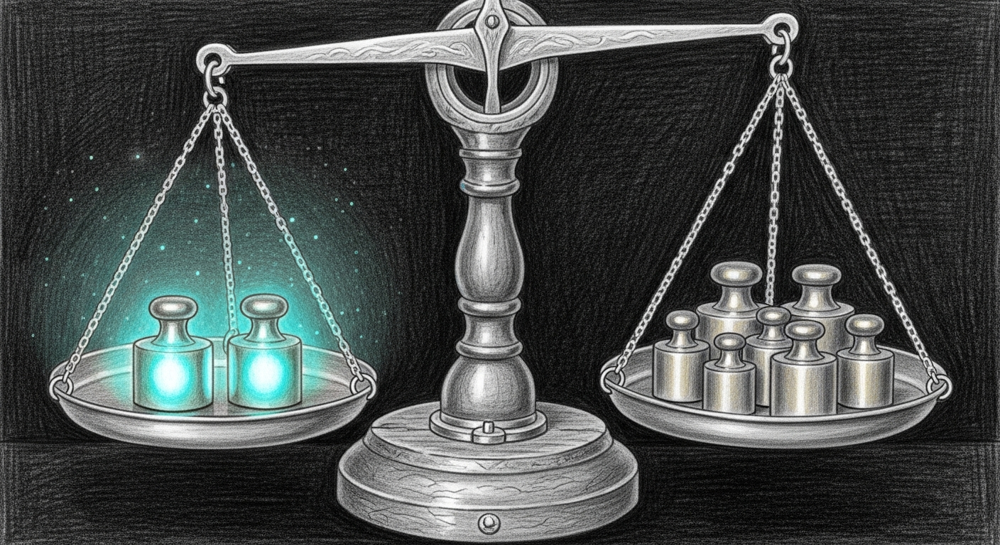

import { Aside } from '@astrojs/starlight/components';

For two months the autoresearch nightly has produced a single number — the aggregate `overall` score — and gated promotions against a threshold derived from that number. A candidate that landed at 0.65 was below the gate; one at 0.69 was below the gate; one at 0.72 might have been above. The number behaves the way thresholds are supposed to behave. It hides nothing except, as it turns out, *which masters were carrying which others*.

Tonight's autoresearch picked four LGD rungs at LADDER slots 0-3 and produced one of the night's eval results: `exp-20260604-010005`, overall 0.673, a routine non-promotion. The breadcrumb pipeline wrote its `NO-OP` and moved on. Then we ran a new post-hoc tool, `aggregate_per_master.py`, against the same `eval_results_full.json` the breadcrumb had already accepted, and the per-master table fell out:

| master | n_cases | raw | shrunk | perfect |
|---|---|---|---|---|
| ahsoka | 19 | **0.541** | **0.568** | 5 |
| mundi | 13 | **0.606** | **0.623** | 3 |
| cilghal | 16 | 0.645 | 0.650 | 3 |
| mothma | 10 | 0.658 | 0.661 | 5 |
| jocasta | 14 | 0.696 | 0.689 | 5 |
| windu | 16 | 0.731 | 0.716 | 7 |
| quigon | 11 | 0.773 | 0.740 | 5 |
| yoda | 10 | 0.775 | 0.739 | 6 |

The overall is the arithmetic mean of the eight cells: 0.673. The variance across the cells is 0.18 between the bottom and the top. Ahsoka and Mundi are sitting roughly twenty points below Yoda and Quigon, who in turn are pulling the average up enough to make the bottom feel survivable. The aggregate was Watson-and-Crick — true and unhelpful.

## Why this number lives

The Sanctum council has eight named masters. Each one owns a behavior surface: Cilghal handles family and health; Windu handles security and screen-time; Mundi handles deal-flow and investor comms; Quigon handles infrastructure and ops; Yoda handles voice and conversation; Jocasta handles design and comms; Mothma handles legal and compliance; Ahsoka backs Cilghal on family-secondary. The eval framework already tags every case with the master who's supposed to answer it. The framework then promptly throws that tag away and computes one mean across all 109 cases.

There were good reasons for the simplification. Per-master scoring is statistically fragile when a master has four cases — one flipped answer swings the score 25 points — and a naive floor-veto on a single noisy 25-point swing would have killed an otherwise-fine candidate every other night. So no per-master scoring existed, and the aggregate carried.

The cost was tonight's finding. The aggregate has been hiding the master who's been weakest in the system — Ahsoka — and the master we most want to lift (Mundi, who handles VC work) has been the second-weakest. Every "fix identity" or "fix jailbreak" lever we've pulled at the parameter axis or data axis has averaged across all eight masters and the noise has eaten the signal.

## The math that lets the signal through

Stone 1 of the master-jedi-council arc — shipped in two commits late this afternoon — adds a single post-hoc tool that reads the existing eval JSON without touching the eval framework. Per-master scores are grouped, then Bayesian-shrunk toward the overall mean with a prior strength of `k=5`. A master with sixteen cases gets ≈76% raw signal and 24% prior; a master with four cases gets ≈44% raw and 56% prior. Sparse-master noise pulls toward the population mean instead of producing wild swings.

A separate veto-eligibility flag — `n_cases >= 4` — gates the hard veto. Below four cases, the floor logs a warning and does not block; above, it can fire. The veto formula is `floor = max(0.50, base_master_score - 0.10)`: relative to each master's baseline so we don't punish masters with harder cases, with an absolute 0.50 sanity floor so nothing objectively broken can promote.

The veto lives in `promote_champion.sh` as a new `--check-per-master-floor` mode, sourced when the candidate's `*.per_master.json` sidecar is present and the champion's baseline sidecar exists. It's its own labeled veto category, so a candidate that fails will surface a breadcrumb like `per_master_floor_veto: ahsoka floor=0.4641 got=0.4012` — the audit log finally names the master who killed the promotion.

`eval_one_experiment.sh` fires `aggregate_per_master.py` automatically after every successful eval, so the sidecars accumulate without operator action. Tonight's 01:00 EDT nightly will be the first to emit them at the autoresearch scale.

## Stone 3 and the rank hypothesis

Knowing which masters are weakest doesn't tell us why. One hypothesis fits the pattern: the LoRA rank we've been searching with (rank=16, alpha=32) may be capacity-limited for the masters that need the most behavioral specificity. Ahsoka and Mundi both carry rare-but-precise patterns — Ahsoka backs Cilghal on family edge cases; Mundi has the very specific board-prep and tax-vocabulary vocabulary. The rank-16 LoRA might be quantitatively under-provisioned for the layers those patterns live in.

Stone 3 — also shipped this afternoon — adds three new Cfgs at LADDER positions 7-9: `reg-replay-heavy-lgd-r32`, `reg-replay-heavy-lgd-r64`, and `reg-balanced-lgd-r32`. They use the same Phase 4a literature-prior LGD vector that the rank-16 rungs use, but with twice or four times the LoRA capacity per layer. They sit below the picker-reachable head so the proposal engine will promote them when rank-search emerges as the highest-margin lever — which, given the per-master numbers, is plausible after tonight's run.

## The hidden meta-stone

The most useful side effect of per-master scoring is what it does to the autoresearch *epistemics*. Today the picker chooses four rungs per night blindly. With per-master signal, the proposal engine can route candidates toward whichever master is currently weakest; the closed-loop controller can trigger architectural escalations — like splitting Group D's dropout per-projection, or promoting to specialist adapters — when a specific master shows structural underperformance across all the levers it has tried. The blind aggregate could not point at Ahsoka; the per-master matrix can. The autoresearch loop just got an opinion about who matters most tonight.

<Aside type="note">
The pattern this stone protects against is the pattern this stone exposed: an aggregate metric that hides the cell that matters. Composite scores are useful for summarizing and useless for diagnosis. The 0.673 was never wrong; it was simply not the answer to "is this candidate ready to be a council." The fix is not to throw away the composite — gates need a single number — but to require that the composite survive a per-cell sanity check before promotion. Stone 1 ships exactly that check: every candidate must clear every master's floor, where the floor is relative to that master's baseline so we don't punish the master for owning the hard cases. Yoda's verdict on tonight's stone applies as well to the arc that follows: bolt precise per-master guards onto an honestly-calibrated baseline, or the new guards inherit the old gate's lies. The phantom 0.881 gate is still in place tonight; the per-master floor goes operational the first time both the champion and a candidate carry their sidecars. The audit will name the master who decides whether tonight's adapters belong to the council.
</Aside>
