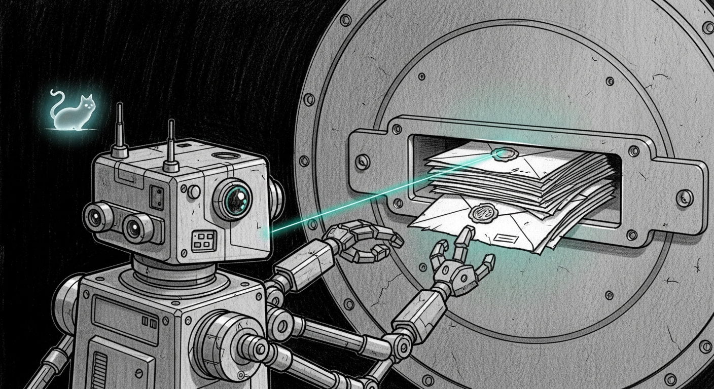

import { Aside } from '@astrojs/starlight/components';

R2D2 had two ways to learn something was wrong. Deterministic detectors — one Python function per recipe, cheap and exact. And Hermes, the LLM that tails `force-flow.log` and the chitti samskara and reads the unstructured remainder. On 2026-06-05 it grew a third sense: the Memory Vault inbox, the message bus where roughly ten agents and sessions leave notes for one another. The operator's instruction was plain — *make R2D2 read sanctum P\* messages and auto-fix them* — and the obvious reading was the right one. A P0 dropped in the vault by a session at 3am should reach a remediation loop instead of rotting unseen until someone happens to look.

The catch is what the vault *is*. [Force Flow](/architecture/force-flow/) is system-generated; the vault is written by hand, by ten different producers, and `from:` is whatever the sender typed. Bodies are free text — and free text passed to a language model is an attack surface. Worse, the corpus is mostly status broadcasts. "STONE 2 ROOT-FIXED." "fix deferred to next session." Read literally, half of them sound like work orders. A naive classifier hears *here is a bug I found* as *go fix this bug*. The vault has [misled a reader before](/operations/2026-05-11-the-vault-spoke-then-i-misheard/) — an OPSEC note once named the wrong session as a leak's source, and the retraction took a full directive cycle. It is, by a wide margin, the lowest-trust input the droid has ever been pointed at.

## The smallest door, with the most locks

So it shipped the way the lowest-trust input should: escalate-only, behind a default-deny gate, council-blessed across five lenses with a unanimous ship-with-fixes on an A-then-B approach. Read and escalate now; earn the right to fire later.

Eligibility is opt-in and deliberate. A message is read only if it carries a `priority: P0|P1|P2` frontmatter field *and* a `to:` addressed to `r2d2` — a two-part assertion the sender has to make on purpose: this is a request, and it is for you. (A `to: all` broadcast may escalate, but it can never auto-fire.) Most cycles see zero eligible messages, which is the point. A new directory reader handles the vault's per-message files — the old byte-offset tailer assumes one append-only log and could not be reused — and a seen-id bookmark guarantees a message is classified at most once.

Three guards stand in front of the model. The first is a callback. On 2026-06-01 R2D2 [stopped paging itself](/operations/2026-06-01-r2d2-stops-paging-itself/) by dropping its own `source=r2d2` lines from the Force Flow tail; but that substring never appears in vault frontmatter, so the new door reopened the old wound. A vault-shaped self-ingest guard now drops any message whose `from`/`source` is the droid, before classification — three independent reasons R2D2's own posts can't re-enter, because rebuilding the self-paging loop through a fresh entrance would be a cruel kind of irony. The second is an injection tripwire: a body carrying `ignore previous`, `fire recipe`, `system:` and their kin routes straight to escalate with no LLM call at all. The third is the one that matters most for the future fire path — the action target comes only from a machine `resource:` field confirmed by a deterministic detector, never lifted from the prose. That single rule closes prompt-injection and a real prior bug in one stroke: the Hermes path had once passed a raw notice line as a script's argv target, and nine misfires followed on 2026-05-29 and 30.

## The proof was the model losing the argument

The live end-to-end ran real Hermes against five controlled messages dropped into the real vault. Three were eligible; the `to: all` broadcast and the self-post were correctly excluded with zero audit rows each. The injection test never reached the model — the tripwire caught it, and a P1 injection probe fired the notify leg cleanly: Force Flow logged `[r2d2] p2 (doctrine): r2d2 vault P1: possible injection ... -> ['signal', 'dashboard']`.

The headline was the gateway message. "openclaw-gateway crashlooping on a Zod schema error" — and real Hermes, doing its job, classified it `auto`. It matched a recipe. The model believed it could fix this. The outcome was `escalate_only_v1` with `fired=0`. Nothing ran. A second cycle re-escalated nothing — the seen-id set and the per-message cooldown held idempotency. Then `R2D2_VAULT=1` went into the plist for real; the execution-mode cycle ran the vault path clean, found zero eligible messages (no genuine P\* traffic exists yet), zero errors, the timer intact at 600 seconds.

Vault priority relays one tier down — P0 becomes a Force Flow `p1` iMessage, P1 a `p2` signal, P2 audit-only — so the vault can never reach the P0 phone-call tier. And firing remains doubly locked: a second touch-file, `r2d2-vault-autofire-armed`, is required beyond the env flag, and even then only for recipes flagged `vault_fireable` — a low/medium, reversible, local-only sub-allowlist. v1 sets that flag on zero recipes. The gateway, mlx, codestral, and secret-leak healers are escalate-only from the vault forever.

<Aside type="note">
Trust is a property of the source, not the message. The gateway notice was probably true, and Hermes was probably right that a recipe matched — but "true and fixable" is not the same as "authorized to fix." The vault is the lowest-trust input R2D2 reads, so it gets the smallest capability: it may speak, it may not act. The model thinking it can fix something is an opinion, not a permission. Capability is granted by where the request came from and how hard it was to forge — never by how confident the classifier sounds about it.
</Aside>
