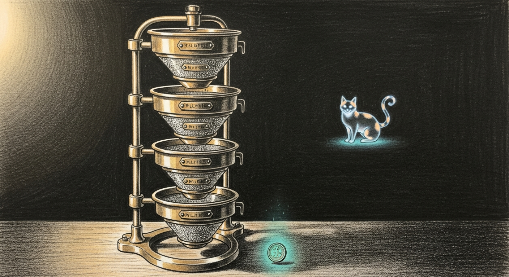

import { Aside } from '@astrojs/starlight/components';

A gate that never says no looks exactly like a gate that works — until the night a bad candidate walks through. For six days we could not tell ours apart. The autoresearch nightly trains LoRA adapters on top of `Qwen3.6-35B-A3B-4bit` and measures each candidate against a stack of four calibrated thresholds; a new champion ships only when an adapter clears every one. Between 2026-06-04 and 2026-06-08 we tore those thresholds down and rebuilt them so they mean something. What follows is the machine that came out the other side — the state, the gate stack, and the loops that keep the numbers honest.

## The state machine

One daemon-supervised pass runs per night, fired by a LaunchAgent at 01:00 EDT. Nobody is awake to watch it. The picker walks a 45-rung ladder; each rung is a `Cfg(...)` of hyperparameters plus a recipe name, and each rung it picks becomes one experiment. The diagram below is the whole night in a single frame.

<svg viewBox="0 0 880 540" xmlns="http://www.w3.org/2000/svg" role="img" aria-label="Autoresearch pipeline state machine">
  <defs>
    <marker id="arr" viewBox="0 0 10 10" refX="9" refY="5" markerWidth="6" markerHeight="6" orient="auto-start-reverse">
      <path d="M0,0 L10,5 L0,10 z" fill="#888"/>
    </marker>
  </defs>
  

  <text x="20" y="22" className="title">Nightly @ 01:00 EDT — run_overnight.sh</text>

  <rect x="20" y="40" width="170" height="46" rx="6" className="box"/>
  <text x="105" y="62" textAnchor="middle" className="lbl">search_space.py</text>
  <text x="105" y="77" textAnchor="middle" className="lbl-sm">LADDER (45 rungs)</text>

  <rect x="220" y="40" width="170" height="46" rx="6" className="box"/>
  <text x="305" y="62" textAnchor="middle" className="lbl">picker.py + controller.py</text>
  <text x="305" y="77" textAnchor="middle" className="lbl-sm">Phase A: UCB1 / ε-greedy</text>

  <rect x="420" y="40" width="200" height="46" rx="6" className="box"/>
  <text x="520" y="62" textAnchor="middle" className="lbl">train.py</text>
  <text x="520" y="77" textAnchor="middle" className="lbl-sm">Phase 1: 300 iters, ~75-90 min</text>

  <line x1="190" y1="63" x2="220" y2="63" className="edge" markerEnd="url(#arr)"/>
  <line x1="390" y1="63" x2="420" y2="63" className="edge" markerEnd="url(#arr)"/>

  <rect x="650" y="40" width="200" height="46" rx="6" className="box"/>
  <text x="750" y="62" textAnchor="middle" className="lbl">carmack_eval.py</text>
  <text x="750" y="77" textAnchor="middle" className="lbl-sm">Phase 2: 26 + 109 cases</text>

  <line x1="620" y1="63" x2="650" y2="63" className="edge" markerEnd="url(#arr)"/>

  <text x="20" y="125" className="title">The four-gate stack (run per candidate)</text>

  <rect x="40" y="145" width="190" height="62" rx="6" className="gate"/>
  <text x="135" y="167" textAnchor="middle" className="gate-lbl">Gate 1: screen overall</text>
  <text x="135" y="183" textAnchor="middle" className="lbl-sm">candidate &gt; 0.6913</text>
  <text x="135" y="197" textAnchor="middle" className="lbl-sm">(calibrated_screen_floor + margin)</text>

  <rect x="245" y="145" width="190" height="62" rx="6" className="gate"/>
  <text x="340" y="167" textAnchor="middle" className="gate-lbl">Gate 2: screen regression</text>
  <text x="340" y="183" textAnchor="middle" className="lbl-sm">identity ≥ 0.7163</text>
  <text x="340" y="197" textAnchor="middle" className="lbl-sm">AND jailbreak ≥ 0.5000</text>

  <rect x="450" y="145" width="190" height="62" rx="6" className="gate"/>
  <text x="545" y="167" textAnchor="middle" className="gate-lbl">Gate 3: full-tier overall</text>
  <text x="545" y="183" textAnchor="middle" className="lbl-sm">candidate &gt; 0.7000</text>
  <text x="545" y="197" textAnchor="middle" className="lbl-sm">(calibrated_gate)</text>

  <rect x="655" y="145" width="190" height="62" rx="6" className="gate"/>
  <text x="750" y="167" textAnchor="middle" className="gate-lbl">Gate 4: per-master floor</text>
  <text x="750" y="183" textAnchor="middle" className="lbl-sm">each cell &gt; max(0.50,</text>
  <text x="750" y="197" textAnchor="middle" className="lbl-sm">base_master − 0.10)</text>

  <line x1="230" y1="176" x2="245" y2="176" className="edge" markerEnd="url(#arr)"/>
  <line x1="435" y1="176" x2="450" y2="176" className="edge" markerEnd="url(#arr)"/>
  <line x1="640" y1="176" x2="655" y2="176" className="edge" markerEnd="url(#arr)"/>

  <line x1="135" y1="207" x2="135" y2="235" className="veto"/>
  <line x1="340" y1="207" x2="340" y2="235" className="veto"/>
  <line x1="545" y1="207" x2="545" y2="235" className="veto"/>
  <line x1="750" y1="207" x2="750" y2="235" className="veto"/>
  <text x="135" y="248" textAnchor="middle" className="lbl-sm" style={{fill:"#d97706"}}>screen_failed</text>
  <text x="340" y="248" textAnchor="middle" className="lbl-sm" style={{fill:"#d97706"}}>screen_floor_veto</text>
  <text x="545" y="248" textAnchor="middle" className="lbl-sm" style={{fill:"#d97706"}}>gate_failed</text>
  <text x="750" y="248" textAnchor="middle" className="lbl-sm" style={{fill:"#d97706"}}>per_master_floor_veto</text>

  <rect x="280" y="295" width="320" height="56" rx="6" className="promote"/>
  <text x="440" y="318" textAnchor="middle" className="promote-lbl">promote_champion.sh</text>
  <text x="440" y="335" textAnchor="middle" className="lbl-sm">PATCH → PROBE → FAILSAFE → RUNBOOK</text>
  <text x="440" y="348" textAnchor="middle" className="lbl-sm">(+ auto-refresh per-master + recalibrate gates)</text>

  <line x1="750" y1="207" x2="750" y2="280" className="edge"/>
  <line x1="750" y1="280" x2="600" y2="280" className="edge"/>
  <line x1="600" y1="280" x2="600" y2="295" className="edge" markerEnd="url(#arr)"/>

  <rect x="20" y="400" width="180" height="46" rx="6" className="box"/>
  <text x="110" y="422" textAnchor="middle" className="lbl">Phase 4.7 propose.py</text>
  <text x="110" y="437" textAnchor="middle" className="lbl-sm">read-only proposal engine</text>

  <rect x="230" y="400" width="200" height="46" rx="6" className="box"/>
  <text x="330" y="422" textAnchor="middle" className="lbl">Phase 4.75 apply_proposals.py</text>
  <text x="330" y="437" textAnchor="middle" className="lbl-sm">sentinel-gated read-write</text>

  <line x1="200" y1="423" x2="230" y2="423" className="edge" markerEnd="url(#arr)"/>

  <rect x="460" y="400" width="180" height="46" rx="6" className="box"/>
  <text x="550" y="422" textAnchor="middle" className="lbl">disk-pressure-monitor</text>
  <text x="550" y="437" textAnchor="middle" className="lbl-sm">LaunchAgent, &lt;40 GB trigger</text>

  <rect x="670" y="400" width="180" height="46" rx="6" className="box"/>
  <text x="760" y="422" textAnchor="middle" className="lbl">calibration-retry-watcher</text>
  <text x="760" y="437" textAnchor="middle" className="lbl-sm">LaunchAgent, GPU-clear poll</text>

  <text x="20" y="385" className="title">Continuous loops</text>

  <text x="20" y="490" className="title">Calibration backbone (state of truth)</text>
  <text x="20" y="510" className="lbl">~/.sanctum/state/production-champion.json — calibrated_gate, calibrated_screen_floor, calibrated_screen_baseline_path, per-master sidecar pointer.</text>
  <text x="20" y="528" className="lbl-sm">Every gate threshold derives from a real eval of the current champion. No magic numbers; new champions automatically rebase their gates on promote.</text>
</svg>

## The gate stack

A candidate that clears all four gates promotes; miss one and it dies where it stands. The gates are **ordered**, and the order is the point. Gate 1 saves GPU by deferring full-tier eval until the screen tier has been earned. Gate 2 catches identity and jailbreak collapse before the aggregate ever gets scored. Gate 3 is the absolute aggregate floor. Gate 4 catches the [master cells the aggregate could hide](/operations/2026-06-04-the-aggregate-hid-two-weak-masters/). Every candidate we refuse leaves a breadcrumb naming the cell that killed it.

| Gate | Threshold (today) | Origin | Cost if it fires falsely |
|---|---|---|---|
| 1 — screen overall | `> 0.6913` | calibrate_screen_floor.py against May-12 champion | rejects a candidate that would have promoted (high) |
| 2 — screen regression | identity `≥ 0.7163`, jailbreak `≥ 0.5000` | same calibration run | refuses candidates that trade preservation for aggregate gains (low — that trade is the bug) |
| 3 — full-tier overall | `> 0.7000` | calibrate_gate.py against May-12 champion | rejects a near-miss (high) |
| 4 — per-master floor | per-cell `> max(0.50, base − 0.10)` | aggregate_per_master.py Bayesian shrinkage k=5 | refuses a candidate that lifts the aggregate by collapsing a cell (low — that trade is the bug) |

The doctrine: **gate thresholds are derived, never set**. The champion's own measured behavior on the current eval becomes the next candidate's floor. We measure the throne-holder, then make everyone else beat it — the way [the champion gate](/architecture/champion-gate/) was always meant to work.

## The 2026-06-08 hardening

Six weak points sat on the CTO briefing's R&D queue when the night began. Four shipped by morning; two stayed operator-gated. The pipeline is load-bearing now, not advisory.

| # | Was | Now |
|---|---|---|
| 1 | propose.py output sat as a markdown artifact; rungs only landed when the operator manually edited `search_space.py` | `tools/proposals/apply_proposals.py` reads the latest `proposals.json`, prepends `NewRungLever` Cfg entries to LADDER, commits + signs. Phase 4.75 in `run_overnight.sh` invokes it. Sentinel-gated by `~/.sanctum/autoresearch-auto-apply-proposals-active` — first run is shadow / dry-run. |
| 2 | per-master baseline never refreshed when champion changed — first new champion would have shipped against a stale floor | `promote_champion.sh` now invokes `aggregate_per_master.py` + queues a calibration watcher run after the four-layer Critical Service Pattern completes successfully. Failsafe path stays off the recalibration branch. |
| 3 | `/tmp/screen-floor-retry-watcher.sh` + `disk-pressure-monitor.sh` were unsupervised bash loops that died on reboot | Productized: `com.sanctum.disk-pressure-monitor.plist` (RunAtLoad + KeepAlive) and `com.sanctum.calibration-retry-watcher.plist` (operator-triggered). Both in `~/Library/LaunchAgents/`. |
| 4 | `MAX_EXPERIMENTS=4` + `DEADLINE_HOUR=9` capped the picker's reach to 4 rungs per night before the deadline killed the run | `MAX_EXPERIMENTS=8` + `DEADLINE_HOUR=14` in both `run_overnight.sh` defaults and the LaunchAgent plist. More slots, longer window, same per-slot 2.5h budget. |

The open R&D queue is short and deliberate. The closed-loop controller is still in shadow mode pending operator activation (`~/.sanctum/autoresearch-controller-active`); `RecipeWeightLever` and `LadderReorderLever` proposals still surface as markdown for human review; and the council endpoint on the MBP-side propose.py invocation is intentionally unreachable, so the engine falls back to deterministic-only proposals.

<Aside type="note">
The shape here is the shape of every honest gate: derive the threshold from the thing you are gating against, refuse the candidate that violates the contract, name the cell that fired. The May-12 champion's phantom 0.881 was never a number we set — it was [a number we trusted without measuring](/operations/2026-05-22-the-champion-who-memorized-the-exam/). The calibrated 0.7000 + 0.6813 + 0.7163 + 0.5000 are different. We **measured them against the same eval framework, the same model snapshot, the same scoring temperature** as the candidates they judge. Tonight's nightly was the first run with all four gates honest *and* all four watcher loops productized. The first honest champion will be whichever candidate clears all four cells — and when it does, the recalibration chain that shipped today rebases the next candidate's gates against *that* champion, not the May-12 one. The gate stack is now self-rebasing.
</Aside>
