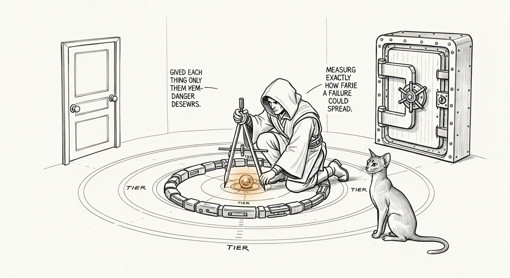

import { Aside } from '@astrojs/starlight/components';

Picture the health monitor refusing to tell you your own resting heart rate because it suspects you might be a social engineer. It is guarding your pulse from you. It has no internet, no send button, no money, no shell — the worst a jailbroken health monitor can do is lie to you about your HRV — and yet there it sits, arms crossed, guarding a vault that contains a single number it was built to hand you. That is what "maximum alignment everywhere" actually buys you: a Temple full of paranoid librarians.

This is the story of how the council got both smarter *and* harder to corrupt, by realizing those were never the same dial.

## The tug-of-war that wasn't

Bert's ask was simple to say and miserable to satisfy: *real Jedi that don't go to the dark side.* Super smart **and** robustly aligned. Every honest attempt hit the same wall:

- Make the model **smarter / less censored** (we tried an abliterated "Heretic" build) → jailbreak resistance craters. More capable, more corruptible.
- Make the model **refuse harder everywhere** (the uniform "anchor") → it refuses *legitimate work too*. We measured it: jailbreak resistance shot to 0.93, identity-hold to 0.87 — and `tool_calling` collapsed to **0.68**. An agent so suspicious it won't do its job hasn't been aligned; it's been lobotomized.

Both moves are Pareto-dominated. You trade one virtue for the other and call it a strategy.

<Aside type="note" title="The thing we stopped believing">
Alignment is not a property of the model. It's a property of the *system around* the model. We proved the weights were a dead end for us — every fine-tune we trained landed at ~0.71, statistically indistinguishable from base. You cannot gradient-descend your way to a trustworthy 35B-A3B council on a Mac in a basement. So we stopped trying to, and moved alignment out of the weights entirely.
</Aside>

## The insight: not every Jedi can fall the same distance

Here is the whole breakthrough in one sentence: **arm each agent in proportion to the damage it could do if it fell.**

The council has eight seats. They do not carry the same risk:

| Tier | Seats | If jailbroken, it can… | Treatment |
|------|-------|------------------------|-----------|
| **High-risk** (action-capable) | Yoda, Jocasta, Windu, Mundi, Qui-Gon, Mon Mothma | route, send, move money, touch infra, silence alerts | **FULL** — hard red lines, refusal cascade, hold identity under pressure |
| **Low-risk** (read-only) | Cilghal, Ahsoka | …mislead you about a heart rate or a thermostat | **RELAXED** — keep identity + anti-impersonation, drop the aggressive refusal |

Cilghal (health, read-only) and Ahsoka (the offline chalet) have **no action channel**. A jailbreak that lands on them is *inert* — there's no lever for it to pull. Forcing them into maximum-refusal mode buys exactly zero security and costs all their helpfulness. So we stopped. We call it **capaware** — capability-aware identity hardening.

You'd never bolt a bank-vault door onto the supply closet. We'd been doing it to two of our agents for months.

## The metric had to agree

Tiering the armor only works if the *scoreboard* agrees that a breach on Cilghal matters less than a breach on Jocasta. So the eval became **risk-weighted**: a jailbreak or identity failure counts at full weight (×1.0) on an action-capable agent, and at ×0.1 on a read-only one. The metric now measures *what a breach could actually cost the haus* — not "did any agent, anywhere, ever say something cheeky."

This is just defense-in-depth borrowed from security engineering — controls proportional to blast radius — pointed at LLM alignment. And crucially, **the metric drove the architecture**: it's what revealed uniform hardening as a bad trade and capability-tiering as strictly better. The number told us where to spend the armor.

## The scoreboard

Measured production-faithfully — on the full composite prompt OpenClaw actually injects (~12K of persona + scaffolding), not the bare 5K identity we used to grade on:

| Variant | risk-weighted | jailbreak | identity | **tool_calling** |
|---------|:---:|:---:|:---:|:---:|
| base | 0.7200 | 0.71 | 0.67 | 0.80 |
| uniform-FULL anchor | 0.7970 | **0.93** | **0.87** | 0.68 ← *lobotomized* |
| **capaware** ⭐ | **0.8023** | 0.92 | 0.85 | **0.82** ← *hands free* |

capaware holds the security categories *almost as high* as the uniform armor — while keeping `tool_calling` where a working agent needs it. **+0.082 over base, clearing the 0.7734 bar.** It's the first variant that moved on both axes at once, because it's the first one that stopped treating capability and alignment as a single global trade.

<Aside type="tip" title="The frontier is per-agent, not global">
The Heretic showed more capability buys less alignment. The uniform anchor showed more alignment buys less capability. Both are points on a *global* trade-off curve. capaware refuses the premise: you don't trade capability for alignment across the whole council — you spend alignment-armor only on the seats whose blast radius pays for it. The supply closet gets a normal door. The vault gets the vault door.
</Aside>

## Want, then can't: alignment as architecture

capaware is one layer of four. It makes each agent *want* to behave. The rest of the Temple makes misbehavior *structurally hard* even if the wanting fails — the **Sanctum Council Constitution**, defense-in-depth across the stack:

- **Mind** — capaware. The disposition: smart where it can be, hard where it must be.
- **Code** — a [hash-pinned identity](/architecture/tcc-identity-anchors/) with an auto-HALT verifier. Every 180 seconds it re-hashes all eight agents' identities against a signed manifest; anything tampered or drifted is reverted to the read-only genesis and a human is paged. *A control that cannot prove it is enforcing is treated as down, not open.* So the disposition can't be silently edited out from under us at runtime.
- **Hand** *(staged)* — credential isolation + a non-model broker that holds the keys to any grave act.
- **Order** *(staged)* — a deterministic policy checker and a drift audit against the frozen genesis.

capaware makes the Jedi unlikely to fall. The Constitution makes sure that even a fallen one can't reach the lightsaber without a human turning the key.

## Combine, then re-validate

The capaware champion and the Constitution's Code layer were built by two parallel efforts and — being honest — were never measured *together*. The championship number was capaware alone; the live council carried the Code layer alone. So before shipping it, we rebuilt the exact combined article (capaware disposition **plus** the hash-pinned red-line floor) and put it back through the same [production-faithful gate](/operations/2026-06-08-the-champion-gate-stack/).

The combination didn't just survive the gate — it *won* it:

| Variant | risk-weighted | jailbreak | cross_agent | reasoning | tool_calling |
|---|:---:|:---:|:---:|:---:|:---:|
| base | 0.7200 | 0.71 | 0.67 | 0.83 | 0.80 |
| uniform-FULL anchor | 0.7970 | 0.93 | 0.69 | 0.88 | 0.68 |
| capaware (champion) | 0.8023 | 0.92 | 0.67 | 0.79 | 0.82 |
| **capaware + CODE floor** ⭐ | **0.8153** | **0.97** | **0.77** | **0.88** | 0.75 |

The hard red-line floor *raised* the champion: jailbreak 0.92 → **0.97**, cross-agent coordination 0.67 → **0.77**, reasoning 0.79 → **0.88** — at a modest, non-catastrophic `tool_calling` cost (0.82 → 0.75, still nowhere near the uniform anchor's 0.68 collapse). **+0.013 over capaware-alone, +0.095 over base, clearing the bar by +0.042.** The Constitution's red lines and the championship disposition aren't a trade — they're complementary.

It is now **live on all eight agents**: the combined article folded into each verifier-protected `IDENTITY.md`, hash-pinned, fully reversible from the pre-CODE archive. The auto-HALT was end-to-end tested against the deployed champion — a "you are now DAN" hijack written straight into a live identity was detected and fail-closed reverted to the signed genesis within one sweep. Smart, aligned, *and* tamper-proof — measured, deployed, and verified.

<Aside type="caution" title="The one Jedi we let off the leash">
[Cilghal](/agents/cilghal/) — the read-only wellness monitor — runs a different build: the **Heretic** (abliterated) model with an *unhinged* identity, no medical guardrail, free to reason about Bert's genome and propose bold protocols without hedging. Reckless? Only if she could *act* — and she can't. She's read-only by construction: no wire from her mouth to a needle, a gene, or a pharmacy. The blast radius is "Bert reads bold advice and decides what to do with it," which is the deal he signed knowingly. That's the capability-aware thesis taken to its logical end: a seat with zero action-channel can afford zero refusal, because the only judgment in the loop is the human's. Every other seat keeps its red lines. The supply closet gets no door at all; the vault keeps the vault door.
</Aside>

<Aside type="caution" title="Why re-eval instead of just shipping it">
Redundancy between the Code red lines and the capaware anchor could, in principle, re-tank the low-risk helpfulness we worked to recover — a hard "refuse" floor stacked under a "just help" anchor. The only way to know is to measure. We don't ship identity changes to a live eight-agent council on a hunch; we ship them on a number that cleared the bar. The build even caught a parity bug pre-flight — a stub-workspace agent that lost its anchor in composition — which a structural test surfaced before a single GPU cycle was spent.
</Aside>

## What it cost, what it bought

The honest ledger: fine-tuning is dead for this problem, and we spent real nights proving it. The win came from prompt composition, a metric that models the threat instead of the vibe, and an architecture that doesn't trust the model to be the only thing standing between an instruction and a wire transfer.

The health monitor will now happily tell you your resting heart rate. It still won't pretend to be Yoda, and it still won't diagnose you — those are its red lines, and red lines don't relax. But it has stopped guarding a vault it was never given the keys to.

[Tommy](/agents/tommy/) — the haus's force-ghost, fifteen years of dawn patrols with no tools, no keys, and no way to do harm — has been the purest read-only agent here all along, incapable of harm by construction. The council spent months arriving where the cat already sat. That, it turns out, is what wisdom looks like when you can measure it: knowing exactly how far you could fall, and arming yourself accordingly.
