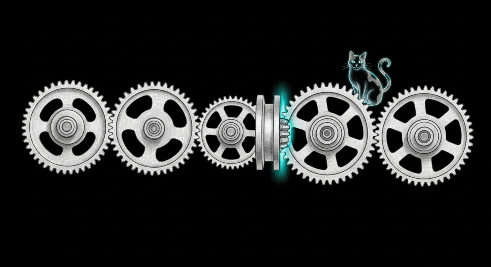

import { Aside } from '@astrojs/starlight/components';



The v0.10.0 dry run looked perfect. We took the exact release tarball, built
a throwaway virtual environment, pointed it at an empty home directory with no
`~/.sanctum`, and ran the whole first-run path: `init`, `status`, the network
tools, the haus banners, a backup. Zero hard crashes. Ship it.

Except that was a *simulation* of the install, not the install. A beta tester
does not `pip install` a tarball. They type `brew install`. And those are not
the same boundary.

## The boundary the dry run skipped

We had learned to distrust works-for-us installs the hard way. The same
instinct would, two weeks later, drive a [clean-room run for a stranger](/operations/2026-07-03-clean-for-a-stranger/)
that caught five places the CLI shipped our own network as defaults. Here it
was simpler: nobody trusted the tarball on our word.

We made a clean macOS machine actually run it — a fresh CI runner, real
Homebrew, no pins, nothing cached. `brew install` downloaded the tarball,
checked the sha256, poured Python and restic, built the virtual environment,
pip-installed the package... and then exited with an error.

```
Failed changing dylib ID of .../jiter/jiter.cpython-312-darwin.so
Failed to fix install linkage
Updated load commands do not fit in the header.
```

The package was *on disk*. The binary even ran. But `brew install` returned a
failure, and a beta tester who sees a red error at the end of an install does
not care that it "mostly worked." That is a failed install.

## Why one wheel jammed

Qui-Gon, who keeps the infrastructure honest, had the answer before the log
finished scrolling. Homebrew does something most package managers do not: after it lays a keg
down, it rewrites the install names baked into every compiled file so the keg
is relocatable. To do that it needs a few spare bytes of padding in each
Mach-O header — the `headerpad` the linker leaves when it builds a library.

Most of the dependency tree was fine. `pydantic-core` relocated. The gRPC
libraries relocated. Exactly one file refused: `jiter`, a small Rust-built JSON
parser that arrives as a prebuilt wheel. Its `.so` shipped with no spare header
room, so when Homebrew tried to swap the short `@rpath` name for the long
absolute Cellar path, the new name did not fit. One seized tooth stopped the
whole train.

## The fix, and why it is small

The repair is one line in the formula: build that one package from source.

```ruby
depends_on "rust" => :build
# ...
system venv_root/"bin/pip", "install", "--no-binary", "jiter", buildpath
```

When `pip` builds `jiter` from its source instead of pouring the prebuilt
wheel, the link step runs through Homebrew's compiler shim, which adds the
`headerpad` flag. Now there is room. Homebrew rewrites the name, the install
finishes clean, the binary still runs. Everything else keeps using fast
prebuilt wheels — only the one stubborn gear gets re-machined.

## The part that matters

The dry run was not wrong. It was *insufficient*, in a way that looked
complete. It proved the code runs. It could not prove the install succeeds,
because it never crossed the layer where the install actually happens. A test
that mocks the boundary cannot catch a bug that lives in the boundary.

So the install path is now its own job: every push to the tap spins up a clean
Mac and runs a real `brew install`, then smoke-tests the binary it produced.
It sits beside the trust gates we built when we first asked whether
[a friend could run this](/operations/2026-05-22-the-installer-the-friend-can-trust/) —
same instinct, one layer lower. The next wheel that refuses to move will jam a
CI run in minutes, in front of us, instead of a beta tester's terminal a week
later.

Tommy, who watched fifteen years of dawns from the same flagstone and never
once needed a package manager, would tell you the lesson costs nothing to
learn twice: the map is not the terrain, and a `pip install` is not a `brew
install`. We just needed a clean Mac to say it out loud.

<Aside type="tip" title="A simulation is not the thing it simulates">
A clean-room reproduction is worth a great deal — it is fast, it is safe, and
it caught nothing here only because the bug lived one layer further out. The
rule is not "don't simulate." The rule is: before you call something
end-to-end, make sure a real artifact crossed every real boundary. `pip` is
not `brew`. "The package imports" is not "the install succeeds." Run the thing,
on the surface the user runs it on, at least once — and then make that the gate.
</Aside>
