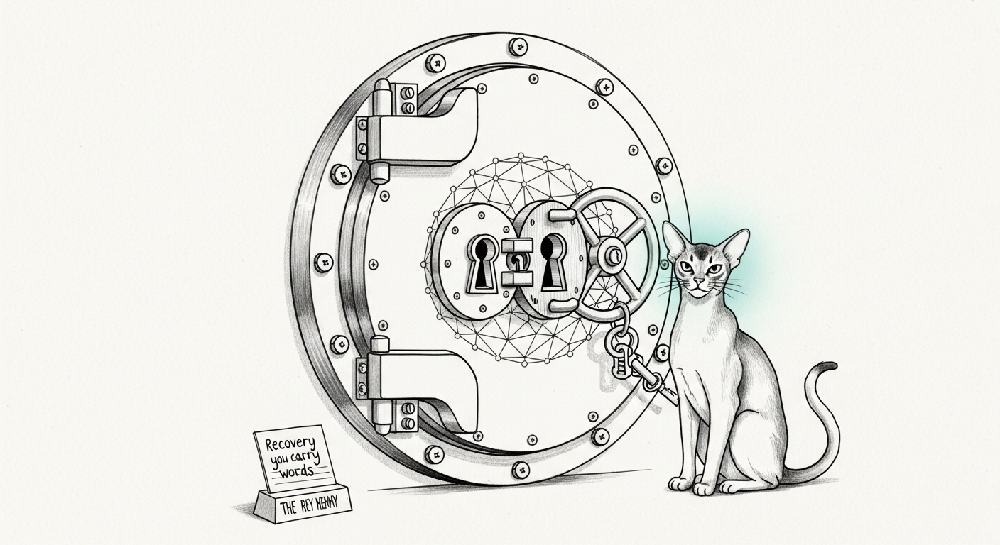

import { Aside } from '@astrojs/starlight/components';

Most of the stack defends data **in motion** — mTLS on `:1337`, post-quantum key
exchange at the proxy, WireGuard between machines. But the hardest part of the
threat model isn't the wire; it's the **archive**. Some data is sensitive
*forever*, and forever is long enough that a patient adversary can copy the
ciphertext today and wait for a quantum computer to read it later. Harvest-now,
decrypt-later. The answer is not a faster classical cipher. It's a vault whose
confidentiality does not rest on a problem a quantum computer makes easy.

`sanctum-vault` is that vault: quantum-resistant **at-rest** encryption, plus a
recovery ceremony deliberate enough to trust with data you can afford neither to
lose nor to leak.

## The cipher — hybrid, never weaker than the classic

The seal wraps a data-encryption key with the **X-Wing** KEM combiner
(`draft-connolly-cfrg-xwing-kem`): **X25519** (classical) *and* **ML-KEM-768**
(post-quantum, FIPS 203) combined so the result is at least as strong as the
stronger half. The payload itself is sealed under a committing **AES-256-GCM**
AEAD, framed in 1 MiB chunks, with a **separately signed manifest** carrying the
algorithm identifiers and the recipient fingerprint.

<Aside type="tip" title="Why hybrid">
A pure post-quantum scheme asks you to bet everything on a young primitive;
a pure classical scheme is the bet a quantum adversary is waiting to collect.
X-Wing refuses both bets — a classical break alone, *or* a flaw in ML-KEM
alone, still leaves the other half standing.
</Aside>

## The ceremony — mint, anchor, drill, seal

Encryption is the easy 10%. The 90% that earns trust is custody and recovery.

- **Mint, air-gapped.** `mint-recipient` runs under `sudo unshare -n` — a network
  namespace with no interface but loopback — so the secret key has no exfiltration
  path at the instant it is born. The key lands root-owned, mode `0600`.
- **Anchor on paper.** `init-recovery` wraps the secret key under an **Argon2id**
  (RFC 9106) key derived from a handful of diceware words. The words are shown
  once, on your screen, and are never stored or logged. A passphrase KDF has no
  public-key surface for a quantum computer to attack, so the paper anchor is
  quantum-safe by construction — and memorable enough to carry without a sheet.
- **Drill — the hard gate.** Recover the key from the container using *only* the
  words, and prove the recovered bytes are **identical** to the original. Nothing
  downstream is trusted until this is green. This is the gate that earns the right
  to seal.
- **Seal.** Public-key only — no secret needed to encrypt. The output is a
  write-once `.svault` plus a signed manifest. On a macOS cold store the artifact
  is also made immutable (`chflags uchg`).
- **Verify.** `verify --manifest --pin <signer-vk>` cross-checks the signature,
  the pinned signer, and KEM-algorithm consistency in one gate.

<Aside type="caution" title="A gate that can't fail is not a gate">
The verify is load-bearing, not constant-true: pinned against the *wrong*
verifying key it rejects with `manifest signature invalid or signer not
pinned`. A control you can't watch reject is a control you can't trust to
accept — so we keep a negative control next to every positive one.
</Aside>

## What "verified" actually means

The seal was put through an end-to-end sweep — real artifacts crossing real
boundaries, not structural assertions:

| Property | How it was proven |
| --- | --- |
| Ciphertext integrity, machine-to-machine | one `sha256` identical on the working host and the vault host — not "the field exists," the bytes match |
| Immutability | enforced, not asserted — an mtime-only `touch` is denied (`Operation not permitted`), `sha256` unchanged after |
| Recovery | the paper words reproduce the secret key **byte-for-byte**; until that is green, no seal is trusted |
| Manifest signature | verified against the pinned signer, with a wrong-pin **negative control** that rejects |
| Key custody | the secret key is root-owned `0600`; the unprivileged service user genuinely cannot read it; the integrity gate runs as root |

## Three boundary gotchas

This is the "Contracts at the Boundary" doctrine in miniature — every one of these
was a bug caught *before* it shipped, because the test was written from the
consumer's reality instead of the producer's hope.

1. **Exit codes lie across `limactl shell`.** Run a guest command through it and
   even `-- false` returns `0` — the outer exit code carries no information. Every
   cross-boundary decision in the tooling gates on an explicit **STDOUT sentinel**
   (`__MATCH__` / `__DIFFER__` / `__UNREADABLE__`), and "no verdict at all" is a
   *loud* failure, never a silent pass. An exit-code gate here would have printed
   "recovery proven" on a recovery that never happened.
2. **A backstop blob is not a recovery container.** The low-level `escrow`
   primitive emits a bare blob that the recovery path *cannot read* (it lacks the
   wrapped-key nonce). The recoverable artifact comes from `init-recovery`. Same
   friendly intent, deliberately different call — and the difference is whether
   your words can ever open the vault.
3. **The mint runs as root; the tooling does not.** Because the key is born
   root-owned `0600`, every key-touching operation runs under `sudo -n` in-guest.
   The privilege that *created* the key is the only one that may read it.

## Honest edges

Two things the sweep found and did **not** paper over — because a security page
that only lists wins is a marketing page.

<Aside type="danger" title="Verification is environment-sensitive">
Known-answer tests are only as good as the host that runs them. The ML-KEM-768
**cross-implementation agreement** KAT needs OpenSSL ≥ 3.5; on an older OpenSSL
(3.0.x) that leg cannot even initialize, so it must *skip loudly*, never pass
silently. And a `selftest` that merely points at the test runner is not a result
— run the real KATs and confirm the post-quantum leg actually executed. The
X-Wing combiner KAT passing is necessary; it is not the whole proof.
</Aside>

<Aside type="danger" title="A namespace is a moment, not a posture">
`unshare -n` genuinely proves the key had **no egress at the instant of
minting** — verified loopback-only, zero routes. It says nothing about the host
the key rests on *afterward*. Namespace isolation protects the mint moment;
the cold-storage host must be air-gapped (or the custody moved off an online
one) on its own merits. Don't let "minted air-gapped" round up to "stored
air-gapped."

</Aside>

---

The doctrine, in one line: **encrypt for the adversary you'll face in thirty
years, recover from something you can carry in your head, and trust no gate you
haven't watched reject.**
