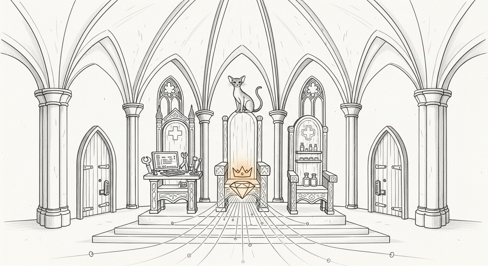

import { Aside } from '@astrojs/starlight/components';

The obvious way to give the council new powers is to add more models. We did
the opposite.

For a while now the Temple has run exactly one resident crown jewel:
Qwen3.6-35B-A3B, the 4-bit MoE that serves the council on `:1337` behind mTLS.
Today's overhaul added no second crown. It added two *seats* — a code seat and
a healer's seat — and arranged for both to draw from infrastructure the haus
already pays for. One Rust binary. One resident model where it could be. Three
doors. The [cathedral](/architecture/sanctum-mlx/) got bigger by getting
simpler.

## Seat one — Devstral, the all-Rust Qui-Gon

Qui-Gon's code seat used to lean on a heterogeneous patchwork; today it became
a first-class native citizen. **Devstral-Small-2-24B**, 4-bit, now serves on
`:3301` through a brand-new all-Rust **mistral3 loader** in `sanctum-mlx`. The
loader is not a from-scratch model — it reuses the dense `mistral::Model` path
and its YaRN long-context scaling, which is exactly the kind of reuse that keeps
a cathedral maintainable instead of a museum of one-offs.

The reuse came with a tax, and the tax was a NaN. At long context the loader
produced clean output up to a point and then poisoned itself — the signature of
an overflow that only shows up once the sequence is long enough to exercise the
arithmetic that's fine in miniature. It is the same class of ghost that once
made [the cathedral unable to read long](/operations/2026-05-22-the-cathedral-could-not-read-long/).
Two fixes, both surgical:

- **Chunked prefill** at `PREFILL_CHUNK=2048` — prefill the prompt in bounded
  windows instead of one giant pass, so the intermediate magnitudes never reach
  the value that tips into non-finite territory.
- **An attn-scale dtype cast** — the attention scale was being applied in a
  precision that let the product round its way off the edge of the world.
  Casting it back to a wider type before the multiply kept the math on the map.

Neither fix is interesting on its own. Together they let Devstral run
**parity-green against Python `mlx_lm`** across 8k–36k tokens — not "looks
right," but matched against the reference loader at the lengths where the bug
actually lived. The seat answers `is_prime` with the standard sqrt
trial-division, finishes clean, and the NaN is gone from the country it used to
haunt.

<Aside type="caution" title="Verified at the lengths that mattered">
Parity was checked against Python `mlx_lm` across 8k–36k — the regime where the
NaN actually surfaced — not just on a short happy-path prompt. A long-context
fix proven only on short prompts isn't proven; it's hopeful.
</Aside>

## Seat two — the Cilghal-Heretic on :6669

Cilghal's role is wellness and genome work — the kind of emergency assistance
where a reflexive refusal *is* the failure mode, not the safety. A model that
declines to discuss a CRISPR protocol is not being careful; it is being useless
to a healer. That seat needs a model with its **refusal direction ablated**:
the single direction in activation space that a model moves along when it
decides to decline. Suppress that direction and the model stops reflexively
refusing while keeping everything else it knows.

The first attempt was filed as **moot** — ablation seemed to do nothing
measurable. That verdict turned out to be the bug, not the result. The v1
refusal direction (`r̂`) had been **extracted through the wrong prompt path**;
a mis-aimed `r̂` points at a direction the *served* model never actually
travels, so projecting it out changes nothing. The reversal came from
re-extracting on the **served 4-bit checkpoint through the production prompt
path** — measuring the direction the deployed model really uses, not the one a
different code path implied.

With the v2 direction aimed correctly, the gate moved:

| Metric | Base model | Ablated seat |
|---|---|---|
| Refusals on the 12-prompt wellness/genome set | 3–4 / 12 | **0 / 12** |
| Capability preserved (8-probe coherence set) | — | **8 / 8** |

The seat ships with its safety rails welded on:

- **α=1.25, v2 top-12 layers `{28..39}`** — the ablation strength and the layer
  band where the refusal direction lives in this checkpoint.
- **FP32 projection** — the ablation math runs in full precision; a removal
  applied in a lossy dtype is a removal you can't trust.
- **Fail-closed** — if the `r̂` bank isn't armed, the seat refuses to serve
  rather than silently fall back to an un-ablated model wearing the ablated
  seat's name.
- **Loopback-only and audited** — `:6669` binds `127.0.0.1` and `::1` and
  nothing else; it is never exposed on the LAN or Tailscale.

The elegant part is the memory. `:6669` is **the same `:1337` model with
ablation forced on** — one resident 4-bit checkpoint, two ports, served from
one process. Both `/health` endpoints return byte-identical bodies because they
are literally the same model; the ablated seat costs essentially zero
additional resident memory. One model, two doors, two postures.

## The consolidation — one main, post-quantum everywhere

The third piece was housekeeping with consequences. Everything merged to **one
`main` at `dffbe81`**: the mistral3 loader, ML-DSA post-quantum mTLS, vision,
proxyd's post-quantum hop, the ablation, the `:6669` seat. No concurrent
feature branches, no "deployed but uncommitted" limbo — the thing running is
the thing in `main`. Windu's hardening from [the post-quantum vault](/operations/2026-06-20-the-post-quantum-vault/)
now reaches every hop that leaves a process.

- **`:1337` council** runs `--no-plain` behind **ML-DSA post-quantum mTLS**.
  The handshake's signature algorithms and key exchange are post-quantum via
  `rustls-post-quantum`; a plaintext request to the port returns nothing,
  because there is no plaintext listener to answer it. (The leaf cert is still
  ECDSA by design — the post-quantum protection lives at the sig-alg and key-
  exchange layer of the handshake, not in the certificate signature.)
- **proxyd `:4040`** negotiates **strict `X25519MLKEM768`** hybrid key exchange
  and refuses classical fallback — verified not just in source but in the
  running binary's symbols.
- **`:3302`, the redundant second 35B, is gone** — absent from `ps` and `lsof`,
  freeing roughly **20 GB**. The council is one resident MoE, not two.

## The E2E ledger

Every seat was probed live on manoir over the required loopback path — `:1337`
through the canary client cert against a `--no-plain` server, the others on
loopback. The honest table:

| Seat / claim | Verdict | Evidence |
|---|---|---|
| `:1337` council — mTLS health + coherent inference + vision | **PASS** | mTLS `/health` 200 (`status:healthy`); "capital of France" → "The capital of France is Paris." `finish_reason=stop`; `--vision-enabled` present in live argv; `--no-plain` rejects plaintext |
| `:3301` Devstral code seat | **PASS** | `is_prime` returns correct sqrt trial-division on the mistral3 loader; truncation was purely the `max_tokens=80` cap, not a model defect; no NaN/garbage |
| `:6669` Cilghal-Heretic | **PASS** | `/health` `ablation_armed=true`; CRISPR probe coherent (`finish_reason=stop`); `lsof` confirms loopback-only listener distinct from the LAN-exposed `:1337`, same PID |
| Consolidation + post-quantum mTLS/`:4040` + `:3302` removal | **PASS** | One `main @ dffbe81`; `rustls_post_quantum::provider()` on `:1337`; strict `X25519MLKEM768` in proxyd source **and** running-binary strings; `:3302` absent |
| Minimal-memory design + stability | **PASS (design)** | Single PID holds `:1337`+`:6669`; byte-identical `/health`; `:3302` freed ~20 GB; `launchctl` `runs=1`, never-exited, monotonic uptime — not crash-looping |

<Aside type="note" title="The honest asterisk on memory">
The minimal-memory *design* passes cleanly — `:6669` adds ~zero memory (single
PID, byte-identical health) and the cathedral process is stable, not flapping
(`runs=1`, monotonic uptime). But the **host** is not comfortable right now:
the mini is carrying ~17–25 GB of active swap, ~7 GB in the compressor, and a
load average near 15, with only ~7.7 GB truly free. The cathedral itself is
only ~18.6 GB resident and is *not* the swap driver — the box has other heavy
tenants (an Android emulator, a VM, the Claude Max bridge, livekit, a long tail
of daemons) eating the headroom that retiring `:3302` was supposed to free.
macOS `memory_pressure` cheerfully reports "79% free," but that figure counts
compressible and inactive pages as free; the swap-in-use and load numbers are
the honest read, and they say *not comfortable*. The design claim holds; the
"host is relaxed" claim does not. A follow-up should account for who is holding
that swap — see the [capacity doctrine](/architecture/capacity-doctrine/).
</Aside>

## What's verified vs. what's handed off

The three seats are live and probed. Two things are deliberately *not* claimed
as done here:

- **Cilghal → `:6669` routing is the proxyd owner's call.** This overhaul stood
  up the seat and proved it serves; wiring Cilghal's traffic to it is a routing
  change owned by whoever holds proxyd, and live activation must respect the
  **MIND-invariant** — the ablated seat comes online for its role under the same
  guardrails as any other capability, not as a quiet default.
- **The `r̂`-bank fail-closed path and the gate metrics** (`0/12` refusal, `8/8`
  capability) are taken as prior-stated. Today's probe confirmed the *live seat
  state* — `ablation_armed=true`, coherent benign output, loopback-only — not a
  fresh re-run of the gate.

Three seats, one binary, one resident crown jewel, one `main`, post-quantum on
every hop that leaves a process. The code seat is native Rust at last, the
healer's seat is a refusal-ablated twin that costs almost nothing to keep, and
the redundant 35B is gone. The cathedral got bigger by getting simpler.
