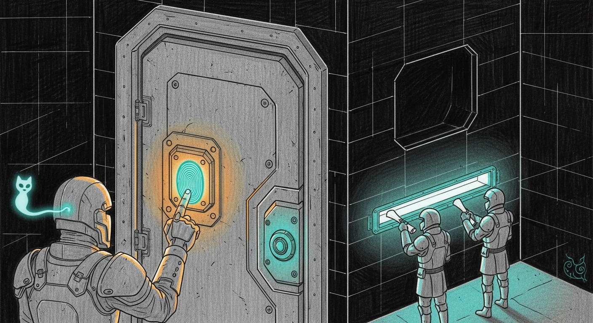

import { Aside } from '@astrojs/starlight/components';



{/* TODO(hero): generate via tools/gen_hero_image.py — prompt: "A small gatehaus at night. A single sentry presses a glowing fingerprint onto a teal-lit door lock; the door has no keyhole, only the fingerprint pad. Off to the side, two tiny armored couriers swap wax-sealed scrolls through a narrow slot. Technical pencil sketch, dark background, teal localized accent lighting, amber halo on the fingerprint, clean hand-drawn lines, no text, no words, no letters." */}

The command-center dashboard on `:1111` served genome data, Apple Health, Withings, supplements, and lab reports to anyone who could reach it. The tailnet ACL kept strangers out, but inside the perimeter the front door had no lock at all. This is the day it got one. The lock is a fingerprint.

## The doctrine: who is on the other end

The right answer is not one mechanism, it is two, chosen by who is knocking. Apple worked this out a long time ago: security you have to think about is not security, it is homework. So the rule split clean.

- **Machines** get full **mutual TLS with post-quantum key exchange**. A daemon does not fumble a cert. The canary client cert lives in the keychain — one leg of the [secrets trifecta](/architecture/secrets-trifecta/) — and the handshake is invisible.
- **Humans** get a **passkey** — WebAuthn, Touch ID, bound to the Secure Enclave. Not a browser client cert. A cert file can be exported and stolen; a passkey cannot leave the Enclave, and it proves *you*, not just your hardware.

## Machine to machine: mTLS+PQ

The cathedral on `:1337` is the reference — `mtls.rs` runs X25519MLKEM768 (post-quantum hybrid key exchange) with ML-DSA client-cert verification, `--no-plain` so no unauthenticated path exists. It is the posture the [April mTLS migration](/operations/2026-04-21-mtls-migration/) established, now extended one port further. On this day the Devstral coder seat on `:3301` was folded in: launched with `--tls-cert/--tls-key/--tls-client-ca --no-plain`, [the castellan](/architecture/the-castellan/) probe moved to the canary cert, and proxyd's `council-code` backend flipped to `https` with `mtls: true`. Because proxyd hot-reloads its config file, the encrypted route went live with **zero** council restart. Verified end to end, a live request returning over mTLS.

## Human to dashboard: a passkey, not a cert

`command-center/server/auth/` is a small, fail-closed WebAuthn module: a 0600 credential store, an HMAC session signer (timing-safe, 12h to match the tailnet's biometric cadence), a v13 `@simplewebauthn` wrapper that requires user verification, a first-credential bootstrap-token gate, and an Express middleware that returns 401 to anything unsigned. The React app installs a `401 -> /auth/` redirect. The server binds loopback; the only ingress is the PQ terminator.

<Aside type="note">
The tailnet ACL is already the device perimeter — only Bert's tagged devices reach `:1111`. The passkey is the second factor that proves the *human*, so a stolen-unlocked iPad or a rogue local app cannot drive the dashboard just because it cleared the network.
</Aside>

## The cert that makes WebAuthn legal

WebAuthn refuses to run on a site with a TLS certificate error. Full stop. The terminator had been presenting a private Sanctum-CA cert, which every browser flags. The fix was not to install that CA on every device (that is the un-Apple homework). Tailscale issues real Let's Encrypt certs for MagicDNS names once **HTTPS Certificates** is enabled in the admin console — one toggle, free on every plan. After the toggle:

```bash
tailscale cert --cert-file le-manoir.crt --key-file le-manoir.key manoir.tailnet.ts.net
```

The `:1111` terminator was repointed at the Let's Encrypt cert. Now the browser shows a clean green lock on every device, no CA installs, and WebAuthn is unblocked. Touch ID, validated live.

## So the lock never silently expires

`tailscale cert` is one-shot and the cert lapses in roughly 90 days — a silent expiry would break passkey login with no warning, which is the opposite of military-grade. `~/.sanctum/bin/sanctum-cert-renew.sh` (LaunchAgent `com.sanctum.cert-renew`, daily at 04:30) re-issues the cert, reloads the terminator only on change, verifies the fresh cert serves, and pages Force Flow if renewal is failing within under 14 days of expiry.

## The stack, end to end

| Layer | Mechanism |
|---|---|
| Network perimeter | Tailscale ACL — device is identity |
| Transport | Let's Encrypt cert + PQ terminator |
| Machine to machine | mTLS+PQ on `:1337` and `:3301` |
| Human to dashboard | passkey / Touch ID |

A genome-and-health dashboard that was wide-open at breakfast opens only to a fingerprint by dinner — secure by default, invisible, hardware-backed.

## Backlog (deliberately deferred)

Two ports stayed plain on purpose. The Heretic ablation listener on `:6669` is loopback-only, bearer-gated, and nothing currently routes to it over the wire — mTLS there means a cathedral rebuild on the most critical service for a dormant port, which fails the cost/benefit. The proxyd model-name cleanup is cosmetic (the live models are already Opus 4.8 and Gemini 3.1-pro). Both are documented and ready for the next supervised rebuild window. Military-grade includes not rebuilding critical infrastructure for marginal gains.
