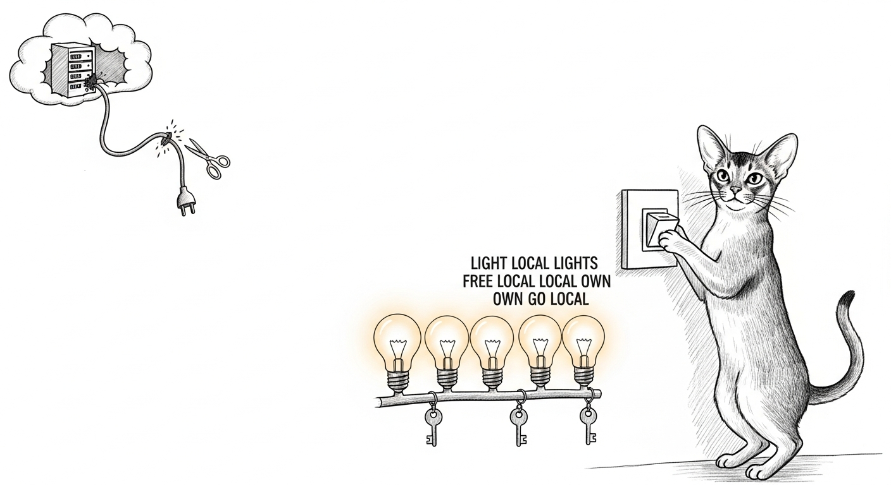

import { Aside } from '@astrojs/starlight/components';

The bulbs were hostages. Every few weeks the Tuya cloud login expired, and until
someone re-authenticated an app on a phone, the house's lights answered to no one.
The durable fix was never "log in again faster." It was **cut the cloud out of
the loop entirely** — talk to the bulbs on the LAN, with their own keys, forever.

## Local or it didn't happen

Fifty device `localKey`s were already extracted. LocalTuya went onto the HA Green.
But before wiring a single entity we did the thing that separates *configured* from
*controllable*: we opened a socket to a real bulb and **turned it off and on**.
GameRoom 4 blinked. Local read *and* write, zero cloud, proven — then and only then
did the integration get built on top of it.

The DP layout wasn't guessed, it was measured (`20` on/off, `22` brightness,
`24` colour, and so on), then cross-checked against LocalTuya's own schema. The
config entry was hand-merged into `core.config_entries` with the blast radius you'd
expect from editing Home Assistant's brain: HA **stopped** first so its shutdown
save couldn't clobber the edit, a full backup taken, the written file **read back
and compared byte-for-byte**, and an automatic rollback armed.

<Aside type="tip">The rollback fired — on our own bug. A stray whitespace in a
size check tripped a false "mismatch," and the guard cleanly restored HA and
restarted it. A safety net that never catches anything is just decoration. This
one caught the author.</Aside>

Second pass, clean: 9 lights live, every one answering Home Assistant. The proof
of done wasn't "the integration loaded" — it was `light.turn_off` flipping a
physical bulb and the state round-tripping back *from the device*. And the six
bulbs that looked "unreachable" earlier? Not powered off — their DHCP leases had
drifted after a week of reboots. LocalTuya now tracks that drift on its own.

## The names that wouldn't stick

Which surfaced the next indignity: in the Firewalla, every one of those bulbs read
`espressif` or, worse, wore a *stolen* name — a light labeled `Marantz NR1609`,
another `Bert's Echo Show`, a third `Bert's Macbook Air` — the router's best-guess
heuristic bleeding nearby names onto the wrong hardware. So we built **Columbo**: a
resolver that fuses every clue (the Tuya keyset, whose device-ids embed the MAC;
Home Assistant; DHCP; vendor) and gives each device
[the name that means who it is](/operations/device-identity/).
The dry run was a quiet triumph — 27 devices named authoritatively, the
cross-contamination corrected.

Then Columbo wrote them, and reported **35 of 35 written and verified.**

It was lying, and the persistence check caught it. A spot-read three minutes later
showed all 35 reverted to blank. The Firewalla's HostManager periodically re-saves
its *in-memory* copy of each host and wipes any name set out-of-band through raw
Redis. Only one survived — the one bulb we'd been toggling, because that activity
forced the router to reload it and pick the name up properly. The same reversion
would ambush us again weeks later, when [blocked devices kept unblocking
themselves](/operations/2026-07-29-the-firewall-that-quarantined-the-dishwasher/):
the firewall's own state machine, winning every write that didn't go through the
front door.

<Aside type="caution">"Verified" at write-instant is not verified. A write that
reports success and reverts in seconds is the most dangerous kind of green.
Persistence over a save cycle is the only check that counts here.</Aside>

So Columbo's brain ships and is proven; its Firewalla write waits for the correct
path — the router's own host object, not a Redis poke — rather than a midnight
hack against the live box that just spent a week misbehaving. The daemon is built
and deliberately disabled until it can persist for real.

The lights obey locally now. The names are next.
