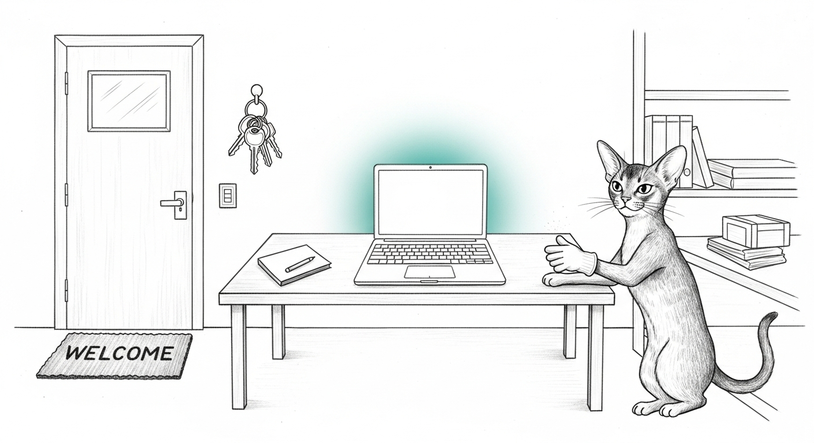

import { Aside } from '@astrojs/starlight/components';

The engineering was ready: a clean blocker ledger, a real security posture, self-healing monitors.
The question that actually gates a first beta user is different, and quieter — *is it clean for a
stranger, or only for us?* Everything works on the machine that built it. The install a stranger
runs is a different animal, and the only way to know is to become the stranger.

## Become the stranger

So we did — a throwaway home directory, no `~/.sanctum`, no keys, a modern `pip`, the exact path
the beta user takes. The good news came fast: the package built, `--version`/`--help`/`status`/`init`
all ran with zero crashes and zero dependence on the operator's state. `init` even named the instance
from *the stranger's own hostname*, not ours. The install path itself was clean.

The leaks were in the defaults.

## Five places we shipped our own house

A full scan of the shipped code, classified by how much each hurt: a comment that merely *mentions*
our topology is cosmetic; a **default value** ships as a wrong-and-leaky default; a value **hardcoded
into logic** breaks on a stranger's machine. Five crossed the must-fix line:

- Our Home Assistant's LAN IP as the default connect target.
- Our **Tailscale tailnet name** — printed to a stranger as if it were *their* address (every tailnet
  has its own suffix; ours told them a wrong fact and leaked our identity).
- Our out-of-band bridge subnet, baked into a safety gate.
- And the worst one: our HA appliance's **MAC address, written into the stranger's `instance.yaml`**
  during onboarding. Not printed — *persisted to their disk*, as if their device were ours.

<Aside type="caution">The MAC leak is the one that would have survived every casual review — it
wasn't in output anyone reads, it was in a config file written on first run. "Works for us" hid it
completely, because on our machine the value was simply correct.</Aside>

The fixes make each one resolve from the operator's own environment — env override, or the live
`tailscale status`, or a generic default (`homeassistant.local`, Home Assistant's own stock name) —
and fall back to *nothing* when unknown, never to ours.

## The crash on a clean Mac

Onboarding was mostly well-built: every haus-specific step is a gate that *skips* when the infra
isn't there. One didn't. The "Your Data" backup chapter is mandatory, and on a fresh Mac without
`restic` it died — `EXIT=1`, mid-flow, before the finish line. A beta user without one Homebrew
package couldn't complete setup. The fix teaches that chapter the same grace the others already had:
catch the missing-restic case, skip with a friendly note, keep going — and *only* that case, so every
other setup error still surfaces honestly.

<Aside type="tip">The first fix for it broke nineteen tests. The naive version checked for `restic`
at the top of the chapter with a real filesystem call — which fired inside the test suite, before the
mocks the tests rely on, short-circuiting flows they assert. The tell was the baseline: stash the
change, the same tests pass. So the failures were ours, not pre-existing. The correct fix catches the
error *from* the mocked call instead of pre-checking — invisible to the tests, present for the real
fresh Mac. Verified end-to-end: onboarding on a machine with no restic now reaches "Welcome to your
haus" with exit 0.</Aside>

## The blocker that was a ghost

One finding was flagged critical: the Homebrew formula pinned a version five releases stale, so a
beta user would `brew install` an old CLI. Real, high-impact — except it wasn't true. The audit had
read a copy of the tap in a directory that had been *migrated* earlier that day (the repo moved off an
iCloud+Drive-synced path that had been quietly corrupting its `.git`). The live tap on the origin — the
one `brew install` actually pulls from — was already current. A fresh clone told the truth the orphaned
copy couldn't.

## The line

Everything that made it clean-for-a-stranger lives on a tested branch, handed to the CLI's owners to
merge — because you don't merge into someone else's actively-moving tree, and you don't cut a release
on their behalf. That boundary is the point. The night's real lesson is the same one the haus keeps
teaching from a new angle: *become the user before you ship to them.* The stranger's machine is where
the defaults you never think about — the ones that are simply correct on your own box — turn into
leaks, wrong facts, and crashes. You can't reason your way to that list. You have to go stand on the
clean machine and watch what the software assumes.
