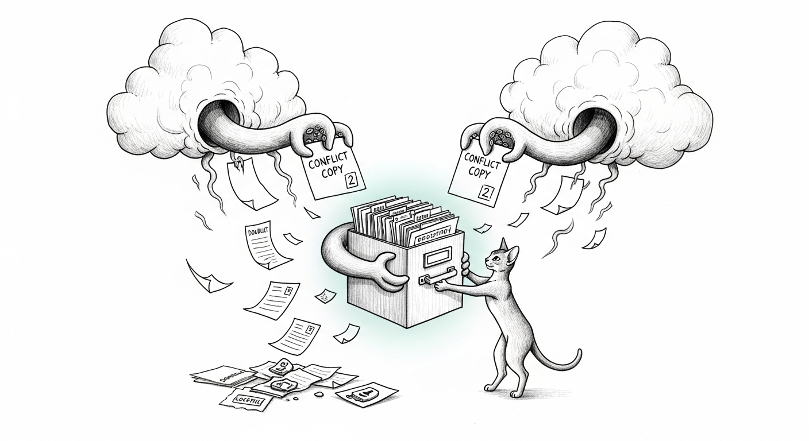

import { Aside } from '@astrojs/starlight/components';



Some bugs announce themselves. This one wore a mask and changed it nightly.

The workspace repo — the one that holds this very site as a submodule — kept
*rotting*. One session would open it to find **460 files staged for deletion**,
including `.gitignore`, `CLAUDE.md`, and the submodule pointers. The next would
find `HEAD` sitting on a commit from **two months ago**, as if the last sixty
days of work had never happened. And through all of it, a `.git/index.lock`
kept reappearing — clear it, and twenty minutes later it was back, a corpse that
would not stay buried.

Each symptom had a plausible, wrong story attached. The mass deletion looked
like a stray `git rm --cached -r .`. The rolled-back HEAD looked like a bad
`reset`. The recurring lock looked like a git process that kept crashing
mid-write. We even blamed OneDrive — the folders were right there in the sidebar.
Every one of those stories was a symptom mistaken for a cause.

## The one command that named the killer

The break came from trying to do the most boring thing possible — fetch:

```
$ git fetch origin
fatal: bad object refs/heads/main 2
```

`refs/heads/main 2`. A file-sync service had reached *inside* the `.git`
directory and made a **conflict-copy of a git ref file** — the pointer that says
"this is where `main` is." Git tripped over the impostor and refused to move.
Pull the thread and the whole sweater comes off: `.git/index 2`,
`.git/refs/remotes/origin/main 2`, packfile `2.idx`, submodule `.git/modules/*/index 2`,
and — the smoking gun for the horror-movie lock — **`.git/index 2.lock`**. The
"stale lock that kept coming back" was never a crashing process. It was a cloud
engine faithfully *syncing a lockfile* between two machines.

## The real root cause: two clouds, one .git, two machines

`~/Documents` was not just any folder. On both the laptop and the Mini it
carried the xattr `com.apple.file-provider-domain-id =
com.apple.CloudDocs.iCloudDriveFileProvider` — the fingerprint of iCloud Drive's
**"Desktop & Documents Folders"** sync, the *same domain UUID on both machines*.
And iCloud was not working alone: **Google Drive was churning the same tree** —
2,242 `.tmp.driveupload` staging files on the laptop, **9,875** on the Mini.

So the repo lived inside a folder that two independent cloud engines were both
syncing, from two computers, in real time. A git repository is a database of
thousands of tiny, order-dependent files that must be written atomically and
owned by exactly one writer. Cloud sync offers the opposite of all three: it
copies files out of order, resolves collisions by duplicating them, and
dematerializes the ones it thinks are idle. The `" 2"` copies were iCloud's
handwriting; the bare-numeric orphans were Google Drive's. The repo was not
broken. It was being *helpfully* eaten.

<Aside type="danger" title="The rule earned here">
A git repository never lives in `~/Documents`, `~/Desktop`, or any
iCloud / Google Drive / OneDrive / Dropbox-synced folder. Cloud sync and git's
object store are mutually hostile. Keep one **non-synced** clone per machine
(e.g. `~/Projects/…`) and let git — not a file-sync daemon — be the thing that
moves your history around.
</Aside>

## The migration, and the trap the council caught

The fix is a relocation, not a repair — iCloud's Desktop & Documents sync has no
per-folder opt-out, so you cannot exclude the repo in place. Move it out and
re-clone fresh from GitHub, on each machine independently. But "re-clone fresh"
quietly means "delete the working copy," so the discipline is all in what you
rescue first:

- **Freeze** the tree (a vault heads-up + acks, not a unilateral cutover), then
  **`git bundle --all`** both the parent and every submodule — the reversible
  backstop.
- **Rescue every dirty submodule's genuine work**, not just the obvious one. A
  naive re-clone would have silently deleted a `triptyq-tearsheets` CSV of real
  CRM corrections and four unpublished field-note assets in *this* repo —
  neither was on any remote.
- **Verify before you retire.** The new clone had to pass `git fsck`, a
  HEAD check, a **blob-hash oracle** (the rescued files must reproduce their
  exact object hashes), directory counts, and a "zero conflict-copies, no
  file-provider xattr" gate — *before* the old copy was allowed to move.
- **Repoint, then let the old copy live** as a ≥7-day backstop. The laptop had 6
  references to the old path; the Mini — the server — had **44**, across two
  daemons and ~26 service definitions.

The sharpest save was one the adversarial reviewer made. The naive plan wanted
to push a diverged submodule's local commit "to be safe" — a `git push` that
would have been a non-fast-forward and, if forced, would have **destroyed two
commits that existed only on the remote**. A single `git patch-id` settled it:
the local commit was byte-for-byte a *duplicate* of a commit already upstream.
No push. No force. No loss. Falsify before you fortify — even when the plan is
your own.

The repo now lives at `~/Projects/Claude_Code` on both machines, non-synced,
verified, with every rescued byte in place. The thing that kept eating it is no
longer in the room.
