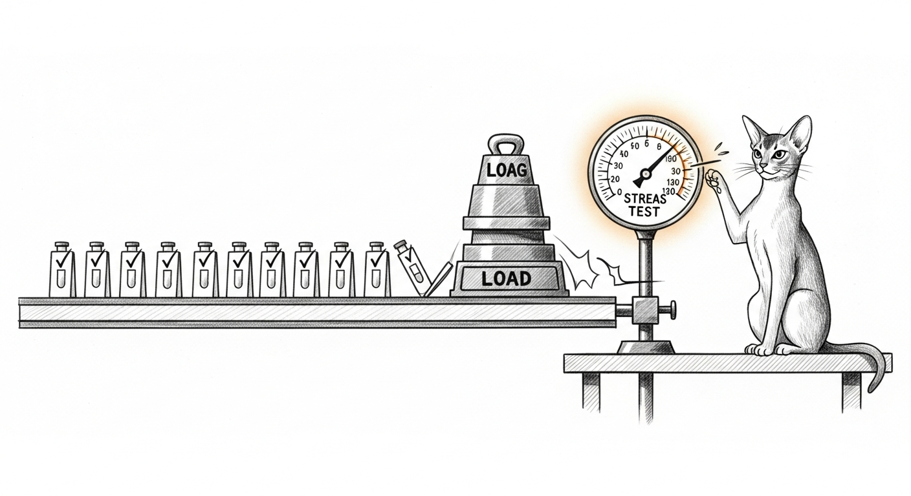

import { Aside } from '@astrojs/starlight/components';



A flaky test is a small betrayal. It passes a hundred times, fails once, and
teaches the whole team to re-run instead of read. Before the first beta, the
suites got the same treatment every service did: find the flake, find the
*reason*, fix the reason — never the symptom.

## Rule zero: root cause before any fix

Every flaky test got the four-phase treatment — reproduce, find the mechanism,
form one hypothesis, fix and verify — because "re-run and it passed" is not a
diagnosis. Two of the three flakes turned out to have precise, provable
mechanisms. The third didn't, and that changed what the right fix was.

## Flake one — the unit test that read the live house

`test_gather_then_voice_flattens_all_findings_into_voice_prompt` checked that a
two-tool council gather flattens **both** findings into the voice prompt. It
mocked the model's tool *decision* but let the tool *execution* run for real —
so `agent_list` and `logs_tail` actually queried the live box.

The voice prompt is byte-capped (8 000 bytes, so a chatty instrument can't blow
the budget). Measured live, `agent_list` alone was **9 991 bytes** — over the
cap by itself. So the flattener truncated mid-first-tool, the second tool's name
never made it in, and the both-names assertion failed. The "flakiness" was just
the running-agent count drifting across the 8 KB line over hours.

The fix is hermeticity: stub the tool-execution boundary with small deterministic
results, so the test exercises the flatten-and-accumulate logic it's *about*,
not the size of the live process table. The subtlety worth keeping: the sibling
tests that assert on the audit trail keep the real execution, because *they*
test the audit write — you mock the boundary a test isn't about, never the one
it is.

## Flake two — the readiness wait that gave up quietly

The `sanctum-server` end-to-end tests spin up mock backends and the real router
binary on ephemeral ports, then poll for readiness. Both polls had the same
bug — they gave up **silently**:

```rust
for _ in 0..60 {                 // 6-second cap
    if health.mode == "routed" { break; }
    sleep(100ms).await;
}
// ...falls through here whether or not the server ever came up
```

Under load — the lib-test binary running beside the e2e binary, each e2e case
spawning its own server subprocess — six seconds occasionally wasn't enough. The
loop fell through, the test ran against a half-started router, and the routing
assertions failed for a reason that had nothing to do with routing.

The fix is the condition-based-waiting discipline: poll to a *generous* deadline
and **fail loudly** on timeout with the last state you saw.

```rust
let deadline = Instant::now() + Duration::from_secs(30);
loop {
    if health.mode == "routed" { break; }
    if Instant::now() >= deadline {
        panic!("server never reached routed mode in 30s (last: {last})");
    }
    sleep(100ms).await;
}
```

A slow-but-fine start now waits instead of flaking; a genuinely broken start
reports the real problem instead of hiding behind a downstream assertion.

## Flake three — the ghost we hardened instead of chased

One test flaked exactly once and never again: `_run_first_hello` resolves the
installed script through `Path.home()`, and in a single full-suite run home
resolved to a script-less directory, so the script never ran. The mechanism was
provable by elimination — a `with patch(...)` always intercepts, so the failure
could *only* be the home-resolution early-return — but nine clean full-suite runs
and a grep of every test and source file turned up no stray `Path.home`/`HOME`
patch to blame.

<Aside type="note">
When a bug won't reproduce after honest investigation, you have two moves: keep
digging, or make the code immune to the whole class. Here the class is
"depends on ambient home resolution," so the fix is to pin `Path.home` per-test
rather than trust the environment any other test could perturb. That's not
papering over a mystery — a unit test that resolves paths through `Path.home()`
*should* control home directly. The ghost can't come back through a door that's
no longer there.
</Aside>

## The one that was a safety decision, not a typo

The workspace sweep also surfaced a test that fails *every* time, not
sometimes: `sanctum-chitti`'s `attention_quiet_overrides_alert`. That's not
flakiness — it's a deterministic disagreement between a test and the code, and
its fix was a **safety decision**, not a mechanical one.

`classify_posture` checked the Fever breaker (acute pressure ≥ 0.95) *before* the
"be quiet" override, so a quiet request at Fever-level pressure still returned
Fever. The test expected Conserving, and a comment one layer up said quiet "wins
regardless of what the lower koshas say." Those genuinely conflicted — and the
two fixes were opposites: correct the test's input to the Alert band (quiet
overrides Alert, Fever keeps paging), *or* reorder the code so a "be quiet" can
silence even a Fever breaker on a live, thermally-stressed box. One of those
changes a running safety behavior. So it went to the domain owner as a question,
not a commit — the guess a machine shouldn't make on its own.

The owner's call: **quiet wins over everything, Fever included.** An explicit "be
quiet" — recording, on-call, asleep — is the human's context, and it outranks
even the saturation breaker. So the `attention_quiet` check moved *above* the
Fever check (the non-quiet path is byte-for-byte unchanged), a dedicated
`attention_quiet_overrides_fever` test now pins the precedence, and the live
`chittid` was rebuilt and restarted to carry it. The interim test-only fix that
kept the suite green while the question was open got reverted into the real one.
Ask first, then execute the answer exactly — including the part that changes a
running service.

## Where it landed

The council and server flakes are fixed and merged; the First Hello test is
hardened; the chitti posture rule is decided and shipped to the live daemon; the
full CLI suite is green across ten runs and every Rust crate is green. The
estate's tests now fail for reasons, or not at all.
