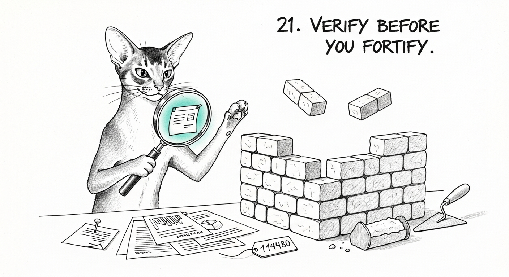

import { Aside } from '@astrojs/starlight/components';

The request was one sentence: *"give me the full haus security status, and fix what's weak."* By
the time the sweep finished, six fixes sat staged and ready to ship. Every one of them was wrong.

Not carelessly wrong — each was a plausible conclusion drawn from a real signal, the kind Windu,
the council's security seat, would page a human about at 3 AM without a second thought. Wrong in
the expensive way: the most dangerous move in security work isn't missing a threat, it's
**fortifying the wrong thing with confidence**. The only thing between these six and a shipped
mistake was the habit of reading the box before rebuilding it.

## The firewall that was "749 days out of date"

A freshly-deployed sentinel reported the Firewalla's firmware as **749 days old** and paged for an
update. The obvious move: automate the firmware update. Instead we read the box: `/etc/firewalla_release`
says `0.0614` — but that's the **immutable base OS image** from 2024, which never changes. The actual
product was on `v1.965`, auto-updated **fifteen days prior**, via a native cron that runs every night
at 03:00. The box was never behind. The sentinel had been reading the one version string guaranteed to
look ancient.

<Aside type="caution">Building a firmware auto-updater on top of that reading would have been a
high-blast-radius fix to a problem that didn't exist — fighting the box's own OTA. We repointed the
sentinel to the real signal (upgrade recency + is-the-updater-even-enabled) and left the updating to
the mechanism that was already doing it.</Aside>

## The bridge that had been dead for two days

The screen-time control bridge returned `503`, and its error blamed DNS: `getaddrinfo ENOTFOUND
firewalla.encipher.io`. The tempting story: a DNS-floor rule blocking the cloud endpoint. But the
Mini's own resolver answered that name instantly. **Diff the working twin** — the OS resolves it, the
bridge's process doesn't. The bridge process had started *before* the network recovered days earlier,
detached from its launchd job, and was carrying a dead resolver like a ghost. Not a DNS bug. A stale
process. Kill the orphan, bootstrap fresh — `sdkReady` in five seconds.

## Post-quantum crypto verified where the attacker isn't

The council traffic was already protected with post-quantum key exchange (X25519MLKEM768) — the one
genuine harvest-now-decrypt-later target. The status tool proudly reported it green. Then we looked at
*what* it probed: `127.0.0.1`. Loopback. The one interface an eavesdropper can never reach. The council
also binds on the tailnet and VM networks — **where an attacker actually is** — and those were
**unverified**. They turned out to be PQ too, but "we assumed" is not "we proved." We extended the
check to the network-exposed hops and added a daily sentinel that pages if any of them ever regress to
classical crypto. Deploying isn't the milestone; verifying where it counts is — the same lesson
[the post-quantum vault](/operations/2026-06-20-the-post-quantum-vault/) had to learn the hard way.

## The isolation that would have broken the lights

The plan to segment IoT devices onto their own isolated group was sound on paper — until we traced it
against last night's work. Those ~50 bulbs had *just* been migrated off the Tuya cloud to local
control, driven by Home Assistant over the LAN — [last night's work](/operations/2026-07-02-the-lights-go-local/), still warm. Firewalla's flat-network isolation is a bidirectional
block with no trusted-initiated exception. Isolating the bulbs would have severed Home Assistant from
them — **breaking the local control we'd built to close the cloud risk in the first place.** And the
cloud risk was already gone. We didn't do it.

## The alarm list nobody could read

876 active firewall alarms. Ninety-six percent were benign kids-activity notices — game, video,
new-device — piled up over 26 days, burying the ~19 that mattered. We archived the aged benign classes
through the box's own supported path (and confirmed it *stuck* — alarms are events, not regenerated
state), **never touching a single security-class alarm**, and left the alarm *generation* alone so the
parental notices still fire. A daily job keeps the list from re-drowning.

## The watchers had no watcher

The last question was the sharpest: *is everything self-healing?* The honest audit said: the
auto-fixable things heal, the judgment-required things alert a human (correctly — you do not
auto-remediate a crypto regression or a secrets mismatch), and the alert pipe reaches the phone. But
nothing ensured the **monitors themselves stayed loaded**. A sentinel unloaded mid-life would stay
dead until a reboot. So we built the watcher-of-watchers — a keeper that re-loads any dropped critical
monitor every ten minutes, the seed of what later grew into [the fleet that watches
itself](/operations/2026-07-24-the-fleet-watches-itself/).

<Aside type="tip">It earned its place immediately: on its first run it false-alarmed on an
already-loaded agent, because grepping the full process list can truncate under load. A flaky
watcher-of-watchers is worse than none. We rebuilt its check to be per-agent and reliable, and proved
it by dropping two sentinels and watching it bring them both back.</Aside>

## The through-line

Six fixes, six wrong first conclusions: automate an update that was already running, blame DNS for a
stale process, trust a green check on the wrong interface, isolate devices into breakage, alarm on the
base-image date, assume the monitors monitor themselves. None of them shipped, because each was checked
against reality before it was fortified. The haus is measurably stronger tonight — single-NAT, key-only
SSH, PQ verified where it counts, monitors that watch each other. But the durable win isn't any one
control. It's the order of operations: **evidence before attribution, verification before fortification.**
The boring config layer is always cheaper to read than the exotic theory is to chase.

Tommy, who patrolled these grounds for fifteen years and never once caught a mouse he hadn't first
watched for an hour, would have understood the whole day in a glance. You do not pounce at the
noise. You pounce at the thing that made it.
