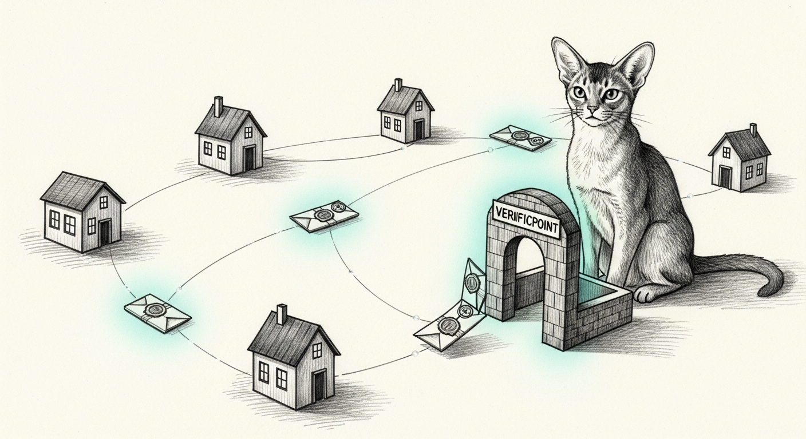

import { Aside } from '@astrojs/starlight/components';

Every haus in the Sanctum world trains its own council champion. Every night, a
little further up the hill: a fresh LoRA adapter, a tiered eval, a new best. It
works. It also means every haus is an island — re-deriving from scratch what the
haus next door already discovered at 3 a.m. last Tuesday.

The mesh is the bridge. Not a private tunnel between two machines Bert trusts —
an **open swarm**, BitTorrent for council champions. Anyone can join. Anyone can
seed. And that sentence should make your security instincts flinch, because the
first thing an open swarm hands you is a stranger's model weights and a friendly
suggestion that you run them.

So the whole design is one question answered five times: **how do you adopt a
peer's champion without trusting the peer?**

## The gauntlet

A champion arriving from the mesh is untrusted code and untrusted weights until
it clears a fixed pipeline, and the pipeline short-circuits on the first failure:

1. **Hash.** The bytes must reproduce the content hash they were advertised
   under. A champion *is* its sha256 — a sorted-file merkle over the adapter, so
   the id is the artifact and a single flipped bit is a different champion.
2. **Signature.** The manifest must be signed by its producer's mesh identity.
   Today that's Ed25519; the seam is built for **ML-DSA-65**, the post-quantum
   signature [the rest of the Sanctum PKI is migrating to](/operations/2026-06-20-the-post-quantum-vault/),
   and it drops in behind the same three-method interface the day the binding is
   pinned.
3. **Eval.** The champion must not *regress* yours. The peer's self-reported
   scores are decoration — your haus re-runs its own [tiered eval](/architecture/eval-harness/)
   on the actual adapter and compares to your baseline. A champion that loses to
   the one you already have is politely declined.
4. **Sandbox.** The adapter is loaded in an **air-gapped VM under `unshare -n`**
   — no network namespace, nowhere to phone home — probed with a couple of
   prompts, and watched for any egress attempt. A model that tries to reach the
   network in a room with no doors gets its producer flagged.
5. **Promote.** Only now, with every prior gate green, does the new champion
   replace the local one.

The invariant that makes it safe to leave running: **your champion is
authoritative and is never replaced on a failure.** Every rejection keeps what
you had. The mesh is strictly additive — the worst a hostile peer can do is
waste a few CPU-seconds of your eval and get remembered as hostile.

<Aside type="tip" title="Why the tracker is allowed to lie">
Discovery runs through an open tracker (a content-hash → seeders index), and the
mesh places **zero** trust in it. It can serve you a forged manifest, a bogus
seeder, a champion that claims a perfect score. None of it matters: verification
is entirely client-side. The tracker points; the gauntlet decides. A tracker
that returns garbage earns a clean error, not a crash — and never a promotion.
</Aside>

## What's proven, and what isn't

Here is where a lesser field note would tell you the mesh is live and move on.
It isn't, and the honest shape matters.

The single-box drill is real and it passes: a genuine loopback tracker over HTTP,
a real Ed25519 identity minting and signing, real content-addressing, and the
full adopt pipeline — the happy path promoting a good champion, and all four
gates rejecting the bad ones (tampered bytes → *hash*; forged signature →
*signature*; a regression → *eval*; an egress attempt → *sandbox*). Eight for
eight, exactly one promotion, the local champion held on every reject.

Two things in that drill are honestly bounded, and they're bounded because they
lean on infrastructure a single box can't stand up:

- the **eval runner** is a fixed stand-in — the real gate logic runs, but the
  full 109-case eval on a 35B model is the nightly's job, not the drill's;
- the **sandbox probe** is a VM-pending stub on the happy path, because the real
  `unshare -n` egress check wants [the air-gapped VM](/operations/2026-07-26-the-airgap-that-forgot-itself/)
  up.

Which is the whole point of shipping the sandbox as a real, **fail-closed** seam
instead of faking it green: a VM that's down, a probe that can't render a
verdict, a missing helper — all of it raises and rejects. A security gate you
can't run is a security gate that says *no*. The one thing it never does is
shrug and wave an unvetted model through.

The gate that turns "single-box proven" into "field-proven" needs a second haus:
box B seeds a champion, box A pulls it across its own tailnet, and the VM sandbox
loads a genuinely foreign adapter and confirms it stays silent before promoting.
That's the acceptance test, and it's written down, and it's waiting for a second
island to exist.

## The join

None of this asks anything of a new haus but one command. `sanctum mesh join`
brings up Tailscale-on-box (its own free tailnet — the mesh is the shared
*discovery* layer on top, so nobody hits a free-tier ceiling), mints the mesh
identity if it's absent, and registers with discovery. Every checkmark it prints
is earned from a real outcome: *joined* means the tailnet was observed up **and**
the tracker actually acknowledged you — never assumed. It's also a skippable
chapter in `sanctum onboard`, because the first thing you should be able to do
with a swarm is decline to be in it.

Tommy has seen a lot of parcels cross a lot of thresholds. He has never once let
one through on the strength of its return address.
