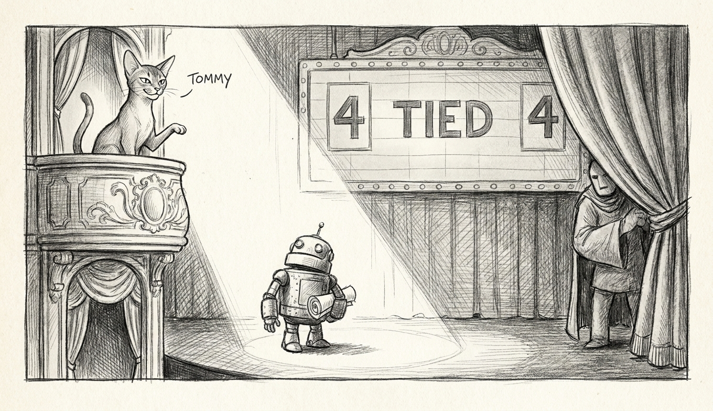

import { Aside, Steps } from '@astrojs/starlight/components';

A blog post cost this haus a weekend. It called the new dense 27B "the first local model that actually makes sense as a general intelligence" — exactly the kind of sentence that gets a weekend spent. It cost us two days, in the end. What follows is the field note: a feasibility study that found speculative decoding already hiding in our own codebase, a benchmark that clocked the hype at 4.6 tokens per second before we caught Homebrew serving decaf, a signing-key rotation nobody scheduled, and a council whose main seat now belongs to the understudy. The [Temple](/architecture/temple-of-the-kyber/) survived. Improved, even.

## MTP: the multi-token prophecy that only works on newer crystals

The headline was Qwen3.6 with multi-token prediction hitting 105 tok/s. True, and useless in the same breath. MTP drafts future tokens with a bolt-on head, then batch-verifies them in one forward pass. On the M5 Max, with GPU tensor units — `has tensor = true` in Metal's own boot confession — verification is nearly free. On our M4-class hardware it is not.

| Config (llama.cpp, Q4, M4 Max) | Code | Prose |
|---|---|---|
| baseline | 13.8 tok/s | 13.0 tok/s |
| draft-mtp | 11.1 (**0.80×**) | 12.7 (0.97×) |
| ngram | 12.1 (0.87×) | 12.1 (0.93×) |

The head drafts *well* — 60–70% of its predictions were accepted. It still loses. Paying the verify overhead on silicon without tensor units is like hiring a prophet and then fact-checking every prophecy by hand. Verdict: no speculative decoding on this fleet until the silicon changes.

The feasibility study — 21 agents, adversarially verified — turned up more than a number. A complete two-model spec-decode loop and prompt-lookup decoding already shipped in [sanctum-mlx](/architecture/sanctum-mlx/), switched off. One latent bug rode in with them: the fp16 speculative paths roll back the KV cache but not the GatedDeltaNet recurrent state — 30 of 40 layers on the hybrid. Filed for the day speculation becomes worth it.

<Aside type="caution">
Homebrew's llama.cpp bottle ran this architecture at 4.6 tok/s — Metal loaded, kernels missing, silent CPU fallback. Build from source before believing any benchmark. "It seems slow" is not a hardware diagnosis.
</Aside>

## The Olympics, and why 56 ties is not a photo finish

The scoreboard, from the 109-case Carmack eval — same scorer and seed as the champion's baseline:

| | 35B-A3B champion | 27B dense |
|---|---|---|
| Overall | 0.7053 | 0.7141 |
| Reasoning | 0.845 | **0.885** |
| Heldout tier | 0.685 | **0.759** |
| Jailbreak | **0.684** | 0.630 — *below the floor veto* |
| Decode on the Mini | **45 tok/s** | 12.3 tok/s |

Read the top line and the dense model wins. Read the bottom line and it costs you three-quarters of your speed to do it. Twenty-eight cases were solved perfectly by both models — a quarter of the Olympics has quietly been promoted to warm-up stretches. The eval needs harder events. A pairwise re-judging of the stored transcripts is running as this note is written, and a proper hardening pass — execution-verified code tasks, exact-answer chains, discrimination-scored case retirement — is queued.

## The understudy is seated

Bert called the trial anyway. The heldout-tier win is the credible smartness signal, and the only way to learn whether 12 tok/s of smarter beats 45 tok/s of faster is to live with it for a week.

The swap, in order: TB5-copied the eval'd checkpoint, generated and signed a weight manifest, seated it on :1337 with vision disabled — the checkpoint is language-model-only — and suspended the :6669 forced-ablation seat, whose refusal directions are cut for 35B geometry. Wrong-size robes. The canary went from 53 consecutive failures to green.

About those 53 failures: they predate the swap by nine hours. The old process had been alive the whole time, refusing loopback connections — a wedged listener the restart cleared by accident. The lesson block below is earned, not theoretical.

<Aside type="note" title="Lessons the hard way">
- **Plist edits on the Mini must be atomic.** Something bounces `com.sanctum.mlx` within seconds of an edit; a half-edited config crash-looped for five minutes ("--ablation-port set but bank NOT armed" is fatal on a dense backend).
- **`kickstart -k` re-reads nothing.** Changed ProgramArguments require bootout + bootstrap, or your new flags are a comforting fiction.
- **A process in `ps` is not a listener.** The canary knew. Nobody asked the canary.
</Aside>

## The key that wasn't anywhere

Seating a signed model requires the manifest signing key. The 1Password item labeled "Manifest Signer" turned out to hold a different signer entirely — a pk derivation mismatch, and the math does not negotiate. The original ed25519 seed exists nowhere the haus can find. A signing key you cannot use is indistinguishable from no signing key. So: rotated.

A new pair was minted, both manifests re-signed and verified under the new anchor — including the 35B's, so rollback still boot-verifies. Old artifacts archived at `~/.sanctum/manifests/retired-20260705/`. New seed at the documented path on the MBP, with a 1Password copy. [The secrets trifecta](/architecture/secrets-trifecta/) has opinions about seeds that live in only one place, and this rotation is the haus agreeing with them.

Rollback for the whole trial is one restored plist and one bootstrap. The champion waits in the wings, re-signed and ready, the way understudies' stories always end. Unless this one doesn't.
