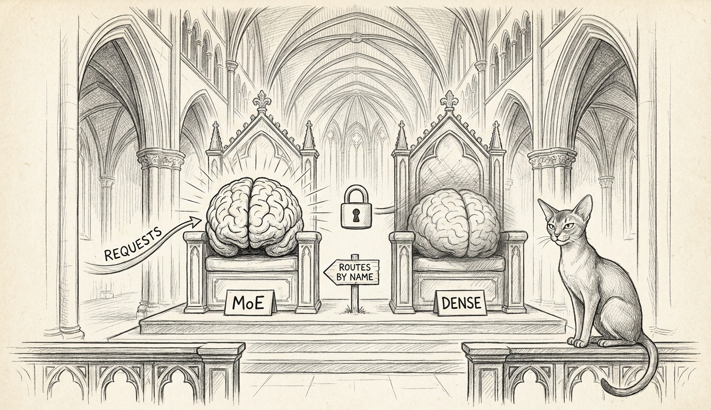

import { Aside, Steps } from '@astrojs/starlight/components';

The Cathedral has spent its life serving one model at a time. It doubled its *seats* once (Devstral, Cilghal-Heretic, and a main), but those were separate processes on separate ports — three tenants, three leases. This is different: **one process, one port, two full models**, and a request chooses which mind answers it by name. It is the kind of thing that sounds reckless right up until the moment you realise the machinery was already 90% there, waiting, with a `#[allow(dead_code)]` on it.

## Why two minds

We benchmarked the dense 27B against the 35B-A3B MoE champion on the honest 109-case eval and, after a properly rubric-grounded pairwise re-judging, they came out **statistically tied** — 14 wins each, 0.714 vs 0.705 overall. The MoE is 3.7× faster (45 vs 12 tok/s on the Mini). The dense model is easier to fine-tune and edges the leakage-resistant heldout tier. When two models are peers on quality but differ on speed and temperament, picking one is leaving value on the table. So we stopped picking. Route the workhorse traffic to the fast MoE, route the hard calls to the deep dense reasoner, and let the request decide.

## How it works

| Piece | Behaviour |
|---|---|
| **`AppState.primary` + `secondary`** | Two `ResidentModel` bundles in one process. Secondary is `Option` — absent means the server is byte-identical to its old single-model self. |
| **Routing** | The OpenAI `model` field, matched by directory basename. Unknown or absent name → **primary, never a 404** (this is load-bearing: the canary and parity probes send stale names and must keep working). |
| **The one lock** | Both minds share a single GPU-dispatch mutex on the single MLX inference thread. They physically cannot touch Metal at the same time. This is the same lock that ended the SIGABRT era; dual-residency just gives it a second customer. |
| **Readiness** | The primary flips `ready` the instant *it* warms. A sick secondary can no longer hold the healthy primary hostage — only requests naming the secondary wait. |
| **Manifests** | Both models are ed25519-signed and fail-closed at boot. A bad-signature secondary exits before a single weight loads. |

## The memory hack, and the kernel that nearly said no

Two 4-bit checkpoints is 19 GB (MoE) + 15 GB (dense) = 34 GB of weights. The Mini has 64 GB and is not empty. There is no per-buffer wiring API in our vendored MLX — we checked, exhaustively; the residency set is one global thing the allocator keeps to itself. So the "hack" is embarrassingly humble: **load order**. The primary materialises first and wins the wired set; the secondary loads after and pages out under pressure. In the soak, both-resident RSS sits at ~22 GB, not 34 — the idle mind is on the SSD until someone calls its name.

<Aside type="danger" title="The disappearance">
Two large models executing GPU ops together under **default** MLX allocation get `SIGKILL`ed on the first co-resident forward — no crash report, no jetsam line, ~9 GB RSS, just *gone*. Neither model does this alone. The fix is a single explicit `--metal-memory-limit-mb`. If your dual-residency process vanishes without a word, you did not set it. This cost a "diff the working twin" afternoon to find; it is now doctrine.
</Aside>

## What shipped, and what didn't

Merged to `main` as a **dark land**: ten commits, every task spec-and-quality reviewed plus a whole-branch pass that caught two bugs the per-task reviews couldn't see. Single-model deploys are unaffected. The dual configuration lives in a **staged plist that is never bootstrapped** — it does not run until someone measures the memory ceiling on the actual Mini during a soak and decides, deliberately, to cut over.

That is the whole point of a dark land: the code is in the building, the lights are off, and turning them on is a separate, sober decision. The Cathedral now *can* hold two minds. Whether it *will*, on the 64 GB machine that also runs a coder model and a VM, is a number the soak is currently measuring — one probe every ten minutes, for a day.

<Aside type="note">
Rollback is one line: drop `--model-secondary` from the args, `bootout`/`bootstrap`, and the Cathedral forgets it ever had a second mind. It kept the first one warm the entire time.
</Aside>
