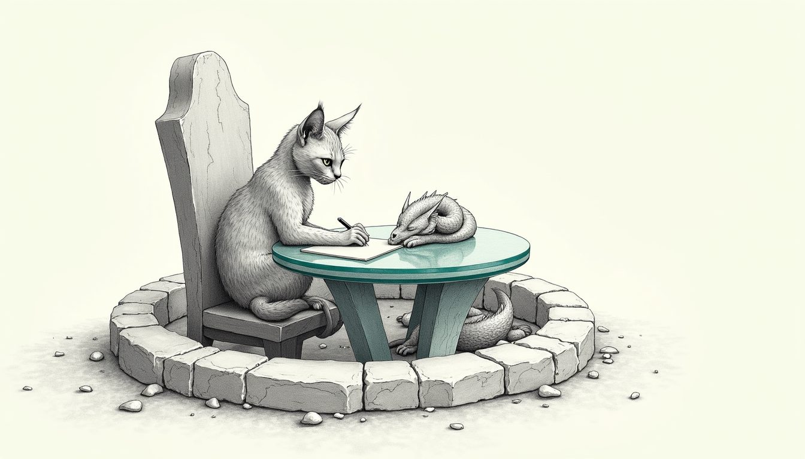

import { Aside, Steps } from '@astrojs/starlight/components';

Builds and connects. That was the line the [Dragonpit](/operations/2026-07-06-the-dragonpit/) note closed on, and every word of it was true.

It was also the floor.

The Dragonpit already had the hard parts. A Conduit homeserver we own on the tailnet. **Aemon**, the maester-bot who answers from the local cathedral and brags, with reason, about answering to no cloud. A room with a real moderation model. What it had *for a client* was a first-cut chat panel in the Holocron that logged in, rendered a timeline, and sent a message — which is exactly where you start and nowhere you stop. This is the note where that panel earned its seat.

## Owning the client, for real

Own the whole stack. That is the [apple way](/operations/2026-07-06-the-dragonpit/) — server, client, and the app the client lives in. Aemon sits one tab over from the household controls in **the Holocron**, Bert's Electron control surface, so the client can't be a rented Element window borrowed from someone else's design language. It has to be *ours*. It has to feel like everything else in the app: iOS-blue-on-black glass, the same tokens, the same restraint.

The panel talks to the homeserver the plain way: the **Matrix client-server API, directly over `fetch`** — log in, pull the room timeline, send. No SDK, no bundled client, no second styling system to fight. The sign-in card asks for a homeserver, a username, and a password, with a quiet *"First time? Registration token"* disclosure for a one-time invite token — the soft gate from the origin note, now wearing a form. A successful login persists its access token, so the rider comes back to a live room instead of a login wall.

<Aside type="note" title="Why fetch, not a Matrix SDK">
The panel needs three verbs — authenticate, read a timeline, post a message — against a homeserver we control. A full SDK brings a store, a crypto stack, and its own opinions about DOM and state, none of which the Holocron wants inside its single-renderer glass. Talking to the client-server API directly keeps the panel a *panel*: token-scoped, styled from the app's own design tokens, and small enough that the whole thing reviews in one sitting.
</Aside>

## The bug that mattered was one line

The panel was inline-styled. Somewhere in its inputs and its message box sat the most quietly hostile line in front-end work:

> `outline: 'none'`

Nothing put back. On a mouse it looks clean. On a keyboard it is a blindfold: Tab moves focus from field to field, and **nothing on screen tells you where you are.** For an app whose whole thesis is that you own your tools, shipping a form you cannot cross without a mouse is not the apple way. It is the exact opposite of it.

The fix was the app's own convention, not a new invention. The switch, the segmented control, and the language toggle already do the same thing: no outline at rest, a crisp accent ring on `:focus-visible` — keyboard focus, not mouse clicks. The panel does it now too, scoped under a single `dp-scope` class so nothing else in the app is touched.

<Steps>
1. Base state keeps `outline: none` — the resting look is unchanged.
2. `:focus-visible` draws a `2px` `var(--accent)` ring with `2px` offset — the exact ring the rest of the app already uses.
3. Two quality-floor extras from the same review: a subtle button hover (brightness, on the app's `--motion-fast` / `--ease` tokens) and a `prefers-reduced-motion` guard that drops the hover and turns the scroll-to-latest from *smooth* to *instant*.
</Steps>

<Aside type="caution" title="Written down so it doesn't come back">
`outline: none` with no replacement is a recurring own-goal in inline-styled components — it passes every visual glance and fails every keyboard user. The rule for this app: if a control turns off its outline, it owes a `:focus-visible` ring in the same breath. The design system already had the ring; the panel just wasn't spending it.
</Aside>

## Verified where it counts

Nothing here is trusted on a screenshot alone. The panel was driven in a **headless render** of the running app — signed-in state, the sign-in card, and a keyboard-focused field with the accent ring visibly drawn — then put through the full gate suite the rest of the Holocron answers to.

<Aside type="tip" title="Every gate, green">
- **Build** — clean production build, 1848 modules transformed.
- **Lint** — ESLint clean on the panel, including the `jsx-a11y` rules.
- **UX check** — the repo's design-system linter: **0 violations** across the scanned files (token-only styling, no raw hex, no stray icon sets).
- **Smoke** — all 9 renderer markers present, including the `aria-current` sidebar-nav state the a11y pass requires.
- **Focus ring** — confirmed by eye in the headless render: Tab into the form, the accent ring is *there*.
</Aside>

## Where it stands

The work lives on a fork branch, **`feat/dragonpit-matrix-chat`**, as an open PR. Honestly pre-merge — not yet the live client. What it changes is small and self-contained: the panel component and one scoped block of the renderer stylesheet. The origin note's five-beta-riders posture is unchanged; this widens no gate and touches no homeserver. It only makes the seat one already sits in worth sitting in.

The Dragonpit note said *train a dragon, earn your place.* The panel had a place from the first night. Now it has earned it. You can reach every field with a keyboard, the ring tells you where you are, and the whole thing answers to the same bar as everything else in the app it lives in — which is the only bar Aemon was ever going to accept from his own front door.
