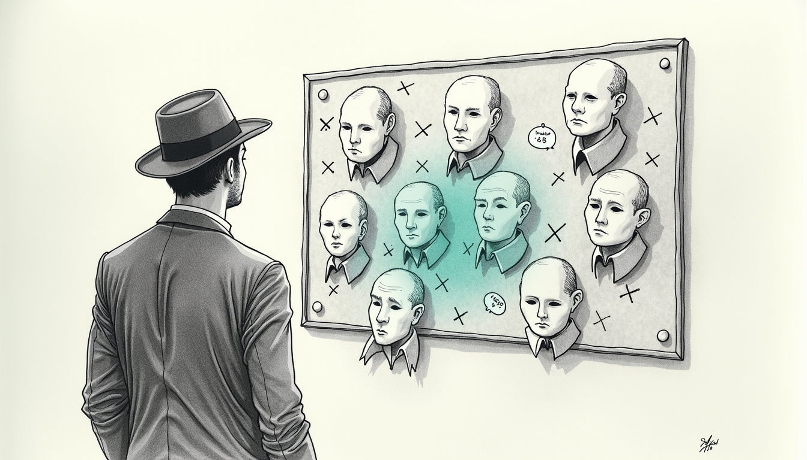

import { Aside } from '@astrojs/starlight/components';

Modern phones lie about who they are, politely and by design. iOS **Private Wi-Fi Address**, Android's randomized MAC, the game consoles — every one of them rotates the hardware address it presents to the network, on a schedule you don't control. For a household router that keys everything on the MAC, this is quiet chaos: the same phone becomes a stranger every few days, curfews and device groups slide off the device they were meant for, and the network's own device labels drift into fiction.

This is the note where identity stopped trusting the MAC.

## The problem, stated honestly

We group devices for a reason: a child's devices carry a bedtime curfew, the parents' don't, the smart-home bulk lives in its own lane, guests get their own rules. Every one of those groupings is only as good as the answer to a single question — *whose device is this?*

When we went looking, every signal we'd been leaning on turned out to be unreliable:

- **The MAC address** rotates. Pinning a rule to it means the rule expires the next time the phone reshuffles.
- **The router's own device labels** (`bname`, `name`) are hand-edited and stale — they had a lighting bridge and a printer filed as people's phones.
- **The router's device-type detector** was cross-contaminated: leftover records from an old subnet made a phone advertise itself as a "smart speaker," which is how one child's phone spent weeks disguised as a basement TV.

Three signals, three different lies. The lesson wasn't "find the one true signal." It was **stop trusting anything the network says *about* a device, and trust only what the device says about *itself*.**

## What a device says about itself

When a device joins a network it introduces itself twice, in ways it sets from its own firmware:

- its **DHCP hostname** — the name it hands to the router when it asks for an address, and
- its **mDNS / Bonjour name** — the name it broadcasts to say "here I am."

A HomePod cannot claim to be `Someones-iPhone`; a phone sets that string itself. These names ride *with the device* across every MAC rotation, because the device re-announces them each time it rejoins. That is the anchor. Key on the self-announced name, and the moving MAC stops mattering.

<Aside type="tip" title="The ordering that matters">
DHCP hostname first (firmware-set, hardest to fake), then Bonjour, then the DHCP lease. Never the router's own `bname`/`name`/`detect` fields — those are exactly the labels we're correcting.
</Aside>

## Fusing the signals without being fooled

Self-announcement is the spine, but a few rules keep it honest:

1. **A strong device-class beats a contaminated name.** A speaker that announces the Sonos protocol is a speaker, even if someone once labeled it "in the kid's room." Hardware-class self-advertisement (Sonos, ESP microcontrollers, smart bulbs) wins over a person's name that leaked onto the device.
2. **Shared-family guard.** A name carrying *"library,"* *"family,"* or two people's names ("Alice & Bob's Mac") is communal — it routes to a shared group and never inherits an individual's curfew.
3. **Refuse to guess.** A device that broadcasts *nothing* — a rotating MAC with no hostname — is not force-fit into a person. It goes to a **Review** bucket. Misfiling someone is worse than admitting you don't know yet.

That last rule is the discipline that was missing before. The old system guessed, and its guesses hardened into wrong curfews. The new one would rather say *"I can't prove whose this is."*

## Grouping that heals itself

Resolution feeds a writer that assigns each device to its group over the network router's **native group API** — the same create-group and assign-device operations the router's own mobile app performs, driven through a small local bridge. Assignment is **additive by default**: a device joins the group it belongs to without being silently yanked out of another it already holds. The whole pass runs every ten minutes as a quiet daemon tick; steady state is silent because it only writes the differences. When a phone rotates its MAC overnight, the next tick recognizes it by its self-announced name and re-files it — no human, no re-pinning.

<Aside type="caution" title="A device's name can go stale too">
Self-announcement is durable, not infallible. A hand-me-down tablet keeps broadcasting its original owner's name long after it's been handed to someone else. When a human knows the device changed hands, that knowledge overrides the broadcast — an explicit override sits above the automatic resolver for exactly this case.
</Aside>

## The tail we don't pretend to have solved

A handful of devices give up nothing: a generic `iPhone` with a randomized MAC and no Bonjour name, an Android phone that advertises only its model. No static signal can name them. Rather than guess, the system logs them and collects a second kind of evidence over time — **co-presence**. Devices owned by the same person go online and offline together, because they leave the house in the same pocket and bag. Snapshot who's online each tick, watch which unknown devices track a known-owner device's comings and goings, and the anonymous ones can be named by the company they keep. It needs days of data and a household that actually comes and goes, which is the honest cost of not guessing.

## What this bought

Identity that survives the shuffle. Curfews that stay on the right devices when the MAC underneath them rotates. Groups that reorganize themselves every ten minutes without a human re-pinning anything. And a **Review** bucket that is the feature, not the failure — the system's way of saying *this one hasn't earned a name yet.*

The detective's trick was never the magnifying glass. It was refusing to be told who someone was, and waiting for them to say it themselves.
