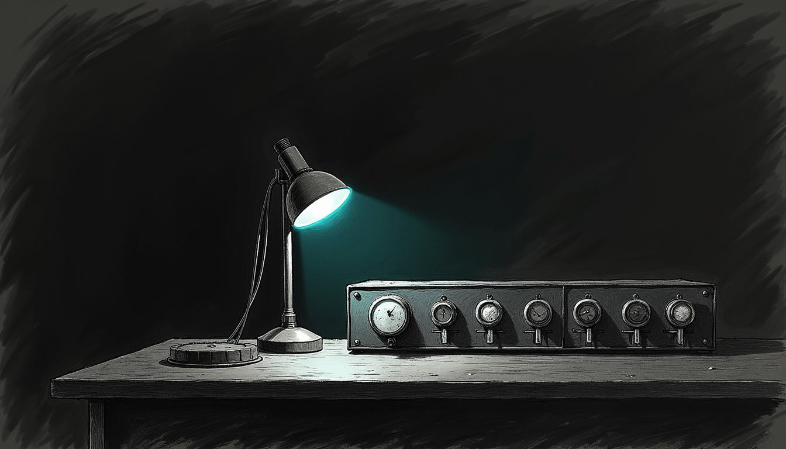

import { Aside, Steps } from '@astrojs/starlight/components';



The most important interface in Sanctum is a Signal thread with Yoda. When it
goes quiet, every other green dashboard is a lie.

On 2026-07-16 the operator watched our outbound probes land on his phone and
still got **no answers** to the messages he sent back. Health said OK. The
bridge was "up." Yoda's texts arrived. Bert's never did. The silence was
inbound-only — the worst kind, because nothing was on fire and nothing was
logged loud enough to notice.

## Symptom

Every check that could be green was green. The one that mattered was not.

| Check | Result |
|-------|--------|
| `signal-cli` / socat / yoda-chat-proxy | Up |
| Outbound send (`openclaw message send`, agent `--deliver`) | **SUCCESS** |
| Operator receives Yoda-originated texts | **Yes** |
| Operator texts Yoda | **No reply** |
| Proxy `recent_events` | Contained `dataMessage` from Bert (`"hi"`) |
| openclaw-gateway journal after that `hi` | **No agent run** |

Outbound green plus inbound mute is the tell: the transport works, and
something in the **inbound parser or the channel gate** is quietly eating
messages. The `hi` reached the proxy. It just never became an agent run.

## Root causes (stacked)

Two independent faults, either one enough to swallow a message on its own. We
fixed the first, watched the provider start, and still heard nothing — which is
how we found the second.

### 1. Channel disabled on the live gateway

On the VM, `~/.openclaw/openclaw.json` had Signal switched off:

```json
"channels": {
  "signal": {
    "enabled": false,
    "httpUrl": "http://127.0.0.1:5150",
    ...
  }
}
```

The Mac Mini host config still had Signal enabled, which is exactly what made
this so convincing — someone glancing at the twin config would swear it was on.
But the **gateway that matters runs on the sanctum-vm**, and that copy was
off. Enabling it made the provider start (`[signal] starting provider`) and
still did not process a single message. One fault down, and the room was just
as quiet.

### 2. SSE payload shape mismatch (the silent drop)

The `yoda-chat` proxy emitted its receive events like this:

```
event: receive
data: {"method":"receive","params":{"envelope":{...},"account":"..."}}
```

OpenClaw's Signal monitor reads them like this:

```js
payload = JSON.parse(event.data);
const envelope = payload?.envelope;  // undefined when nested under params
if (!envelope) return;               // silent drop
```

The envelope OpenClaw wanted at the top level was nested one layer down, under
`params`. So every real inbound envelope arrived at the proxy, was faithfully
recorded in `/api/v1/status`, and was then **discarded by OpenClaw** without a
log line loud enough to page anyone. The bridge was not down. It was reading
the mail and filing it in the wrong drawer.

The fix flattens the SSE write path so the data field is the signal-cli params
object itself:

```python
# data MUST be the signal-cli params object (top-level envelope)
payload = json.dumps(params if isinstance(params, dict) else {"value": params})
self.wfile.write(f"event: {method}\ndata: {payload}\n\n".encode("utf-8"))
```

Proof after the fix: a synthetic inject produced typing, then a send, then
`[signal] delivered reply to +15555550100`. The operator confirmed a live reply
on his phone. The round trip closed for the first time in the incident.

## Self-heal (R2D2 / signal-link-sentinel)

A fix that only a human can reapply is a fix with a half-life. The Mac-side
**signal-link-sentinel** — wrapped by R2D2 recipe `heal-yoda-signal-link` —
now treats inbound readiness as first-class, so both of the day's faults have a
named state and a named heal.

| State | Heal |
|-------|------|
| `SIGNAL-CHANNEL-DISABLED` | Re-enable `channels.signal` + restart gateway |
| `SSE-CONTRACT-BROKEN` | Re-apply SSE payload shape from goldens + restart |
| `GATEWAY-DOWN` | Restart `openclaw-gateway` + `yoda-chat-proxy` |
| (existing) `SIGNAL-CLI-DOWN` / `BRIDGE-DOWN` / `VM-CONSUMER-DOWN` | kickstart / doctor |

The sentinel gathers its facts from a probe script that lives on the VM and is
called over SSH:

```
~/.openclaw/yoda-chat/scripts/inbound-readiness.py
```

The tracked golden copies live under sanctum-config, ready to re-apply after a
rebuild wipes the VM's working copy:

```
~/.sanctum/yoda-chat/   # sanctum-config
  scripts/inbound-readiness.py
  patches/proxy.py
  patches/doctor.py
  apply-inbound-goldens.sh
```

## Operator commands

Four commands cover the whole surface — check readiness, force the heal R2D2
runs, redeploy goldens after a rebuild, and ask the VM for the raw facts:

```bash
# Readiness (Mac)
python3 ~/.sanctum/sentinels/signal-link-sentinel.py --check

# Force heal (what R2D2 runs)
bash ~/.sanctum/scripts/r2d2/heal-yoda-signal-link.sh yoda-signal-link

# Re-deploy goldens to the VM after a rebuild
~/.sanctum/yoda-chat/apply-inbound-goldens.sh

# VM inbound facts only
ssh yoda 'python3 ~/.openclaw/yoda-chat/scripts/inbound-readiness.py'
```

Healthy inbound facts come back looking like this — five booleans, all true,
or the channel is not really up:

```json
{
  "signal_channel_enabled": true,
  "sse_contract_ok": true,
  "gateway_running": true,
  "gateway_sse_subscribed": true,
  "proxy_ok": true
}
```

## Lessons

1. **Outbound success is not inbound health.** Always require a
   `dataMessage` → agent run → reply chain for the primary channel.
2. **The gateway config on the VM is the source of truth for Signal**, not
   the Mac Mini's twin `openclaw.json`. The twin is the decoy.
3. **Silent drops are worse than crashes.** If a monitor early-returns on a
   missing field, log at warn with the raw payload shape once. A crash pages
   you; a silent return lets you sleep through it.
4. **Liveness is not readiness.** Process up plus port open is necessary;
   channel enabled plus SSE contract plus subscriber connected is sufficient.
   The lineage is the rest of the bridge — [The Holocron Bridge](/architecture/yoda-chat/)
   for how yoda-chat is wired, and [Signal troubleshooting](/operations/signal-troubleshooting/)
   for the layers below this one.

For an incident that never threw an error, the receipt is small: a text goes
in, an agent runs, a reply comes back. The sentinel now refuses to call the
channel healthy until that whole round trip completes — because a bridge that
only carries traffic one way is not a bridge, it is a very convincing green
light.
