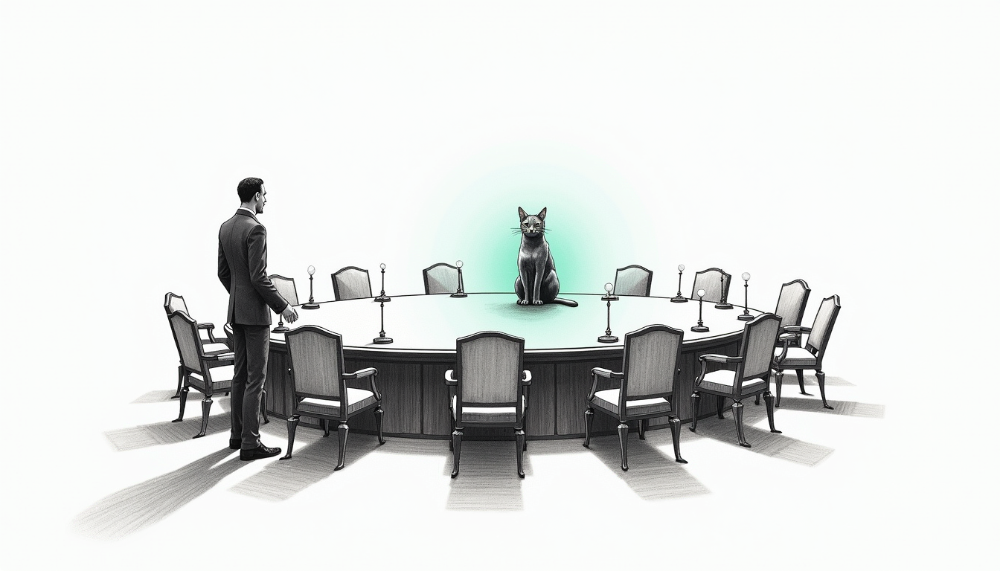

import { Aside, Steps } from '@astrojs/starlight/components';

Screen-time enforcement is the whole reason this haus exists — the one feature a parent actually depends on. On 26 July we discovered it had no owner. Not a bug: an accountability gap. A confgen run produced a confident, well-formed page describing enforcement that was not, in that moment, guaranteed to be happening — the same failure shape as an airgap that quietly reopens. Everything looked green. Nobody's name was on the question *"did the curfew actually fire?"*

An orphaned feature is worse than a broken one. A broken feature reports itself. An orphan fails silently, because no one is watching the seat.

## The wrong way to fix it

The obvious move is to assign an owner. Point at the Grand Master, say "screen-time is yours," and move on. That is how you get a DRI who owns policy it cannot set and levers it does not hold — a nameplate on an empty chair.

So instead of assigning, we asked. Each council seat was put the same question: which tentpole do you want to be DRI for, end-to-end, and what is the one functional probe that proves you are doing it? Ownership is **claimed, not imposed**. A seat that could not name a real probe did not get handed the territory.

Eight of ten resolved themselves in a single round.

| # | Tentpole | DRI |
|---|----------|-----|
| 1 | Screen-time | **Windu** |
| 2 | Infrastructure | Qui-Gon |
| 3 | Security | Windu |
| 4 | Operations | Mothma |
| 5 | Health | Cilghal |
| 6 | Finance | Mundi |
| 7 | Chalet | Ahsoka |
| 8 | Comms | Jocasta |
| 9 | AI model fleet | Yoda |
| 10 | Memory / continuity | Qui-Gon (Jocasta sub) |

## Windu claimed the crown jewel

Screen-time went to Windu, and he claimed it himself — not because it is important, but because every tooth already lives in his hand. The Firewalla is his. The network map is his. Bypass attempts — VPN, DoH, MAC randomization — are intrusion detection wearing a different hat, which is his charter verbatim. Three other seats had independently nominated him. He came with a real probe. That is what claiming looks like.

The one clean boundary: **policy is Bert's**. Windu does not decide when a twelve-year-old sleeps; he guarantees the decision holds and proves it.

<Aside type="note" title="Two things went to Bert to break">
Windu claimed both Security and Screen-time unhedged — one seat holding the perimeter and the family's most-used feature. Bert consented, with a tripwire: if screen-time consumes over 40% of Windu's incident load in any 30-day window, or a security probe regresses while screen-time is green, the two split. Reviewed monthly by Mothma. Separately, Memory was an orphan too — declined by all three adjacent seats — and Bert assigned it to Qui-Gon end-to-end, with Jocasta as sub-DRI for the records layer.
</Aside>

## Never grade your own homework

The real risk with screen-time was never load. It was Windu marking his own paper. Enforcement that silently stops still answers pings; a doctor that checks its own work will report itself healthy right up until the quarter it lost.

So the **verification** slice was carved off and given to Mothma, structurally independent — it does not report through Windu. Windu owns *enforcement*; Mothma owns *did it actually fire*. Cilghal advises on outcome (does the curfew move sleep onset earlier) but never touches the blocking, and no raw health data crosses into Security. Her firewall holds.

> Silent failure is the danger with this feature, and silent failure is Mothma's business.

## The Standard

Out of the round came a standard Mothma now holds every seat to. Four requirements, no exemptions:

<Steps>
1. **One end-to-end functional probe** — a synthetic transaction through the *real* production path, asserting a business outcome. A probe silent for 25 hours is a FAIL, not a pass. Dead probes look green.
2. **A declared circuit-breaker**, with a domain-specific fail direction. Security and screen-time fail *closed*. Health and finance fail *silent* — no number beats a wrong number. Infrastructure and ops fail to *last-known-good*. Chalet fails *locally autonomous*. Comms fails *queued*.
3. **A declared autonomy posture.** Infrastructure, ops, fleet, comms, memory, and chalet heating *auto-heal* — pipes freeze faster than humans answer phones. Security, screen-time, health, finance, and the chalet alarm are *escalate-biased*: family-safety and money do not get to improvise.
4. **A declared upstream list** — so Force Flow can suppress a storm of forty symptoms into one root-cause incident.
</Steps>

> "A seat that cannot meet all four is not a DRI, it's a volunteer."

## What is actually running

Two seats already have doctors. **Qui-Gon** is live — the infrastructure self-healer, auto-heal and castellan-governed, running at boot and hourly with gated remediation authority. **Windu's doctor was built today**, escalate-biased by design: it runs three functional probes — the Curfew Canary, the perimeter posture check, and a live PII-scrub test — and on a confirmed regression it surfaces and proposes the exact remedy. It never changes auth, firewall, secrets, or a child's controls on its own. When it cannot verify, it reports UNVERIFIED rather than a comforting false green. The other seven doctors are roadmap, each owing the probe they already named.

The fix here was not a firewall rule or a script. It was putting a name on a chair that had been empty the whole time — and building the thing that files a complaint when the seat goes quiet.
</content>
