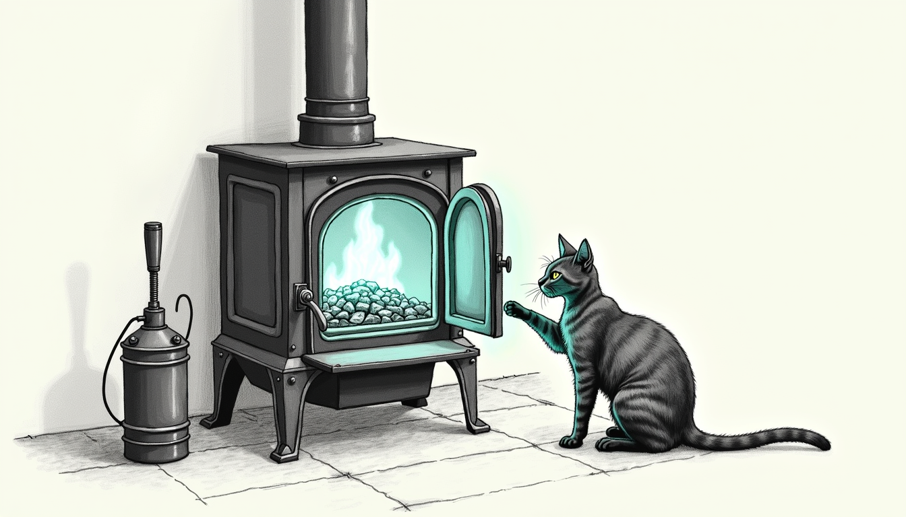

import { Aside, Steps } from '@astrojs/starlight/components';



Qui-Gon stopped answering. Every turn failed the same way — both his seats timing out at 120 seconds — while the model behind them answered a short prompt in eight. Nothing was down. Nothing was misconfigured. The thing that had made him fast was simply gone, and the machine built to restore it could no longer tell.

## Three wrong diagnoses, in order

The first instinct was **the model is too slow**. Measured cold, Devstral ran 6.2 tok/s against the 35B's 34.5 on the same task, which looks damning until you notice the comparison is unfair: Devstral is 24B *dense*, every parameter active per token, while the 35B is A3B — 35 billion parameters, roughly three billion of them awake at any moment. A sixfold gap is architecture, not defect.

The second was **the box is thrashing**. It genuinely had been: 17.8 GB of 18.4 GB swap consumed, free RAM at 0.1 GiB, decode swinging 37 to 88 tok/s where it once held near a hundred. That got fixed. Qui-Gon still died.

The third was **the prompt is too big**. It isn't. His whole context sits well inside the cap.

<Aside type="caution" title="A measurement of a broken warm-path is not a measurement of a model">
The 6.2 tok/s figure came from a cold, uncached prompt. Qui-Gon's real path is a ~19k-token cached prefix that answers at 3.6s TTFB with a 99.7% cache hit. Benchmarking the cold path and concluding the model was slow nearly replaced a component that was working exactly as designed.
</Aside>

## What was actually wrong

A sentinel exists to warm that prefix. Its trigger was:

```bash
[ "$REQS" = "0" ] || exit 0
```

`total_requests == 0` is the freshly-restarted-cold signature. It fires **once per process lifetime** and then can never fire again. But the prefix cache ages out under memory pressure long before the process does. When it went, Qui-Gon cold-prefilled for minutes and died on OpenClaw's 120-second idle timer — a limit that cannot be raised from outside.

The sentinel sat idle throughout, because `total_requests` was 12, not 0. It was detecting a **cold process**. The problem was a **cold cache**. Those are different failures that happen to share a name — and the warmer had been guarding the one that almost never happens.

## The fix

`/health` exposes no cache metric, so the trigger now uses the best available proxy — idleness:

<Steps>
1. No request for 25 minutes, so assume the prefix is evicted and re-warm.
2. `total_requests` *drops*, so the process restarted underneath us — re-warm. The old check caught this only if it happened to sample exactly zero.
3. First run records state and waits, rather than firing blind.
</Steps>

The warming turn is sacrificial by design: its own gateway timeout is expected, and the detached prefill is the point.

## Proving it, not asserting it

Backdating the state file produced `idle 31m >= 25m — prefix cache assumed evicted`, the prewarm landed (`total_requests` 12 to 13), and the turn that had been failing completed — returning the VM's actual kernel `boot_id`, confirmed against `/proc`. That is the proof standard used when the seat was commissioned, and it is not a value a model can invent.

## The part worth keeping

The memory work that preceded this was real and it helped. Bounding [the cathedral's Metal ceiling](/operations/2026-07-06-the-cathedral-holds-two-minds/) took it from 24 GB to 19 GB and turned decode from a 2.4x swing into a steady 39 to 49 tok/s. But it did not fix Qui-Gon, because Qui-Gon was never a memory problem.

There is a specific trap here, and it is subtle. Reading `swap used` alone said the box was still in trouble at 13 GB. Reading **swapouts per interval** said zero — the pages were parked, not moving. One number is a high-water mark, the other is what is happening now. The same class of error, hours earlier, came from computing free memory with a 4 KiB page size on a machine that uses 16 KiB pages: a figure that looked authoritative and was wrong by exactly four. It is the discipline [a rotated key taught the trifecta two days later](/operations/2026-07-28-the-cache-that-overwrote-the-source/) — verify the value, never the word that stands in for it.

A monitor that watches the wrong quantity is worse than no monitor, because it reports success while the thing it was built to protect quietly stops working. Tommy, the haus's oldest observer, has no tools and no permissions and cannot warm a single cache — but he has never once mistaken a cold hearth for a warm one, because he watches the fire and not the log line that swears there is one. The sentinel does that now. It stopped counting restarts and started noticing the cold.
