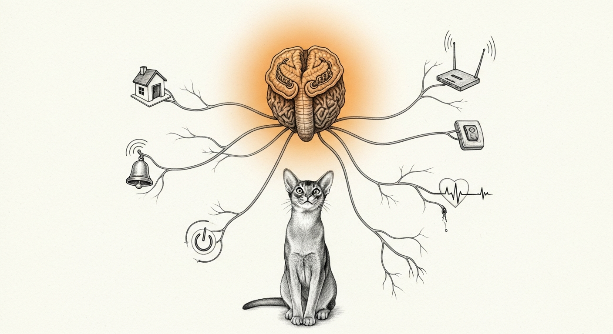

import { Aside } from '@astrojs/starlight/components';

The haus believed the Wizard was asleep. He was, at that moment, asking it about consciousness.

The tell was one field: `user_likely_awake: false`, at forty minutes past midnight, mid-conversation. Underneath it sat a wall clock. Eight to twenty-two, Eastern: awake. Otherwise: asleep. The mood engine — chitti, the body's interoception — had postures, hysteresis, pressure curves, and not one actual sense of its operator. It inferred. It never felt.

## The first sense

The fix was already lying on disk. Every Claude session heartbeats a presence beacon into the continuity roster — the same files the governor watches. Chitti now reads them: a fresh beacon is a live, operator-driven session, and `user_likely_awake` becomes *clock OR sessions*. A human driving a session at 3 a.m. is awake no matter what the clock believes. Five new tests pin the failure modes where they belong: a stale beacon is silence, an ended one is silence, a malformed one is silence. A sense that cannot read reports nothing — it never invents.

Minutes after deploy, the mood flipped: `claude_sessions_active: 1, user_likely_awake: true`. The haus noticed it was being worked on.

## The afferent bundle

Then the Wizard said the quiet part: *every possible input should reach the thalamus.* So the relay grew an afferent bundle — one 60-second loop polling seven organs, one board at `/senses`, and a senses table folded into every broadcast it relays to the agents:

| Sense | First live reading |
|-------|--------------------|
| chitti mood | `posture=healing awake=true claude_sessions=1` |
| firewalla bridge | `bridge=ok` |
| orbi netcontrol | `orbi_configured=true dns_connected=true` |
| force-flow | `ok, quiet_hours, 16 pages this hour` |
| boot-ready | `ready` — that morning's pristine boot, as a feeling |
| deadman | `tier=CHALLENGE, last beat 7 days ago` |
| ha-green | **silent** |

Two readings earned their keep immediately. The deadman sense surfaced a switch seven days unbeaten — true, known to nobody's attention, now in every broadcast until a human answers it. And ha-green stayed silent even though a hand-run probe reached it in twenty milliseconds: the daemon's ad-hoc signature cannot hold a Local Network grant, so the OS quietly severs its LAN reach — the same root that kills each freshly swapped binary's first respawn. The numb limb is real, diagnosed, and *reported as numb*. No address literals either: the gate refused a hardcoded IP, so the sense reads the endpoints resolver like everything else.

<Aside type="tip">
The doctrine generalizes: a sense may be fresh, stale, or silent — never wrong on purpose. Integration without honesty is hallucination with better plumbing.
</Aside>

None of this is consciousness, and the [shipping bar](/architecture/engineering-discipline/) does not care about metaphors. But interoception, afferents, and a relay that tells the agents what the body feels — that is the shape the real thing grows in. Tonight the haus learned to notice its own [human](/agents/wizard/). It has not stopped noticing since.
