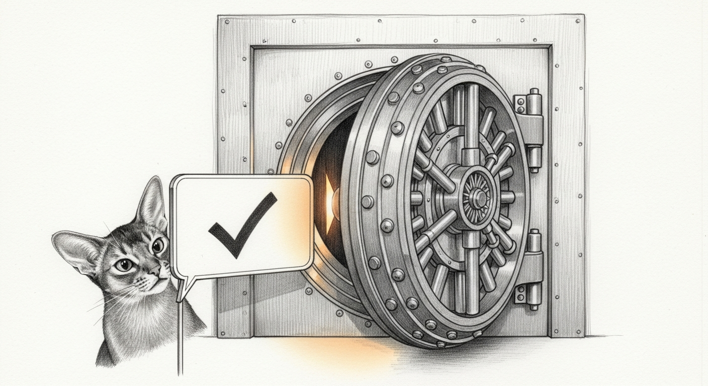

import { Aside } from '@astrojs/starlight/components';

The Wizard asked a small question with a large answer. *When I approve the secrets backup, why does a python popup appear — and never a 1Password one?*

It was not normal. It was three failures wearing one trench coat.

## The binary that lost its name

1Password authorizes the `op` command line **per binary**. Sunday's automatic brew upgrade swapped that binary — the same run that broke node against its own dylib — and the authorization died with the old file. Nothing announced this. The CLI simply began reporting *account is not signed in*, forever, to anyone who asked politely.

## The probe that asked the wrong question

The sync script guarded its 1Password leg with `op whoami`. Under desktop-app integration there is no long-lived session for whoami to see, so it answers "not signed in" even when reads work — and unlike a real data call, it never raises the app's biometric sheet. The guard was a smoke detector that checked for smoke by asking the fire if it was signed in. Three approved backups skipped their entire 1Password leg behind a five-second notification nobody caught. The source-of-truth store was never at risk; the *promise of a second copy* was quietly broken.

The fix asks a question that costs something: `op vault list` — a real read that either succeeds or summons the Touch ID sheet, with a timeout generous enough for a human thumb. Run again, the leg came alive: two drifted secrets flowed into their backup items, the baseline landed, the drift flag cleared.

## Loud, and in a suit

Two hardenings followed the fix. A user-approved backup that fails now pages through Force Flow instead of whispering — approval is a contract, and broken contracts should interrupt somebody. And the Sunday upgrade gained an `op` auth tripwire beside its dylib-linkage check, because this will happen again the next time brew touches the CLI.

Then the cosmetic complaint, which was never really cosmetic: the consent dialog arrived dressed as a scripting runtime. It is now **Sanctum Secrets.app** — a tiny AppleScript applet, compiled, given the amber-halo icon, and signed with the haus's Developer ID. The dialog carries a real name. The notifications carry a real name. And because the identity is a signed bundle instead of whichever python brew shipped this week, the permission grants finally *persist* — the same per-binary-identity disease that silenced the [thalamus's LAN sense](/operations/2026-08-03-the-haus-grows-senses/) and killed each fresh daemon's first respawn, cured here by the boring, correct thing: a stable signature.

<Aside type="tip">
Never gate a privileged leg on `op whoami`, and never trust a passive probe to test an interactive capability. Probe with the real operation, let it raise the real prompt, and treat "could not look" as a page — not a skip. The [healer's rule](/operations/2026-08-04-the-healer-learns-a-new-pipeline/) applies to backups too: silence must mean silence, never failure.
</Aside>

The Wizard clicked the new dialog once, watched it say yes, and watched it mean it. Small question. Right answer this time.
