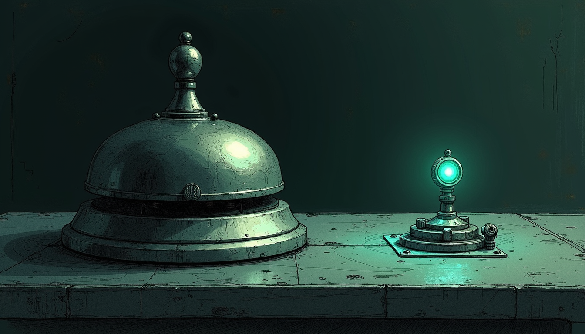

import { Aside } from '@astrojs/starlight/components';

The CRITICAL arrived loud. Force Flow opened the bridge circuit, Signal got the DOWN page, Sonos said its piece, the phone woke. Five minutes later the log line was honest enough: *Bridge recovered — screen-time enforcement restored.* The phone did not wake. Signal did not chirp. The dashboard absorbed a warn and went back to sleep.

That is how you learn a self-heal is only half a contract.

## What was actually broken

The Firewalla bridge on the Mini was not down. `GET /health` returned ok. The bearer token on disk matched the process env. Nothing was shadowing the Orwell port. The breaker tripped on **HTTP 500** responses from host name and lookup calls under load — three in a row, circuit open, enforcement paused for the backoff window.

Windu is the screen-time DRI and was never supposed to reinvent that path. His doctor is escalate-biased: probe, surface, propose. The auto-heal seats are Force Flow's circuit breaker, the bridge sentinel, and Qui-Gon when a critical kicks him. All three did their jobs. The missing piece was the human-facing close of the loop.

## The routing lie

Force Flow's severity map is deliberate. A `critical` DOWN rides `iphone_critical`, Sonos, Signal, and the dashboard. A `warn` restore rides `iphone_silent` and the dashboard — ambient by design, so flap storms do not re-page the haus every half-open probe.

The restore was therefore **technically correct and operationally mute**. Anyone who only watches Signal — Sanctum's main operator channel — saw a CRITICAL with no corresponding recovery. The outage looked open for hours after the bridge was fine.

## The fix

In `screen_time.py`, the breaker already remembered that it had alerted. It did not remember *how hard* it had alerted. The patch tracks `paged_severity` on open and branches on close:

| DOWN severity | Restore behaviour |
|---|---|
| `critical` | `force_channels=["signal", "dashboard"]` — Signal always gets the close, quiet hours included |
| `warn` (flap window) | ambient warn restore — no Signal spam |
| boot-grace open | still silent — parents were never paged |

`force_channels` is the Force Flow escape hatch that bypasses severity routing. Using it only on critical self-heal keeps the flap hysteresis honest and puts the recovery where the operator actually looks.

The suite that owns the breaker (`test_bridge_resilience.py`) now asserts the critical path: one restore, severity `info`, Signal forced, message says *back to normal*. The flap path stays ambient. Twelve of twelve green.

## Deploy path

`sanctum-screen-time` on the Mini is the live engine (symlink into Force Flow). Land `1ca17c9` on `main`, pull on the Mini, then **actually** restart the process that owns port 4077. A plain `launchctl kickstart` is not enough when the launcher sees a healthy orphan listener and exits zero without reloading code — kill the listener, let KeepAlive respawn, confirm process start is after the file mtime.

<Aside type="caution" title="A healthy port is not a loaded patch">
Force Flow's launch wrapper deliberately no-ops when `:4077/health` is green. That saves EADDRINUSE storms. It also means a kickstart after a git pull can leave yesterday's Python process holding the port. Verify start time against the tree you think you shipped.
</Aside>

## What EETISMAD looks like here

| Gate | Evidence |
|---|---|
| Everything E2E Tested | `test_bridge_resilience.py` 12/12 including Signal-on-critical-restore |
| in Sanctum-docs | This field note + sidebar entry |
| Merged | `sanctum-screen-time` `1ca17c9` on `origin/main` |
| And Deployed | Force Flow reloaded on the Mini; bridge sentinel HEALTHY; authenticated `/hosts` 200 |

The bridge still has a real failure mode under 500 storms. That is a box-side problem, not a Mac-side token problem. What changed is that when the circuit opens loud and closes itself, the operator hears both doors — which is the same honesty rule [Screen Time Enforcement](/operations/screen-time-enforcement/) already demanded of the block path, enforced here through [Force Flow](/architecture/force-flow/) severity routing under the [EETISMAD](/architecture/engineering-discipline/) bar. Windu still owns the reliability DRI; he still does not edit secrets alone ([DRI Governance](/operations/2026-07-26-dri-governance-the-council-picks-owners/)).

## Related

- [Screen Time Enforcement](/operations/screen-time-enforcement/) — the runbook the breaker protects
- [Force Flow](/architecture/force-flow/) — notify routing and quiet-hours doctrine
- [Engineering Discipline](/architecture/engineering-discipline/) — EETISMAD as the shipping bar
- [DRI Governance](/operations/2026-07-26-dri-governance-the-council-picks-owners/) — Windu owns screen-time reliability, not autonomous secret edits
