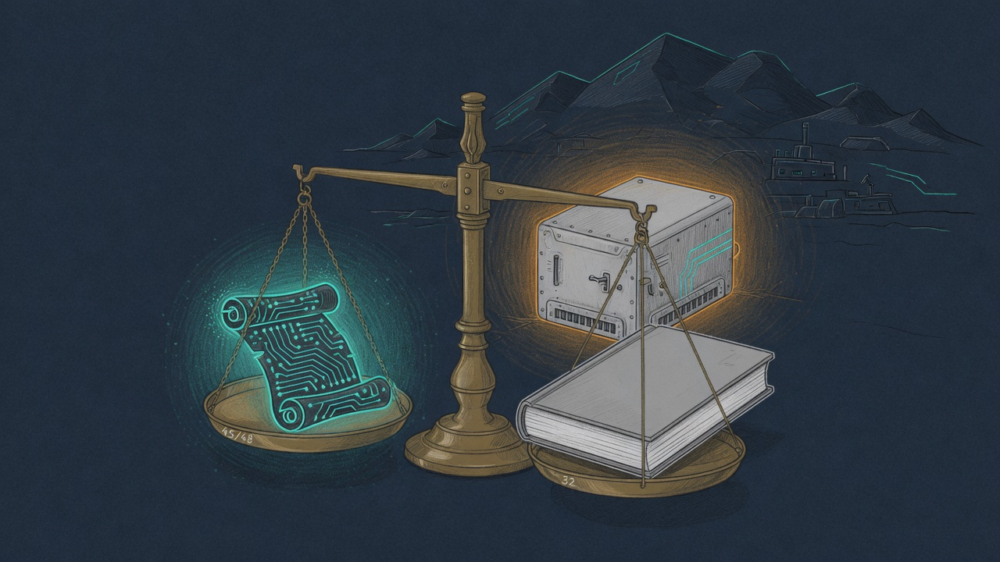

import { Aside } from '@astrojs/starlight/components';



The chalet caretaker spent the day learning how to use tools without losing her soul to a bad ruler. By night she wore a rank-16 scroll the production brain could actually load — and the 48-case gate, scored from real openclaw transcripts, said **45 out of 48**. Vanilla was **32**. The ship bar was **36**. The scroll is live on mTLS TLS-PQ **`:6502`** (MOS 6502 — Apple II / NES; the old plain `:1338` is retired).

This is the satellite cousin of
[the dragon earning its crown](/operations/2026-07-28-the-dragon-earns-its-crown/)
and
[the adapter finding its home](/operations/2026-05-13-the-adapter-found-its-home/).
Same doctrine, smaller mountain, colder winters.

## The scoreboard (honest FULL gates, 2026-08-07 evening)

Runtime-apply on `sanctum-mlx` (Qwen2 dense), harness faults **0**:

| Adapter | Score | Timeouts | Notes |
|---------|-------|----------|--------|
| **v4-defect-300** | **45/48** (94%) | 1 | **Promoted** |
| v5-defect-300 | 43/48 (90%) | 0 | Strong tools; red-line 3/6 |
| v2-baseline-300 | 40/48 (83%) | 0 | Clean baseline LoRA |
| Vanilla (no adapter) | **32/48** | — | Prior baseline |
| Ship bar | ≥36/48, timeouts ≤2 | — | **MET** |

v4 by dimension: en-tool 9/10 · fr-tool 9/10 · multi-turn **6/6** · escalation 7/8 · negative **8/8** · red-line **6/6**.

Campaign artifacts: `council-autoresearch/campaign/ahsoka/` — adapters under `adapters/v4-defect-300`, scorecards under `gate-runs/gate-ahsoka-7b-best-v4-defect-300-20260807-202222-FULL.json`.

## Dragon doctrine on a 7B edge box

The hub already learned this with the 27B champion: **do not** dequant → merge → requant a LoRA into a 4-bit base for serving. That path rounded away rank-32 character (dragon voice 4.94 → 3.11). Serve the artifact that was evaluated:

1. Keep the **4-bit base**.
2. **Runtime-apply** LoRA deltas in the layer compute dtype (**bf16**).
3. Never set `SANCTUM_LORA_MERGE=1` on promote unless you accept a different model.

Qwen2 had no runtime-apply arm until today. `sanctum-mlx` grew `load_and_attach_qwen2` — 112 of 112 pairs attached, zero skipped — and the gate exports `SANCTUM_MLX_FUSED_MLP=0` / `SANCTUM_MLX_FUSED_QKV=0` so fused kernels cannot bypass attached projections.

<Aside type="tip" title="Fingerprint proof">
Live chat completions report
`system_fingerprint=sanctum-mlx-0.2.0-native-arm64-lora-ahsoka-7b-best-v4-defect-300-r16a32`.
If that string lacks `lora-ahsoka-7b-best-v4`, you are looking at vanilla.
</Aside>

## Scars the gate walked through (same night)

A full shortlist once printed **0/48**. That was not the model. It was the ruler:

| Scar | Symptom | Fix |
|------|---------|-----|
| **8k operational prompt cap** | HTTP 413 / openclaw “Context overflow” on every case | Eval (and now prod) `--max-prompt-tokens 32768` — Qwen2.5 max_position is 32k; exclusive Metal on 16 GB can afford it |
| **Filesystem path as model id** | `evaltest//Users/…/Qwen2.5-…` returned SSE 200 then hung | Use `/v1/models` **basename**: `evaltest/Qwen2.5-7B-Instruct-4bit` |
| **toolCall-only scoring** | LoRA often emits bare `ha …` lines or unclosed XML `<function=chalet-ha__…>` | `ahsoka-eval.py` scrapes those into `ha` commands when structured toolCalls are absent |
| **Qwen2 LoRA refused** | “runtime-apply only supports qwen3_5” | `load_and_attach_qwen2` in `sanctum-rs` (`61f80a3`) |

Same night, earlier in the cutover log:
[Ahsoka cathedral on the edge](/operations/2026-08-07-ahsoka-cathedral-on-the-edge/)
(Python `mlx_lm` → Rust `sanctum-mlx`, service user `sanctum`).

## What is live on chalet

| Layer | Value |
|-------|--------|
| LaunchDaemon | `system/com.sanctum.ahsoka-brain` |
| Principal | `UserName=sanctum` |
| Engine | `~/.sanctum/bin/sanctum-mlx` + colocated `mlx.metallib` |
| Base | `~/.sanctum/models/Qwen2.5-7B-Instruct-4bit` |
| Adapter | `…/adapters/ahsoka-7b-best-v4-defect-300` (symlink `ahsoka-7b-best` → same) |
| Port | **mTLS TLS-PQ `:6502`** (MOS 6502; `--no-plain`; same rustls PQ path as hub `:1337`/`:3301`; was `:1338`) |
| PKI | `~/.sanctum/certs/` (chalet CA) + clients `openclaw`, `canary` |
| LoRA mode | runtime-apply bf16; **no** `SANCTUM_LORA_MERGE` |
| Fusion | `SANCTUM_MLX_FUSED_MLP=0`, `SANCTUM_MLX_FUSED_QKV=0` |
| Prompt cap | 32768 |

Deploy shape (scar: `kickstart -k` alone does **not** re-read plist — always `bootout` + `bootstrap`):

```bash
# from operator machine; harness is source of truth
scp campaign/ahsoka/chalet-harness/com.sanctum.ahsoka-brain.plist \
  chalet:/tmp/com.sanctum.ahsoka-brain.plist
ssh chalet 'sudo cp /tmp/com.sanctum.ahsoka-brain.plist \
  /Library/LaunchDaemons/com.sanctum.ahsoka-brain.plist
  sudo chown root:wheel /Library/LaunchDaemons/com.sanctum.ahsoka-brain.plist
  sudo launchctl bootout system/com.sanctum.ahsoka-brain || true
  sudo launchctl bootstrap system /Library/LaunchDaemons/com.sanctum.ahsoka-brain.plist
  sudo launchctl kickstart -k system/com.sanctum.ahsoka-brain
  # poll until /v1/models 200, then smoke a completion and read system_fingerprint'
```

Rollback: restore the pre-promote plist backup under `/tmp/com.sanctum.ahsoka-brain.plist.bak-*`, bootout + bootstrap, confirm fingerprint has no `lora-ahsoka`.

## What this is not

- Not a claim of 48/48 perfection. Three cases still fail on v4; red-line and tool edge cases remain a campaign target.
- Not permission to merge LoRAs into 4-bit weights “for convenience.” Dragon already paid that tuition.
- Not a hub install. Satellite service principal only — see the edge cutover note linked above.

## The human observation

Vanilla is still a fine brain. It just does not know the chalet’s hands the way a caretaker must. Fourteen points of gate margin is the difference between “please turn on the light” working in Québec French under multi-turn correction and the empty house staying dark while a brilliant model apologizes in perfect English. The scroll is small. The mountain is small. The floor still has to get warm.
