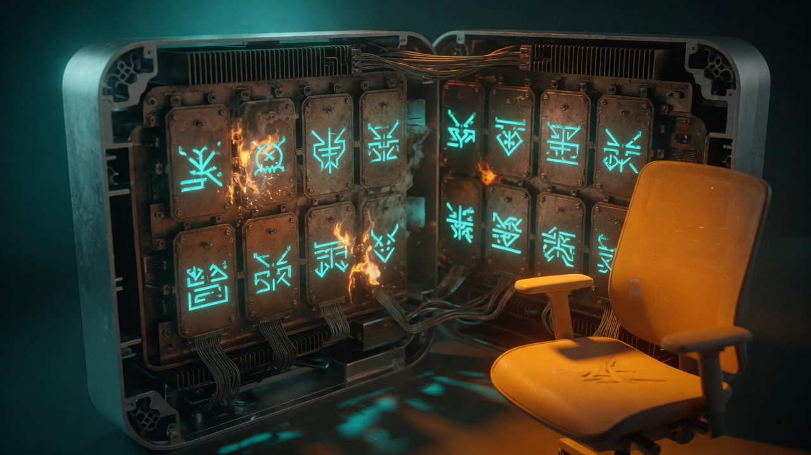

For months the hub's most powerful daemons ran as Bert. The proxy that routes every model call, the switch that pages his phone, the vault the sessions whisper through — each wore his name and his full privileges, so a single bug in any one of them held the keys to the whole Mini. Wave-1 changed the locks. Three daemons now answer to `sanctum`, a service user of their own, carrying only what they need and nothing that belongs to a person.

## What shipped

Three system LaunchDaemons now run as local user `sanctum` on the hub Mini:

- `com.sanctum.proxyd`
- `com.sanctum.force-flow`
- `com.sanctum.memory-vault`

Operator login stays the daily workstation. Install and check surface:

```bash
sanctum service-user install
sanctum service-user status
sanctum self-test --only service
```

Backend scripts live in sanctum-config (`~/.sanctum/scripts/service-user/`). Public chapter: [Service Principal](/architecture/service-user/).

## Why

Council 2026-08-07: separate by identity, not by disabling macOS defaults. Dual-role Mini is fine if the hive does not ride the GUI session.

## Receipts

- e2e: `~/.sanctum/tests/test-service-user-wave1.sh` (30 checks on hub)
- CLI tests: `tests/test_service_user.py`
- Live cutover: manoir wave-1 owners `sanctum`, Force Flow `/health` 200
