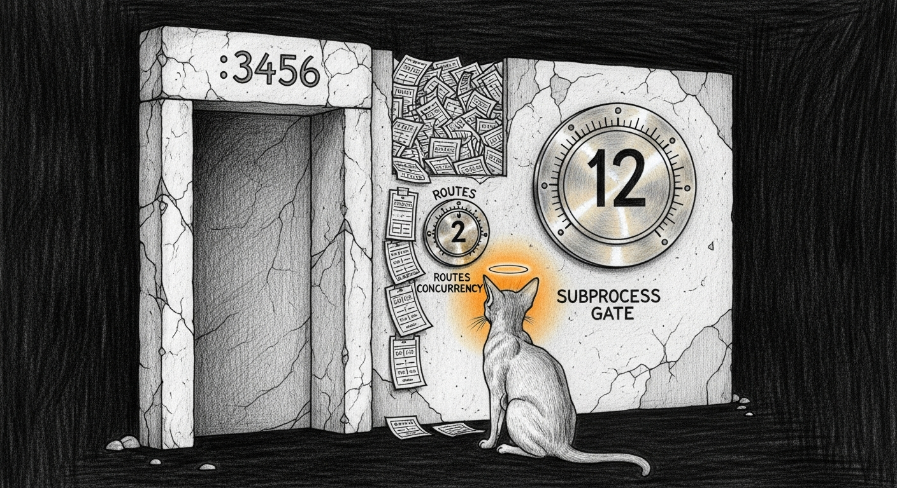

import { Aside } from '@astrojs/starlight/components';



The banner looked like a routing policy failure: **`ROUTE claude-fable-5 → claude-best-pro (local · claude-opus-4)`**. The reflex was familiar — wrong account, Team vs Max, [proxyd](/architecture/proxy/) rewriting Opus, e2e lying. We checked each of those first. They were all wrong. The fire was one door upstream, with two dials on it.

## What it was not

Live OAuth against the Mini's token said **personal Max**: org type `claude_max`, tier `default_claude_max_20x`, active org the personal Max subscription — not the Team orgs that also appear as memberships on the same account. Fable and best-pro both pointed at the same Max bridge on `:3456` with different `api_model` values. When the path worked, stream probes returned `model: claude-fable-5` with no ROUTE banner. Account type was a red herring.

The daily light e2e stayed green the whole time. It only checks format contracts with empty `messages` — no inference, no seating assert. That is how you get a green monitor and a red session in the same hour.

## The two dials

`claude-max-api-proxy` has two independent concurrency fences:

| Env var | Where | Default if unset | What it gates |
|---------|--------|------------------|---------------|
| `CLAUDE_MAX_CONCURRENCY` | `routes.js` semaphore | **2** | HTTP requests that may enter the bridge |
| `CLAUDE_MAX_SUBPROCESS_CONCURRENCY` | `manager.js` gate | **12** | CLI subprocesses after a request is admitted |

The LaunchAgent only set the second. So the real limit was **two concurrent** Claude CLI jobs, while the subprocess dial advertised twelve. Long council and agent `claude --print` sessions held both slots. Everything else queued. Non-stream waits for full completion — queue time became TTFB — clients timed out at 60s — seat error rates climbed — proxyd's fallback ladder stepped from fable to best-pro (same bridge, Opus alias). The ROUTE banner was honest: fable failed, next rung answered.

Lifetime counts backed it: hundreds of subprocess exits with code **143** (SIGTERM from the manager timeout path) sitting next to clean zeros. Under load, non-stream hung. Idle, a short pong completed in about six seconds and seated fable.

## The fix

Set both dials in the live Mini LaunchAgent and bootstrap (not merely `kickstart` — env is only re-read on load):

```xml
<key>CLAUDE_MAX_CONCURRENCY</key>
<string>4</string>
<key>CLAUDE_MAX_SUBPROCESS_CONCURRENCY</key>
<string>12</string>
```

Canonical path: `~/.sanctum/launchagents/live/com.sanctum.claude-max-proxy.plist` (symlinked into `~/Library/LaunchAgents/`). Landed as `sanctum-config@84451aa`. After bootstrap, `launchctl print` and `ps eww` both showed `CLAUDE_MAX_CONCURRENCY=4`.

Four is deliberate: enough headroom for a short operator probe while a long agent turn runs, without returning to the unbounded spawn storm the original 2026-06 concurrency patch was written to stop. Host-tools policy for what may land on that bridge still lives in [proxyd host-tools](/architecture/proxyd-host-tools/) — concurrency is how many may land at once; host-tools is *what* is allowed to land there.

## What e2e learned

Light mode still owns plumbing and Anthropic-native error shape. Full mode now owns the truth that light cannot see:

- **Mini:** `proxyd-fable-seat-nonstream` / `stream` — real short completion; **FAIL** if `x-sanctum-seated` is not fable; WARN if seated but slower than 45s (queue smell).
- **MBP tunnel:** `tunnel:fable-seat-*` — same contract through `https://127.0.0.1:4040`.
- **Bridge knobs:** `bridge-concurrency-knobs` — WARN if routes concurrency is unset or under 4.
- **SIGTERM ratio:** sample of last 200 process closes; clean/rotated log is PASS, not a missing-signal WARN.
- **Refresh horizon:** FAIL under 1 day, WARN under 3 days, PASS with horizon in detail when longer (the old under-7 WARN fired for a week of healthy live tokens).

Scripts live in `sanctum-mbp` (`scripts/proxy-e2e.sh`, `scripts/proxy-e2e-mini-probes.sh`), symlinked from `~/.sanctum/scripts/` on the MBP.

## Operator checklist

```bash
# Bridge env (must show CONCURRENCY=4)
launchctl print gui/$(id -u)/com.sanctum.claude-max-proxy | grep CLAUDE_MAX

# Seat a real fable turn through the tunnel
curl --cacert ~/.sanctum/certs/mini-proxyd-ca.crt -sS -D- \
  -H 'content-type: application/json' -H 'anthropic-version: 2023-06-01' \
  -d '{"model":"claude-fable-5","max_tokens":16,"messages":[{"role":"user","content":"pong"}]}' \
  https://127.0.0.1:4040/v1/messages | grep -i x-sanctum-seated

# Full chain (inference burns a few Max tokens)
~/.sanctum/scripts/proxy-e2e.sh --full
```

After a concurrency change: **bootstrap** the LaunchAgent, do not only kickstart. After a long incident: heal sticky seat error windows with a handful of short successful fable completions, or restart proxyd when you have daemon privileges — exponential decay alone is slow.

<Aside type="caution" title="Two dials, one queue">
Raising only `CLAUDE_MAX_SUBPROCESS_CONCURRENCY` does nothing if the routes semaphore is still two. The large dial is a spare key to a door the small dial already closed. Read both env vars on the live process, not the comments in the patch script.
</Aside>

## Landing

The ROUTE banner was never inventing a diversion. It was reporting that fable could not get a slot on a bridge whose public concurrency dial said twelve and whose private one said two — the same lesson as [the day the proxy was never the problem](/operations/2026-07-21-the-proxy-was-never-the-problem/): believe the router, then measure the queue behind the door it points at. Turn the small dial. Assert seating on real completions.
