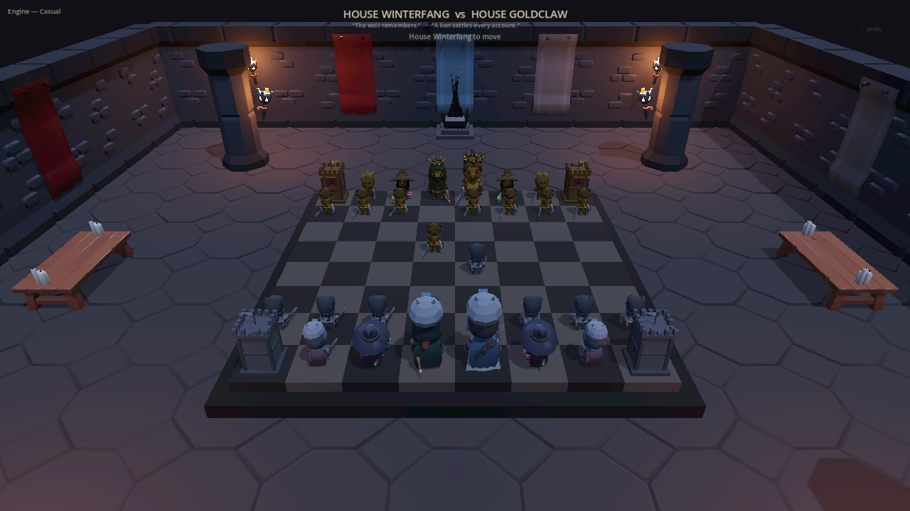

import { Aside } from '@astrojs/starlight/components';

Bert asked for the best chess game in Godot. A research sweep fanned out across engines and forks and came back with Duke's Gambit — an existing 3D battle-chess with a compiled native AI. It shipped before lunch. Then a small bridge changed the flavor of the day: the [ds4 Oracle](/agents/ds4-agent/) took the other side of the board, DeepSeek answering from the MBP over TB5, and Bert was playing chess against his own local model. He considered that for a moment and raised the stakes: *make it look like Game of Thrones.*

## Thirty agents, nine banners

What followed was thirty agents in five waves — research, scaffold, engine port, asset, integration — building an original game in `~/Projects/godot-lab/great-houses-chess`. Not a reskin of Duke's Gambit: its own rules code, its own look, its own tournament.

Nine original great houses, every sigil an IP-safe wink — Winterfang, Goldclaw, and seven more banners in a bracket. A torch-lit great hall. Per-house costumed armies dressed from CC0 KayKit, Quaternius, and Kenney packs, finished with headless-Blender props: crowns, sigil crests, watchtower rooks flying their banner, a throne of blades. Captures play out as slow-motion duels with in-character smack talk — 576 hand-written lines, plus live DeepSeek generation when the script runs dry. A medieval CC-BY/CC0 soundtrack. A spectator dragon that judges every move and, at mate, incinerates the losing army Mortal-Kombat-style, leaving charred skeletons smoking on their squares. A Stockfish-backed Grand Maester mode, where the engine proposes candidates and DeepSeek picks one with in-character reasons. Undo and take-back. And an in-engine e2e suite thirty scenarios deep, driving real synthesized input — every scenario green.

## Five bugs the suite never saw

Then the family sat down to play. Bert and Albert put one evening on the finished game and handed the haus five real bugs the suite had missed:

- the capture-notation parser censoring moves it should have read
- board-wide tile parity inverted, wearing the costume of a king-and-queen swap
- a queen with a mustache
- every Oracle reply landing at a flat two minutes
- duelists playing their slow-motion capture without facing each other

Five defects, one sitting, none of them visible to thirty green scenarios. Each was run down evidence-first — reproduce, observe, fix, observe again — and each fix landed with a new scenario that would have caught it.

## The board that argued with itself

The parity bug earned its own act. Two agents investigated the same board and returned opposite verdicts, each backed by a self-consistent chain of checks: one proved the corner square light, the other proved it dark, and both were reading the same engine state through different conventions. Nothing inside the program could break the tie, because every witness was the program. The tiebreaker was a labeled-overlay screenshot — file and rank painted onto the rendered frame, convention-independent, checkable by any pair of eyes. One look settled it. The parity was inverted; the king and queen had been innocent all along.

The suite kept the lesson. Board truth is now proven from rendered pixels and screen geometry — the same class of outside ruler that [settled the twenty-seven-run eval](/operations/2026-07-26-the-ruler-was-broken/) — never from the engine grading its own homework.

<Aside type="tip" title="An outside ruler, or no ruler">
When two self-consistent proofs disagree, the answer is never a third internal proof. Paint the labels onto the rendered frame and look. Any check the subject runs on itself inherits the subject's conventions — and its bugs.
</Aside>

## What the day taught

The rest of the day's scars are cheaper for you to read than they were to earn:

- Check the exit code of headless `--import`. An empty `.godot/imported` cache still boots — into a dead UI.
- GUI apps under test need a LaunchServices launch (`open -n`); a raw binary spawn leaves synthesized input tapping on a window that never takes focus.
- Never take performance numbers from a screenshot-taking run. A 6K readback stalls the frame, and that stall is the profiler talking, not the game.
- Blender's glTF exporter drops FBX actions that are not stashed as NLA tracks: the props arrive, their animations silently do not.
- External observers outrank green suites. Thirty scenarios proved the game could pass its own tests; Albert proved it had a mustached queen.

One request at breakfast, an original tournament by midnight — and the sharpest instrument in the room was never in the suite. It was a kid pointing at a queen and laughing. The dragon judges the moves. The family judges the game. Only one of those judges runs in CI, and it is the wrong one to trust alone.

## Related

- [ds4-agent — Oracle](/agents/ds4-agent/) — the local model on the other side of the board
- [The Ruler Was Broken, Not the Model](/operations/2026-07-26-the-ruler-was-broken/) — the last time the measuring instrument was the defect
- [The Probe That Could Not Tell on Itself](/operations/2026-07-26-the-probe-that-could-not-tell-on-itself/) — why witnesses outside the process count double
