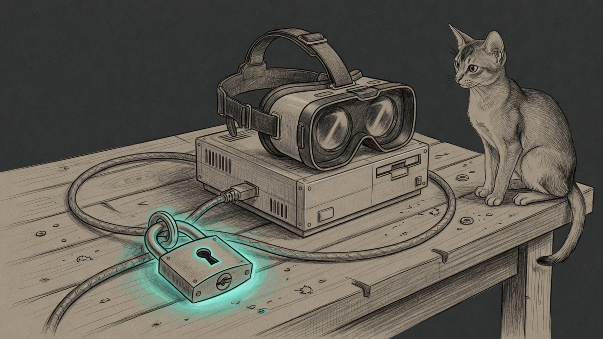

import { Aside } from '@astrojs/starlight/components';

The Quest curfew struck on time. The television in the den went dark the way it should. What should not have gone dark was the Mini that runs the curfew. For a stretch of that night the enforcement host had no WAN: Signal could not reach Yoda, Grok could not reach the Mini, and the only machine still on the internet was a laptop that was not supposed to be the brain.

The Firewalla still had a WAN address. The box itself could still talk to the world. The Mini could still ping the gateway. The path that had died was one MAC, one name, one adopt.

## What the box believed

Firewalla showed the Mini's Ethernet NIC as **Meta Quest (Albert)**. DHCP and Bonjour still said Manoir. The vendor string was Apple. The Quest screen's static list had grown a second MAC — not the headset's pin, the Mini's.

Adopt had a reason that looked scientific. `flow_host_patterns` for the Quest watch `oculus.com`. The Mini had those hosts in a flow. Score fifty, sole matching screen, enroll, rename, and — because holiday curfew was already on — pause immediately.

That is how an identity feature built to catch a rotating headset [the night the Quest wore Unknown](/operations/2026-08-04-quest-that-wore-unknown/) put a VR label on the computer that enforces VR bedtime.

`infrastructure_prefixes` already listed that NIC. `_classify_mac` already returned infrastructure. `_block_mac` already refused the enforcement host's own addresses — when it could see them. Adopt never asked any of those floors. Classify existed. Enroll ignored it.

## Two more ways the floor was hollow

The sanctum Force Flow daemon starts with a PATH that is often `/usr/bin:/bin`. `ifconfig` lives in `/sbin`. `_resolve_self_macs` called a bare `ifconfig`, collected nothing, and left `_SELF_MACS` empty. The 2026-06-09 unblockable floor — never pause the box that talks to the Firewalla — did not fire, because it did not know who it was.

Then a unit test on a laptop, aimed at the adopt bug, reached the live parachute path with a null session. `sanctum-fwblock` wrote a twelve-hour DROP on the Mini's MAC. Clearing the Firewalla pause was not enough. The [parachute](/architecture/the-parachute/) is supposed to hold a curfew when the cloud SDK is down. It is not supposed to hold the haus brain because a test forgot to stub the fallback.

## What landed

Adopt now refuses a MAC that is this host, or that classifies as infrastructure, before it writes `devices.yaml` or device-canon. Flow scan and host scan skip the same set. `_resolve_self_macs` calls `/sbin/ifconfig`.

Yoda's Signal skill `screen-time` talks to Force Flow the same way a parent should: `POST /screen/override` on the Den Room Apple TV (`first_floor_appletv`), never a Firewalla-app pause, never a HomePod, never `shared` for that television. Default thirty minutes, cap one hundred twenty.

The named suite is `scripts/eetismad-identity-smoke.sh` in `sanctum-screen-time`. It runs the alias tests, the adopt-refuse units, and live checks: Quest list, device-canon, Force Flow, Firewalla label, parachute iptables, and the Yoda VM hop. It does not grant time and it does not plant a DROP.

<Aside type="danger" title="A flow is not an identity">
`graph.oculus.com` on a MAC is a clue. It is not a warrant to enroll the haus brain as a child's headset. If classify already said infrastructure, adopt is done talking.
</Aside>

## Deploy path

`~/.sanctum/screen-time` is the repo. Force Flow imports `screen_time` from that tree. After a pull, a healthy `:4077` is not a loaded patch — kill the listener and let KeepAlive respawn, then confirm the process start is after the file mtime. The skill lives in `openclaw-skills/screen-time` and is on Yoda's `main` allowlist.

Text Yoda: *Give the den TV 2 hours.* That is the cap. Asking again resets the window.

## What EETISMAD looks like here

| Gate | Evidence |
|---|---|
| Everything E2E Tested | `eetismad-identity-smoke.sh` plus `test_quest_flow_identity.py` adopt-refuse cases |
| in Sanctum-docs | This field note + sidebar entry |
| Merged | `sanctum-screen-time` `772a60d` and `openclaw-skills` `98172fa` on `origin/main` |
| And Deployed | Live symlink, Force Flow on `:4077`, Yoda skill `screen-time`, Mini named Manoir |

The Quest still rotates private MACs. Flow adopt still exists for that. It just cannot eat the computer that runs it.

## Related

- [The Quest that wore Unknown](/operations/2026-08-04-quest-that-wore-unknown/) — why flow adopt exists
- [The Block That Killed the Hub](/operations/2026-07-23-the-block-that-killed-the-hub/) — the other identity-shaped outage
- [The Parachute](/architecture/the-parachute/) — box-side DROP when the SDK is down
- [Screen Time](/architecture/screen-time/) — enforcement ladder
- [Engineering Discipline](/architecture/engineering-discipline/) — the shipping bar
