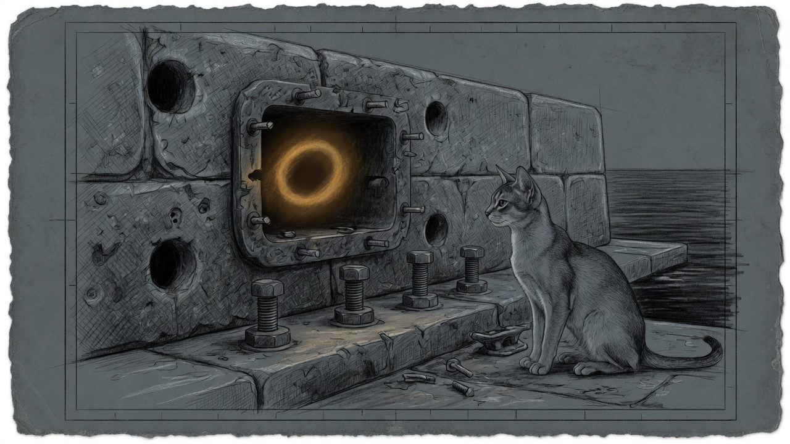

import { Aside } from '@astrojs/starlight/components';



Every new terminal on manoir opened with four lines of `compinit` noise: missing `_orb` and `_orbctl`, then `shift count must be <= $#`. Qui-Gon is the infrastructure guardian. He was not paging. The engine was not down. The engine was **not there** — `/Applications/OrbStack.app` deleted, Homebrew still linking completions at the corpse.

That is a worse class of bug than a crash. A crash has a process. This had a polite symlink.

## What was still wired

| Leftover | Why it bit |
|----------|------------|
| Homebrew cask `orbstack` | Completion stubs `_orb` / `_orbctl` in `site-functions`; `compinit` ran twice in `~/.zshrc`, so each miss printed twice |
| `DOCKER_HOST=unix://~/.orbstack/run/docker.sock` | Every interactive shell aimed docker at a missing socket |
| `/var/run/docker.sock` → OrbStack | Default docker client failed the same way without `DOCKER_HOST` |
| `com.sanctum.castellan` env | Root daemon still injected that `DOCKER_HOST` |
| `state/castellan-pinned.yaml` | Pinned `homeassistant` as a docker container and rescued it with `~/.orbstack/bin/docker restart` — the Mini twin was decommissioned 2026-07-06. Do **not** compose it back up: its automations double-fired against Green for months |
| `post-reboot-verify.sh` | Counted a missing OrbStack process as a **hard FAIL**, so every reboot would look dirty |

Outline and Matrix had already moved to the Lima VM (`com.sanctum.fwd-outline` / `fwd-matrix` to `10.10.10.10`). HA lives on Green at `10.0.0.3`. There was no local engine left to miss — only the paperwork.

## What shipped

- Uninstalled the leftover cask; cleared `~/.zcompdump`; stripped `DOCKER_HOST` from `~/.zshrc` / `~/.zprofile`.
- Removed the default docker.sock symlink (needs `sudo`; see `~/.sanctum/retired/orbstack/remove-root-leftovers.sh`).
- Tracked Castellan plist: `~/.sanctum/launchdaemons/com.sanctum.castellan.plist` — **no** `DOCKER_HOST`. Install with `~/.sanctum/bin/install-castellan.sh`.
- Dropped the HA docker pin; Castellan now pins only the cathedral (`com.sanctum.mlx`).
- `post-reboot-verify.sh`: OrbStack absence is expected; HA Green is the hard check. Bats 16/16 plus `tests/test-orbstack-retired.bats`.
- `sanctum-bootstrap.sh` no longer `open -ga OrbStack`. `services/vm.yaml` heals `com.sanctum.vm-autostart`, not the missing OrbStack agent.
- Disabled obsolete gui labels (Colima, `server-mlx`, `gateway.docker`, LM Studio bridge, old voice-agent). Dormant `com.sanctum.mlx-py-fallback` stays: disaster recovery, zero RAM until the Rust binary is actually dead.

<Aside type="caution" title="bootstrap error 5">
`launchctl bootstrap system` returns `Input/output error` if the job was just `bootout` in the same process. Wait a second, or `kickstart -k` if `launchctl print system/com.sanctum.castellan` still sees it. A Mini reboot also loads `/Library/LaunchDaemons/com.sanctum.castellan.plist` via `RunAtLoad` — strip `com.apple.provenance` with `xattr -c` first.
</Aside>

## After a reboot

```bash
sanctum-boot-ready --check
~/.sanctum/bin/post-reboot-verify.sh
launchctl print system/com.sanctum.castellan | grep -E 'pid |state =|DOCKER_HOST'
```

Wanted: `state = running`, a `pid`, and **no** `DOCKER_HOST`. Lineage: [The Vajrayogini Cut](/operations/2026-04-27-the-vajrayogini-cut/) (Colima → OrbStack), [The Twin That Would Not Die](/operations/2026-07-06-the-twin-that-would-not-die/) (Mini HA decommission), [The Reboot That Stayed Up](/operations/2026-07-31-the-reboot-that-stayed-up/).
