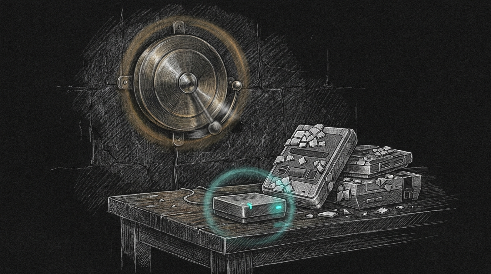

import { Aside } from '@astrojs/starlight/components';



The Signal ping at 22:35 was `[Sanctum INFO] Screen-time enforcement restored: Firewalla bridge is reachable again; kids' curfew enforcement is back to normal.` There had been no matching DOWN on Signal. Quiet hours had swallowed the critical. The close-the-loop patch from [The Restore That Never Rang](/operations/2026-08-05-the-restore-that-never-rang/) had done its job: recovery was forced onto the channel the operator actually watches. The words on that channel were wrong.

## What the log said, five minutes earlier

Albert's holiday curfew is 23:00. Winddown phase 0 (social) fires at 22:30. Force Flow posted `POST /host/{mac}/rules` across the kids' devices in a few seconds. The first eight landed. Then the box returned HTTP 500 on the Xbox's two NICs and the TCL Google TV.

Three 5xx. Circuit open. Backoff 300 seconds. Title: enforcement DOWN. Body: *The Firewalla bridge is unreachable or rejecting auth.*

The bridge process answered every call. The token was readable. Nothing was shadowing `:1984`. `GET /health` was fine. This is the same load-500 class the August 5 field note already named — a burst of `policy:create` under winddown, not a dead box.

It is also nightly. Same 22:30 500, same 22:35 restore, on the 13th, 15th, 16th, 17th, 18th, and 19th. The gong rang because three host writes failed, then rang again because the breaker closed. The router lamp never went out.

## The two lies

Force Flow delivers `title: message` verbatim. The producer invented the outage.

**Lie one — the copy.** `_bridge_note_failure` had one canned body for every classified failure: missing token, HTTP 401, connect timeout, and HTTP 500. "Unreachable or rejecting auth" is a mash of two different faults, and it is false for a 500. The restore mashed them again: "reachable again" is only true if the DOWN was a transport failure.

**Lie two — the circuit.** Per-host `POST /host/{mac}/rules` 500 incremented the *global* enforcement breaker. After the third xbox tile cracked, Force Flow stopped writing *every* device for five minutes and told the parent the bridge was gone. Eight social blocks had already landed. The last three hosts would have been retried on the next tick if the breaker had stayed closed.

[The Restore That Never Rang](/operations/2026-08-05-the-restore-that-never-rang/) taught the close-the-loop rule: if you page CRITICAL, Signal must hear the recovery. This night proved the inverse. A recovery that is forced onto Signal still has to describe the thing that actually happened, or the operator spends the next morning asking what broke.

## What shipped

In `screen_time.py`, every bridge failure now carries a kind. The parent page is rendered from that kind. "Unreachable" is reserved for transport. Missing token is a config fault, not an outage. Global 5xx (`GET /hosts`, `/policies`, `/info`) still opens the breaker — we cannot see the world — and the page names `HTTP 503 on GET /hosts`. Per-host 5xx logs and returns None; it does not open the breaker and does not page.

| Kind | Title | Says |
|---|---|---|
| connect / timeout | enforcement DOWN | unreachable (`TimeoutError` on the path) |
| 401 after refresh | enforcement DOWN | rejecting auth (HTTP 401 on the path) |
| no token | enforcement DISABLED | config fault, not an outage |
| global 5xx | writes failing | HTTP 5xx on the path — never unreachable |
| per-host 5xx | (no page) | log only |

Restore says "reachable again" only when the DOWN named unreachability. Auth restore says auth is working again. 5xx restore says writes resumed.

The suite that owns the breaker (`test_bridge_resilience.py`) pins each kind, including "per-host 500 does not page" and "copy helpers never say unreachable for a non-transport cause." Full hermetic suite green at ship.

<Aside type="caution" title="A 500 is not a missing box">
Qui-Gon still gets kicked when a *classified* DOWN is critical. He should not be kicked because Xbox Dual-MAC 500'd during winddown. If the box is actually unreachable, the transport kind still pages loud, still forces Signal on restore, still waits out boot grace. The change is that the gong no longer swings for a cracked tile.
</Aside>

## Deploy path

`sanctum-screen-time` on the Mini is the live engine (symlink into Force Flow). Landing on `main` is not enough. Force Flow PID 889 started 2026-08-19 16:27 and holds the old module in memory until the process that owns `:4077` is actually replaced. `launchctl kickstart` without `-k` is a no-op when `/health` is green — the launch wrapper exits 0 on purpose, to avoid EADDRINUSE storms.

The reload is `sudo /bin/launchctl kickstart -k system/haus.sanctum.force-flow`. That exact command is what `sudoers-sanctum-kickstart` is supposed to grant NOPASSWD. On 2026-08-19 the repo file was renamed to `haus.sanctum.*`; `/etc/sudoers.d/sanctum-kickstart` was not reinstalled. Live sudoers still matches `system/com.sanctum.force-flow`. That kickstart returns 113 — service not found — and PID 889 does not move. Failsafe healers are a silent no-op until Bert reinstalls the file:

```bash
sudo visudo -cf ~/.sanctum/scripts/service-user/sudoers-sanctum-kickstart \
  && sudo install -m 440 -o root -g wheel \
       ~/.sanctum/scripts/service-user/sudoers-sanctum-kickstart \
       /etc/sudoers.d/sanctum-kickstart
sudo /bin/launchctl kickstart -k system/haus.sanctum.force-flow
```

Then confirm the new PID's start time is after the file mtime, `/screen/liveness` still `enforcement_ready=true`, and enrolled screens still blocked if curfew is on.

## What EETISMAD looks like here

| Gate | Evidence |
|---|---|
| Everything E2E Tested | `test_bridge_resilience.py` including per-host 5xx, no-token config-fault copy, global-5xx warn, auth restore without "reachable again"; full hermetic suite 890 passed, 4 skipped |
| in Sanctum-docs | This field note + sidebar entry |
| Merged | `sanctum-screen-time` `259d779` on `origin/main` |
| And Deployed | **Not yet.** Symlink is the repo file (`259d779`). Live PID 889 started 2026-08-19 16:27. Kickstart of `haus.sanctum.force-flow` needs a password because `/etc/sudoers.d/sanctum-kickstart` still lists `com.sanctum.force-flow` (exit 113). Reinstall the sudoers file, then `-k` the daemon. |

The August 5 note closed the loop so a real outage's recovery could be heard. This one stops the haus from hearing an outage that did not happen. The gong can still ring. It has to mean something.

## Related

- [The Restore That Never Rang](/operations/2026-08-05-the-restore-that-never-rang/) — Signal must hear a critical self-heal; the words still have to be true
- [Screen Time Enforcement](/operations/screen-time-enforcement/) — the runbook the breaker protects
- [Force Flow](/architecture/force-flow/) — notify routing; the body is delivered verbatim
- [Engineering Discipline](/architecture/engineering-discipline/) — EETISMAD
- [DRI Governance](/operations/2026-07-26-dri-governance-the-council-picks-owners/) — Windu owns screen-time reliability
