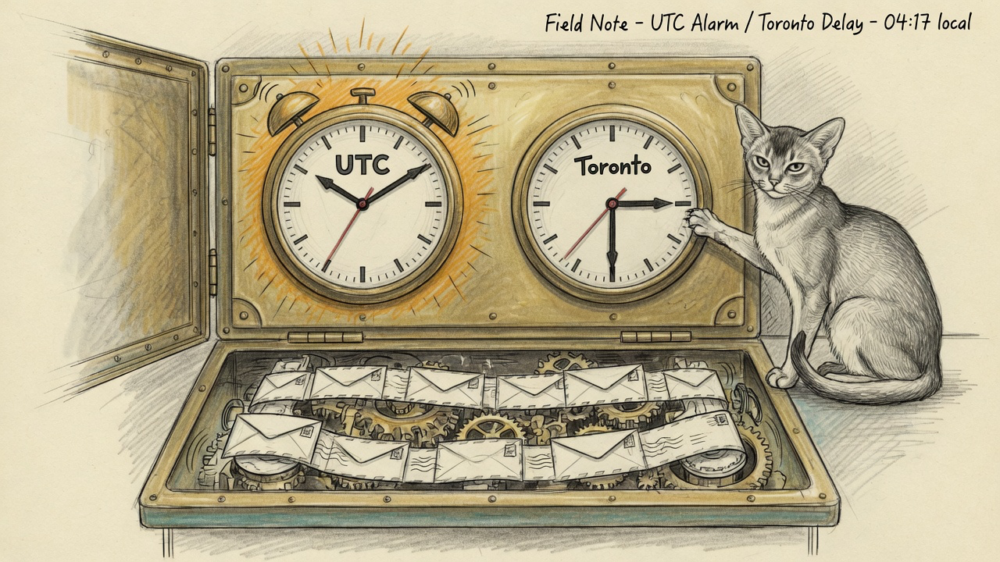

import { Aside } from '@astrojs/starlight/components';

The page arrived as **ETL Pipeline Failure: crm-freshness** — email 6.7 hours since the last message, SLA 6 hours. The hourly ingest job had exit 0. Envelope watermarks were still advancing. A new OpenRouter receipt was in the archive. The only thing that was 6.7 hours old was a clock comparison.

## Two clocks, one age

`v_timeline.ts` is America/Toronto wall-clock. That is the TIMEZONE CONTRACT in `schema.sql`: storage is UTC instants, the view renders local so a human reads "you texted at 4pm". `lib.pin_utc` then pins every DuckDB session to UTC, so `now()` is 10:22 when Toronto is 06:22.

The freshness sentinel did `date_diff(max(ts), now())`. Naive Toronto 05:56 against UTC 10:22 is 4.4 hours. Add a quiet stretch after midnight and the 6h email SLA trips. The log had been doing this every night: 6.2h, 6.9h, 6.3h, 6.7h.

`v_needs_reply` already compared against `now() AT TIME ZONE 'America/Toronto'`. Freshness did not.

At 03:31 Eastern the last real email was about 00:50. Real age 2.7h. Rendered age 6.7h. CRITICAL.

## Why R2D2 sat still

The right question is the one [The Green Lie](/operations/2026-08-08-the-green-lie/) taught: *why isn't R2D2 fixing it automatically?*

This time the refusal was correct. `heal-etl-pipeline` fires on DuckDB lock contention and stuck writers. A crm-freshness title is not a pipeline id, and the body does not match `lock|IOException`. Kickstarting `jocasta-mail-sync` would have been a no-op with extra AppleEvents — the reader was not dead.

A timezone bug is not an ingest stall. Auto-heal that cannot tell the two apart is how a false page becomes a thrash.

## What shipped

- **Sentinel.** `sanctum-crm status --check` now diffs `v_timeline.ts` against `now() AT TIME ZONE 'America/Toronto'` (`lib.LOCAL_TZ`). Live re-check: email 0.5h, all channels inside SLA. The 24h page-cooldown for email was cleared so a *real* outage still pages today.
- **Regression tests.** A just-inserted naive-UTC email under a UTC session must age under 1h, not 4h. The SQL must mention `AT TIME ZONE` and `LOCAL_TZ`.
- **Auto-heal, fail-closed.** R2D2 still owns `heal-etl-pipeline`. A crm-freshness page now maps `email` → `mail-to-duckdb` (and `telegram` → `telegram-to-duckdb`) **only if** `email_history.received_at` (UTC session) is actually past SLA. Source age 2.7h against a 6.7h page: no fire. Source unreadable: no fire. iMessage/SMS/Signal/WhatsApp still share one reader and are not kickstarted from a quiet night.

<Aside type="caution" title="Kickstart is not a heal, and a local clock is not UTC">
The closed loop for a *real* stall remains `connect_rw` after kickstart — same recipe, same 2h cooldown. The new gate is the clock. If you heal from `v_timeline` age you will kickstart every summer night at 03:30. Measure the source table with the session pinned UTC, or do not fire.
</Aside>

Envelope Index is still Full Disk Access-denied for `/opt/homebrew/bin/python3`. Mail ingest runs the Mail.app JXA fallback. That is a degraded path, not this page. Grant FDA to restore the fast reader.

## What EETISMAD looks like here

| Gate | Evidence |
|---|---|
| Everything E2E Tested | `sanctum-crm` `tests/test_tz.py` + `tests/test_freshness_sentinel.py` + mail ingest tests, 67 passed. R2D2 ETL suite including the new UTC-source false-page / real-stall / fail-closed cases. Live `sanctum-crm status --check --json` → `"ok": true`, email age 0.5h on the same rows that read 4.4h before the sentinel fix |
| in Sanctum-docs | This field note + sidebar entry + the timestamp caution on [Sanctum CRM](/architecture/crm-architecture/) |
| Merged | `sanctum-crm` `b685f3b`; `sanctum-config` `489b14f` — both `origin/main` via `gitsync` pathspecs |
| And Deployed | LaunchAgent `haus.sanctum.crm-freshness` runs `~/Projects/sanctum-crm/bin/sanctum-crm status --check` — the repo path. R2D2 runs `~/.sanctum/r2d2/classify.py` — the repo path. Both picked up the new code on the next tick |

The archive kept taking mail. The alarm was a clock that could not tell Toronto from Greenwich. Tomorrow night, if email really goes quiet for six hours, R2D2 kickstarts the reader. If the reader is already feeding envelopes through the gears, the cat keeps her paw on the Toronto clock.

## Related

- [Sanctum CRM](/architecture/crm-architecture/) — timezone contract and freshness SLA
- [The Green Lie](/operations/2026-08-08-the-green-lie/) — a green probe is not liveness; a local timestamp is not UTC
- [Engineering Discipline](/architecture/engineering-discipline/) — EETISMAD
- Repo: `~/Projects/sanctum-crm/`
