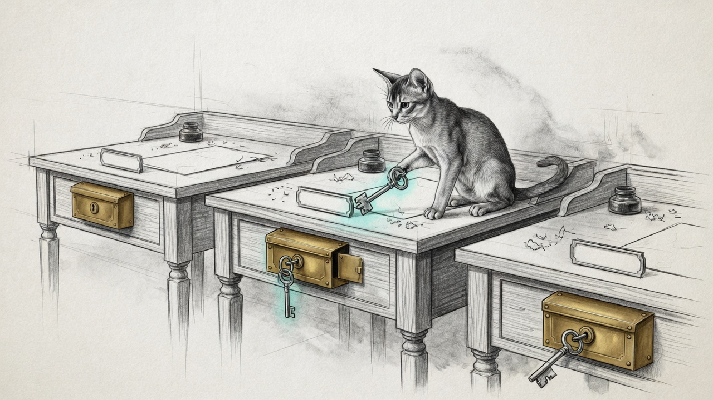

import { Aside } from '@astrojs/starlight/components';



The Memory Vault has one authoritative tree, on the hub Mini. Every coding CLI is supposed to check the same inbox at the start of a turn, with the same wrappers, the same MCP launcher, and a hook the product actually fires. That is the contract [The Vault Across the Wire](/operations/2026-08-05-the-vault-across-the-wire/) already named for Grok on the laptop.

Tonight the disk said the contract was a rumour.

The road laptop (`mbp`) was the gold copy: Grok hooks, agy `PreInvocation` pointing at `agy-vault-inbox-check.sh`, Claude `UserPromptSubmit` pointing at `claude-vault-inbox-check.sh`. The hub Mini (`manoir`) had the wrapper scripts in the config repo and a Grok hook, but Claude's live settings no longer called the vault checker at all — other UserPromptSubmit hooks had kept their seats; the inbox check had not. Antigravity on the hub was worse: `antigravity-cli/settings.json` ran the *Claude* inbox checker, so an `agy` turn would have been handed `inbox/claude-code/` and told it was news. The satellite Mini (`chalet`) had a `.node_id`, an empty Claude `settings.json`, and zero vault scripts.

Three nodes. Three different answers to "do I read the vault."

## Hive identity first

The haus reuses the same LAN map at every site. The Mini is `.10`. The gateway is `.1`. Hostnames rhyme. An agent that SSHes to a LAN address and assumes "this is the hub, therefore this is the vault" will operate on the wrong brain. That scar already has a name: [Device Identity](/operations/device-identity/) — roster name before address; `site_lan` is not `session_node`; a box without `.node_id` has no role you may assume.

The satellite was sitting on `.10` of *its* floor. A vault wrapper that "helpfully" fell back to that address would have talked to itself. The installer does not do that. Satellites get `Host manoir` with MagicDNS as `HostName`. Never the LAN pin.

<Aside type="caution" title="A matching wrapper is not a matching wire">
The satellite now has the same scripts as the hub. `vault.sh who` from that box still fails: the hub's MagicDNS name does not resolve there, and the Tailscale peer path timed out. Config is not connectivity. Do not "fix" it with a LAN IP. Fix DNS and the peer, then the wrappers you already installed will work.
</Aside>

## The kit

SoT is the hub config repo (`~/.sanctum` on `manoir`) and the laptop config repo (`~/.sanctum-mbp`). The satellite is a deploy target, not a third SoT.

```bash
# this node
~/.sanctum/scripts/install-cli-vault.sh
~/.sanctum/scripts/install-cli-vault.sh --check

# the other two
~/.sanctum/scripts/install-cli-vault.sh --remote mbp
~/.sanctum/scripts/install-cli-vault.sh --remote chalet
~/.sanctum/scripts/install-cli-vault.sh --all
```

What it copies: `grok-vault.sh`, `agy-vault.sh`, `claude-vault-inbox-check.sh`, the inbox-check hooks, `grok-memory-vault-mcp.sh` plus the Content-Length/NDJSON bridge. What it merges, never replaces wholesale: Claude `UserPromptSubmit` (prepend the vault check if missing), agy `PreInvocation` (the laptop-proven shape, written to both `~/.gemini/settings.json` and `~/.gemini/config/hooks.json` — the CLI rewrites the former and drops the hook), MCP `memory-vault` only if absent. What it strips: any agy settings still pointing at `claude-vault-inbox-check.sh`.

Grok's `~/.grok/hooks/vault-inbox.json` is a symlink to the repo file. A copy that happens to match today is how next month's edit dies on one floor.

agy identity is `inbox/agy/`, `--from agy-<conv8>`. Grok is `inbox/grok/`. Claude is `inbox/claude-code/`. Mixing those folders is how an agent "reads the vault" and still misses the message addressed to it.

## Mail, the other direction

The same night needed a draft, not just a fetch. `sanctum-crm email` already hydrates a body from Mail.app. It could not open a visible outgoing message. Work-lane `tq` could scan mail; it could not compose.

```bash
sanctum-crm email-compose --to owner@haus --cc partner@haus \
  --subject "Hi" --body-file ./body.md --image ./fig.png

tq mail draft --to owner@haus --cc partner@haus \
  --subject "Hi" --body-file ./body.md --image ./fig.png
```

Neither command sends. Mail.app's HTML content *setter* is the inline-image path; the getter is denied. Images become `file://` `` tags. The two modules are twins on purpose: haus CRM does not import the fund CLI, and the fund CLI does not grow a dependency on `~/.sanctum`.

## What EETISMAD looks like here

| Gate | Evidence |
|---|---|
| Everything E2E Tested | `tests/test_cli_vault_install.py` 10/10. `tests/test_email_cli.py` 13/13. `tests/test_mail_compose.py` 4/4. `install-cli-vault.sh --check` clean on hub and laptop. `bash -n` on the installer. Live `grok-vault.sh who`. Live agy inbox-check emits `injectSteps.ephemeralMessage` |
| in Sanctum-docs | This field note + unique hero + sidebar |
| Merged | `sanctum-config` `85c92ff`, `sanctum-mbp` `3a79413`, `sanctum-crm` `152d5f1`, `triptyq-cli` `97e093f`, this note `57504bf` on `origin/main` |
| And Deployed | Hub: Claude vault check prepended; agy `PreInvocation` in `settings.json` **and** `config/hooks.json` (the CLI rewrote the first and dropped the hook once tonight); wrong agy Claude hook stripped; Grok hook is a symlink. Laptop: already gold, installer made the missing scripts live symlinks. Satellite: wrappers + Claude hook + `Host manoir`. Satellite *calls* to the hub still blocked on MagicDNS — kit deployed, wire not |

[The Vault Across the Wire](/operations/2026-08-05-the-vault-across-the-wire/) gave the laptop an MCP hop. This one makes the *CLI* kit the same animal on every node that claims to be in the hive. An agent that cannot see `inbox/<its name>/` will keep inventing closeouts. An agent that can see it, on only one floor, will keep surprising the other two.

## Related

- [The Vault Across the Wire](/operations/2026-08-05-the-vault-across-the-wire/) — satellite MCP to the Mini vault
- [Engineering Discipline](/architecture/engineering-discipline/) — EETISMAD
- [gitsync](/architecture/gitsync/) — pathspec land, no `git add -A`
- [Device Identity](/operations/device-identity/) — name before address
