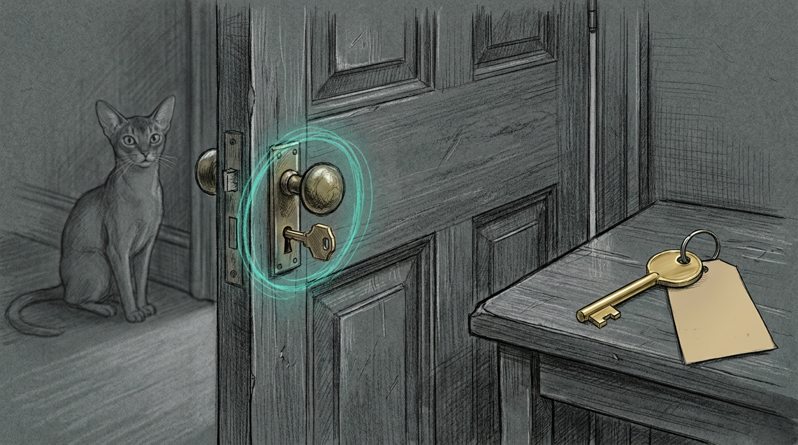

import { Aside } from '@astrojs/starlight/components';



You asked for a new meeting. Zoom handed you the room that already had your name on the door.

`tq zoom create` had just gone live. The join URL looked fine. The topic did not. It was the operator's Personal Meeting Room — the standing PMI, the one partners already know, the one you do not mint for a group call and then forget to throw away. Instant meetings on this Zoom account reuse that room even when the API says `use_pmi: false`.

The CLI had done what it was told. Zoom had a different idea of "now."

## Two passwords

A Zoom website password is not a Server-to-Server secret. The first path that looked finished stored a login and called it an API. The Meetings REST create is `POST /users/{userId}/meetings` with an account-credentials token. That token comes from a marketplace S2S app, not from signing into zoom.us.

The work 1Password account is the store. Each partner keeps a Login named `Zoom` in **their** Private vault on `triptyq.1password.com` — not the shared Employee vault, not haus 1Password, not SOPS. Website fields stay website fields. The S2S trio is `account_id`, `client_id`, `client_secret`. `tq` never treats `password` as the client secret.

`tq doctor` does not call `op`. It only asks Keychain. A missing trio is a setup problem, not a doctor skip for every other probe.

```bash
op signin --account triptyq.1password.com
tq zoom setup
tq zoom create
tq zoom create "Partner sync" --when "today 14:30" --duration 120
```

`setup` copies this Mac's personal Zoom login into work Private if that item is still empty, then caches the S2S trio to Keychain on stdin. Values never travel in `argv`.

## One app, then never the browser

S2S is once per Zoom account. Marketplace app, scopes `meeting:write:meeting` and `meeting:write:meeting:admin`, activate, then the three fields on **your** Private item in the 1Password app. After that the browser is for humans who want to join, not for agents who want to schedule.

The operator's Zoom user is the host `tq` sends when you pass `--host me`. Other partners host from their own S2S apps. Sharing one trio across the firm is how one person's Keychain becomes everyone else's outage.

<Aside type="caution" title="The website password will not mint a meeting">
If `tq zoom setup` still lists the trio as missing, do not paste the Zoom login into Keychain under `TRIPTYQ_ZOOM_CLIENT_SECRET`. That value logs you into a website. It does not speak OAuth. Add the three API fields to Private/`Zoom`, then run setup again.
</Aside>

## Now is not instant

Zoom type 1 is an instant meeting. On this account it is also the PMI. The live create without `--when` returned the personal room id and the personal-room topic. Unique meetings are type 2.

So `tq` no longer asks Zoom for type 1. Omit `--when`, or pass `now`, and you get a scheduled meeting that starts immediately — a new id, the topic you typed, `use_pmi` still false. Relative and clock forms were already type 2. Instant was the odd one out, and it was the one that looked like success.

Zoom caps 100 creates per host per day. Do not smoke-test that cap.

## What EETISMAD looks like here

| Gate | Evidence |
|---|---|
| Everything E2E Tested | `tests/test_zoom.py` + `test_cli_zoom.py` + `test_onepassword.py` + `test_preflight.py` 59 passed. Live `tq zoom setup` green. Live create with `--when now` returned a unique id, not PMI |
| in Sanctum-docs | This field note + unique hero + sidebar. Partner commands in `triptyq-cli` `docs/02_workflows/12_zoom.md` |
| Merged | `triptyq-cli` `e6d5731` on `origin/main`; this note on `sanctum-docs` `origin/main` |
| And Deployed | Live `tq` is `~/.local/bin/tq` → `~/Projects/triptyq-cli/.venv/bin/tq`. Import is `~/Projects/triptyq-cli/src`. Consumer verified through that path |

A haus chapter may describe the job. It may not hold the key. The Zoom trio lives in work 1Password Private, the same wall [Affinity filing](/architecture/affinity-filing/) already named for the CRM. You can read this page and still be unable to create a meeting, and that is the point.

The next `tq zoom create` should open a room nobody has sat in yet. If the join URL is the room that already has your name on the door, type 1 came back — and we already know how that story ends.

## Related

- [Affinity filing](/architecture/affinity-filing/) — work-lane secrets stay on the work side of the wall
- [The venv that ran main](/operations/2026-08-15-the-venv-that-ran-main/) — the live `tq` is the checkout the wrapper claims
- [gitsync](/architecture/gitsync/) — pathspec land, no `git add -A`
- [Engineering Discipline](/architecture/engineering-discipline/) — EETISMAD
