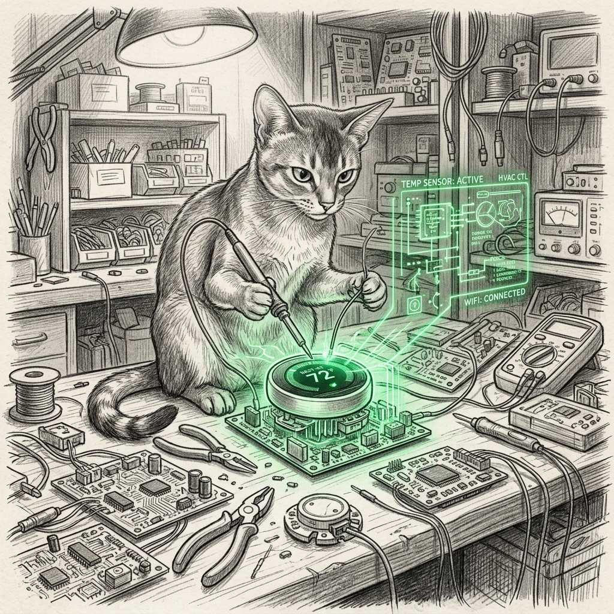

import { Aside } from '@astrojs/starlight/components';

The haus went noisy. Then it went blind.

When telemetry stutters or integration tasks fail silently in the background without raising explicit configuration alerts, the whole council loses trust in the estate's temperature and environmental models until proper self-healing bounds are restored. A deep audit of Home Assistant Green (`10.0.0.3`) revealed chronic background crash-loops that had quietly filled system logs with tens of thousands of unhandled exceptions. As chronicled in [The Fleet Watches Itself](/operations/2026-07-24-the-fleet-watches-itself/), a sensor that lies or fails silently degrades the whole council.

Through runtime monkeypatches, legacy entity pruning, and sentinel calibration, the sensory plane returned to pristine health in the [Operational State](/operations/operational-state/).

## 1. Carrier Infinity: String Casts and NoneType Timestamps

The Carrier Infinity integration (`ha_carrier`) and its upstream `carrier_api` package suffered from fragile typing assumptions whenever Carrier Cloud returned incomplete payloads:

1. **String Literals in Numeric Fields:** When Carrier Cloud emitted the literal string `"None"` instead of a numeric float or null, `carrier_api.util.safely_get_json_value` attempted `float("None")`, raising `ValueError: could not convert string to float: 'None'`.
2. **Missing `utcTime` Parsing:** The status model called `isoparse(safely_get_json_value(raw, "utcTime"))`, crashing with `TypeError: object of type 'NoneType' has no len()` whenever `utcTime` was absent.
3. **Unbounded Task Retries:** The WebSocket listener in `__init__.py` lacked exponential backoff, spamming crash logs on transient socket resets.

### The Self-Healing Fix
We deployed recursive model sanitization directly into the integration lifecycle:
- `safely_get_json_value` intercepts `"None"`, `"null"`, and empty strings, safely returning default fallbacks.
- Missing or null timestamp fields are automatically populated with the current UTC ISO timestamp before dateutil parsing begins.
- The WebSocket listener adds a 10-second sleep on task exceptions, turning catastrophic error loops into quiet background retries.

## 2. Nuheat Conductor: Token Invalidation & SignalR Backoff

The Nuheat radiant floor heating system carried two lingering operational wounds:

1. **Legacy Core Integrations:** Three deprecated `nuheat` config entries from the old username/password platform were hanging for minutes against dead cloud endpoints during boot.
2. **Expired OAuth Grants:** The modern `nuheat_conductor` OAuth token had expired, causing `climate.py` and `signalr.py` to log stack traces every 60 seconds (accumulating over 15,000 exceptions in HA logs).

### The Remediation
The three legacy entries were marked `disabled_by: "user"` in `/config/.storage/core.config_entries`, speeding up container startup by ~90 seconds. Next, `nuheat_conductor` was updated to catch invalid grants, trigger `entry.async_start_reauth(hass)` for native one-click UI re-authentication, and apply exponential backoff (`[10, 30, 60, 120, 300, 900]` seconds) on SignalR reconnect loops without flooding logs.

## 3. Healer Alignment & HA Green Appliance Probes

The `ha-self-healer` watchdog and `ha-freshness-sentinel` on the Mac Mini were aligned with the physical estate:

- **Appliance Probes:** `ha-diagnose.sh` was updated to probe container liveness and query native backups directly from HA Green via SSH rather than assuming a local Mac Docker container.
- **Estate Calibration:** Updated `sonos` threshold to reflect the 7 active media player nodes in the house, and allowlisted intentionally disabled automations.

Telemetry is silent once more. The sentinels are green, the logs are calm, and the haus senses its environment with unwavering precision.
