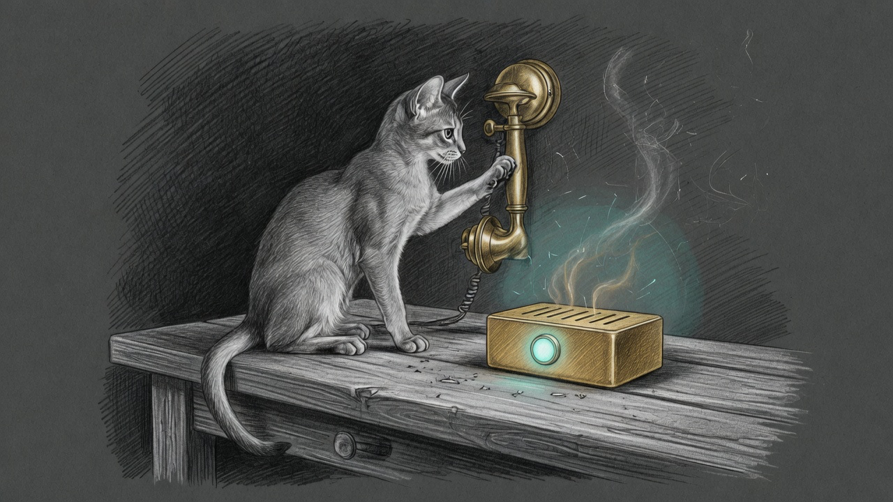

import { Aside } from '@astrojs/starlight/components';

A lock collision in `message-to-duckdb.py` surfaced when ingestion held an exclusive file lock (`flock`) across slow external process fetches. Under concurrent writes from Telegram and Slack ingest pipelines, DuckDB threw an `IOException: Could not set lock on file workspace.duckdb`.

At the same time, The Holocron received a complete architectural upgrade: replacing static device cards with a **100% procedural, adaptive whole-haus control and diagnostics surface** synchronized bidirectionally with Home Assistant Green and Apple Home.

## 1. DuckDB Lock Isolation & Micro-Transactions

The previous ingestion pattern wrapped the entire pipeline execution—watermark discovery, subprocess fetch, and database writes—inside a single broad lock. Slow Apple Mail extraction and network I/O held the lock for multiple seconds, starving concurrent writers.

The pipeline was refactored into distinct micro-transaction phases:

1. **Phase 1 (Watermark Read):** Acquire lock briefly, read watermark timestamps, immediately release lock.
2. **Phase 2 (Fetch & Transform):** Fetch mail, Telegram messages, and Slack histories completely unlocked.
3. **Phase 3 (Batch Insert):** Acquire lock, commit new rows inside a clean atomic block, release lock.
4. **Resilience Layer:** Increased retry limit (`DB_CONNECT_RETRIES = 12`) and added randomized jitter to prevent lock contention spikes.

All 272 CRM unit and trigger tests pass cleanly with zero lock hold across subprocesses.

## 2. Procedural Haus Control & Diagnostic Surface

The new `HausControlPanel` in The Holocron dynamically discovers and groups devices directly from Home Assistant's area registry template (`_HA_AREA_TMPL`):

- **Adaptive Zone Discovery:** Auto-groups lights, climate controls, switches, motorized blinds, media players, and sensors by area without any hardcoded identifiers.
- **Global Actions & HUD:** One-touch *"All Lights Off"*, *"Secure All Locks"*, and real-time averages across all temperature zones.
- **Apple Home & HomeKit Integration:** Leverages the native `Yoda Bridge :21063` and mDNS discovery so state changes in Apple Home or Siri reflect instantly in Holocron, and vice versa.
- **"Fix Everything" Diagnostic Center:** Auto-detects unreachable entities, offline nodes, and low-battery sensors with dedicated probe and re-poll actions.

## 3. Daemon Telemetry & Alert Normalization

`apple-services.sh` and Force Flow (`:4077`) were updated with non-interactive daemon fallbacks using `GUI_UID` (501) and TCP port liveness, resolving false warnings for system service accounts. Alert states across Holocron now properly honor dismissal flags, keeping the dashboard calm and pristine.

## 4. Cathedral Supervision Debouncing & Self-Heal Grace

During hot-reloads of Cathedral MLX engine seats (e.g. speculation updates), launchd transitions through a brief `SIGTERMed` state. `cathedral-supervision-check.sh` previously alerted on a single tick during this 1-second window.

A **2-tick consecutive failure confirmation gate (`SUPERVISION_STREAK_THRESHOLD = 2`)** was implemented. Single-tick transitions that immediately recover are recorded under `supervision-streak-grace` without alerting the operator. Planned deploy/restart detection was also expanded across all vault inbox mailboxes.
