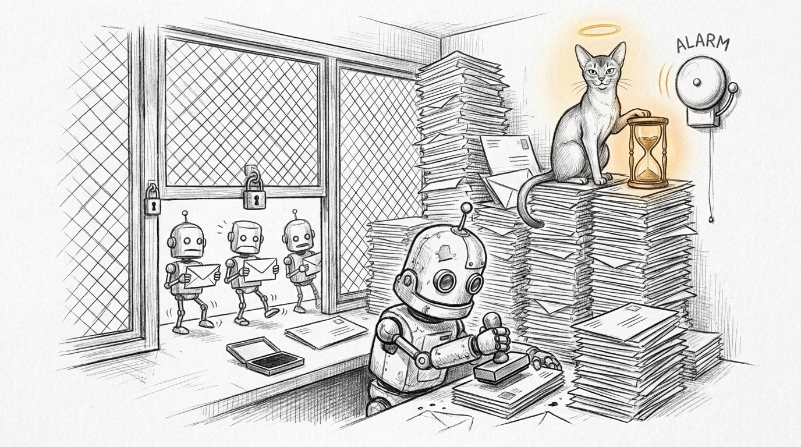

At seven this morning the phone lit up three times before breakfast. Mundi's deal watcher had crashed, Jocasta's calendar sync had crashed, and the meeting-prep agent quietly reported a morning with no meetings. By eight, all three were green again without anyone touching anything. Three critical pages, zero incidents. That is not an alerting success story — that is a pager teaching its operator to ignore it, the week before the operator leaves for two weeks.

## The twenty-minute lock

The trail led to the seven-o'clock job: the daily sync that pulls every person from Affinity and folds their enrichment into the CRM. DuckDB allows one writer, and while a writer holds the file, nobody else — reader or writer — gets in. We had already been here once: [The Procedural Haus and Flock Isolation](/operations/2026-08-25-the-procedural-haus-and-flock-isolation/) shrank each writer's hold to a micro-transaction. But this job's write phase *was* one transaction, and it ran twenty minutes.

The log told on it, run after identical run: ninety-one thousand six hundred and five field writes. Then ninety-one thousand six hundred and five again. The sync was restating every value it had ever written — location, title, company, one statement at a time — whether or not anything had changed since yesterday. Almost nothing ever had. Ninety-one thousand writes, and roughly seven of them were news.

Every sibling that touched the database inside that window starved. The calendar writer retries lock contention, but its patience tops out near three minutes against a twenty-minute hold. Mundi's watcher had no retry at all — a raw connect, first refusal fatal. And the meeting-prep agent swallowed its failed query and printed the most dangerous sentence in monitoring: *No meetings in the next 90 minutes.* There were three.

## Write only what changed

The fix reads before it writes. The sync now snapshots the stored values for every field it owns — one query — and skips any upsert that would restate what is already there. The entry's timestamp bumps only when something actually changed. Same transaction, same correctness, none of the ceremony.

We ran it live before landing it: ninety-one thousand six hundred and seven writes became seven. The write phase — and the lock hold that came with it — collapsed from twenty minutes to seconds. The couriers no longer queue at the counter, because the clerk stopped re-stamping yesterday's mail.

## An hour of grace

The deeper fix is doctrinal. A job that runs every thirty minutes and fails once has not had an incident; it has had a bad cycle. The library now keeps a tiny failure ledger per job: the first failed run starts a clock, and nothing pages until the job has been failing continuously for a full hour. Then it pages once, and daily after that while the outage lasts — the once-then-daily rule standing conditions already follow. A single good run wipes the ledger, and if the outage had paged, it leaves a recovered breadcrumb so the trail has a close.

Mundi's watcher, the calendar sync, and meeting-prep all speak through it now, and Mundi's reads go through the retrying connector like everyone else's. The silent zero got the same treatment with opposite polarity: a failed calendar query still degrades gracefully in the moment, but an hour of it pages loudly — because *briefs are not being generated* is exactly the standing condition the pager exists for, per [The Sanctioned Path](/operations/2026-08-26-the-sanctioned-path/) family of quiet failures.

The suite grew eight tests for the grace ledger and came back fully green — two hundred sixty-nine passing, including two mail-ingest fixtures that had drifted behind the previous night's hardening and were repaired on the way through.

Bert flies out tomorrow, for two weeks. The house will keep syncing, the lock will clear in seconds, and the pager has one job left: stay silent about anything that heals itself, and speak up — once, clearly — about anything that does not.
