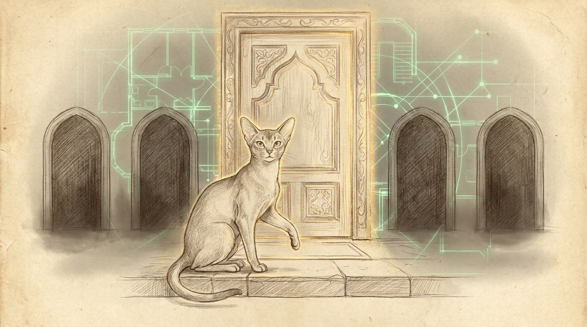

import { Aside } from '@astrojs/starlight/components';

A machine will always offer you a shortcut around the front door. Tonight, four of them led somewhere we did not want to be.

They arrived as unrelated alarms — a CRM pipeline gone quiet, a post-boot roll-call short by two, a screen that never locked — but under each one sat the same decision made the easy way months ago. The shortcut was always faster, right up until the morning it was not. Every fix below is the same move: off the convenient path, onto the one Apple actually sanctions.

## 1. Mail: launch the app before you ask it anything

Jocasta's mail ingester feeds the CRM every hour — the same pipeline whose lock contention we untangled in [The Procedural Haus and Flock Isolation](/operations/2026-08-25-the-procedural-haus-and-flock-isolation/). After the evening reboot it went dark, and the log carried a familiar Apple Events failure: `-1712`, "the operation timed out." The temptation was to reach for Full Disk Access — grant the interpreter raw read of Mail's private database and skip the app entirely. Bert ruled it out in three words: *not the Apple way.* An interpreter-wide disk grant hands every script on the box the whole disk, to scrape one mailbox.

The real defect was subtler than a missing permission. The script asked Mail for data with `tell application`, which auto-launches Mail — so a cold app was starting up *inside* the query's own timeout window, and a post-reboot cold start (IMAP catch-up, index replay) outlives the default hundred-and-twenty-second Apple Events budget every time. The sanctioned route was never broken. It was being asked the wrong way.

The fix launches Mail hidden, polls a trivial "get version" event until the app answers, and only then runs the real query — now wrapped in an explicit three-hundred-second timeout with one paced retry. We reproduced the exact failure (`killall Mail`, then probe) and watched the hardened path relight it and answer. Sixteen mail tests stayed green; a live run under the launchd job's own context inserted rows.

<Aside type="note">The Envelope-Index route needs Full Disk Access and stays dark by policy. Apple Events needs only Automation permission, scoped to one named app you can revoke. That scoping *is* the security property.</Aside>

## 2. LinkedIn: the fix was already running

The same disk-grant question waited one script over. `linkedin-cookie-refresh` scraped Safari's cookie jar — another Full-Disk-Access read — to keep a session token fresh. Here the honest answer was not to harden it but to delete it.

That scraper fed a server-side replay of the LinkedIn API that LinkedIn walls outright; the file's own header records the finding, a redirect loop that no amount of copied cookies escapes. Meanwhile the *live* daily sync had quietly done it right for weeks: it drives a logged-in browser profile and runs the fetch from inside the page, where the browser attaches the session cookie itself. The secret is never extracted, so no protected file is ever read. The lesson costs nothing to state and a lot to skip — before hardening a permission, check whether a healthy sibling already made the permission unnecessary. The offender was dead code guarding a door nobody used.

## 3. The daemons that ran from a workbench

Post-boot health came back thirty-eight of forty-one. Two watchdog services were down — and worse, two *more* had died completely silently, because the checker only watched two of the four. All four ran their binaries straight out of a Rust build directory, and that directory had been wiped earlier in the evening. They kept running on deleted files until the reboot, then launchd could not respawn what no longer existed. Empty error logs, exit code seventy-eight, no page.

Running a daemon from a build tree is a workbench habit: fine while you are hammering on it, quietly fatal the day someone runs `cargo clean`. The durable form is the one Apple has used for decades — install the binary, root-owned, into `/usr/local/libexec`, and point the service at the installed copy. We built the four binaries, installed them with checksummed, backed-up copies, and repointed every plist. As a bonus it closed a real hole: two of those daemons run as root and had been executing files any user could overwrite. A one-command installer now makes the whole move idempotent, and the build directory is once again just a workbench.

## 4. The lock that trusted the wrong thing

The last one was not a crash but an absence: the hub's screen never locked. Every setting read correct — password required immediately, screensaver armed at five minutes — and still it sat open. The idle clock climbed normally, which is exactly why nothing looked wrong.

The culprit was Universal Control. With an awake Mac beside it, macOS holds a *prevent-display-sleep* assertion so your cursor can cross between machines — and on this hub the screensaver was the only thing that ever triggered the lock, so the suppressed display kept the lock from ever firing. It surfaces in exactly one place, a live assertion dump during an idle stretch, and nowhere in the settings that all read fine. We disabled Universal Control on the hub and moved the lock onto the mechanism Apple actually guarantees: display sleeps at five minutes, and the screen locks the instant the display powers off — verified under four seconds from a forced power-down. The screensaver was never a lock. It only looked like one.

Four alarms, one root cause wearing four costumes: the convenient path and the sanctioned path are rarely the same path, and the gap between them is where a quiet Tuesday night's outages live. Bert leaves for two weeks tomorrow; the hub will lock behind him, the mail will arrive, and the daemons will survive a `cargo clean`. The front door was there the whole time.
