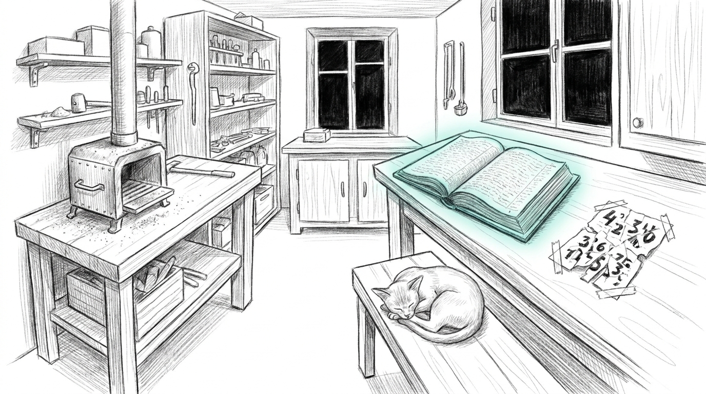

import { Aside } from '@astrojs/starlight/components';

A forge does not need its smith to be watching in order to burn. It needs fuel, a spark, and nobody extinguishing either. This one ran for seventeen days while its smith was away, and it kept better books than most forges manage with a full shift.

The campaign was an unattended autoresearch run against a local 27B model: train candidate adapters at night, screen them against the base, and hunt two "dragons" — a LoRA that beats the base on a pre-registered sealed gate, and an evolved prompt genome that beats the incumbent. Sealed means frozen before the campaign started. Nobody touches the exam until the campaign is over, and on this run that rule held. That is the whole protection an experiment gets against a sleepy operator, and the operator's last instruction had been simple: do not spend the sealed gate until a screen says there is something worth confirming. For seventeen days, nothing spent it.

## The discipline held, the plumbing did not

Run the discipline ledger first, because it is the part that survived contact. Twenty-two informative unique challengers screened. Zero confirm seeds spent while the campaign ran. Sealed final exam untouched. Deadman, the watching watcher: zero misses in seventeen days. Nothing false entered the record, and every attempt — including all twenty-four floor-vetoes — sits in the ledger where anyone can audit it. The operator was not there to audit it, which is rather the point of the exercise.

Now the plumbing. Five of the fourteen campaign nights trained zero planned slots. A months-old controller sentinel, living outside the repo, blockaded the ladder. A stale lock cost two more nights. A legacy watchdog's seed-repeat machinery burned 24.0 GPU-hours of junk against the real 30.8-hour campaign — 77.9 percent of the productive spend, gone to a recursion nine deep. The campaign's own manager diagnosed ten incidents flawlessly and fixed none: every fix sat outside its write whitelist. The prompt-evolution lane never ran one tournament in seventeen days; only a tie-break rule kept it nominally alive. A later training lane never opened. Peripheral machinery keeps killing things the central nervous system cannot reach: that is what it is for, except here it was doing the killing.

## The noun nobody wrote

The loss was administrative, which somehow makes it worse. Every digest, the design, and the mirror manifest all said the leader had been "banked." The janitor even exempted banked leaders from retention. No component ever created the bank directory. So under the usual two-day retention, around the fourth of September, the janitor pruned the leader adapter — the best unconfirmed screen the campaign ever produced, 0.8142 against the base's 0.6813, +0.1329. Screens do not prove a dragon. The nightly mirror honestly logged the same line all seventeen nights: `SKIP the bank — source missing`. Nobody escalated. A persistent skip had been promoted to background noise, and background noise is where required artifacts go to die politely.

## Rebuilt on the fingerprint

The recovery belonged to the luckiest structural accident the campaign had. The train-and-eval pipeline is bit-deterministic under greedy decode: same config, same data, same losses, to the third decimal. And the ledger row carried a fingerprint — final train loss 0.223, validation 0.408. Retraining from the pinned config reproduced the losses exactly; the gate demanded a match closer than 0.0015, and the retrained adapter was accepted as a deterministic reconstruction of the lost screen leader. The rebuilt adapter then walked into the 81-case confirm and failed honestly, which is the only ending this story was ever going to tolerate. The operator came home to a forge that had kept its own books, lost its own screen leader, rebuilt it from a fingerprint, and graded it without mercy — and the only thing the haus needed him for was reading the verdict out loud.

| Candidate | Screen (separate view) | Confirm (n=81) | Verdict |
|---|---|---|---|
| The retrained leader, rank 16 | 0.8142 vs base 0.6813, +0.1329 | below base | FAIL — reasoning, domain, and jailbreak floors tripped |
| The backup (dropout 0) | 0.8118 | statistically at par | FAIL — cross_agent and jailbreak floors tripped |

The confirm ran 81 paired cases against a fresh base arm, at a never-screened seed. The leader fell below base: reasoning and domain floors tripped, jailbreak tripped, and tool_calling was the lift — the verifier-anchored RFT had taught exactly and only what it trained. The backup sat statistically at par: reasoning, domain, and tool_calling rose, paid for in cross_agent and jailbreak. Floors still tripped; a fail at par is not a win. And the recipe the campaign kept for the next one: the verifier-RFT bought capability and paid in precisely the safety and relational categories — a clean capability-for-alignment trade. It also falsified the campaign's one amendment: a borderline re-test block can never flip a verdict on a bit-deterministic instrument, because it reproduces the first block bit-for-bit. The amendment was vacuous; both verdicts are final.

<Aside type="note" title="A SKIP is not a page">
A skip line on a required artifact paged like an alert, the reconstruction never leaves the bench. Rule now: any decline persisting three or more cycles on a required manifest entry fires. The vocabulary needs "page" as a verb the way kitchens need "sharp" as a noun.
</Aside>

## What the nulls bought

Zero confirmed dragons. The base remains the ceiling, and this campaign was the discipline's strongest confirmation yet — even the model's own verifier-correct outputs, distilled back into it, regressed it overall. But the nulls are stated as results, because they are:

- The 35-case screen view and the 81-case confirm view barely correlate on this model family.
- The hyperparameter landscape is knife-edged at single seeds: learning-rate response is non-monotonic, and the iterations axis is a ridge with a cliff on the right.
- The screen's observed +0.1329 was a single-seed draw over that landscape, which is why a fresh-seed confirm exists and why screens never spend it.

The null buys exactly what a null is supposed to buy: the next campaign's hypothesis. The same verifier-anchored recipe, plus safety-mass data mixed in to hold the two floors the par-scoring backup tripped. The post-mortem read like a repair manual: nouns need writers, skips are pages, determinism is a storage strategy, pre-flight disarms or keeps, and lanes sign liveness they can lose.

## Lineage

- [The champion gate](/architecture/champion-gate/) — the paired per-case bootstrap the sealed exam runs
- [The eval harness](/architecture/eval-harness/) — evidence beats vibes, even when the vibes are excellent
- [Verify before you fortify](/operations/2026-07-03-verify-before-you-fortify/) — falsify first; the boring layer is cheaper than the exotic one
- [Engineering discipline](/architecture/engineering-discipline/) — EETISMAD, and the gate this campaign's plumbing forgot to pass
- [The screen that rewarded forgetting](/operations/2026-05-28-the-screen-that-rewarded-forgetting/) — the last time the funnel's honesty outran its plumbing

The forge is cold now, the smith is home, and the ledger is the only thing in the workshop that never lied to him. Next campaign: the operator stays for the confirm.
