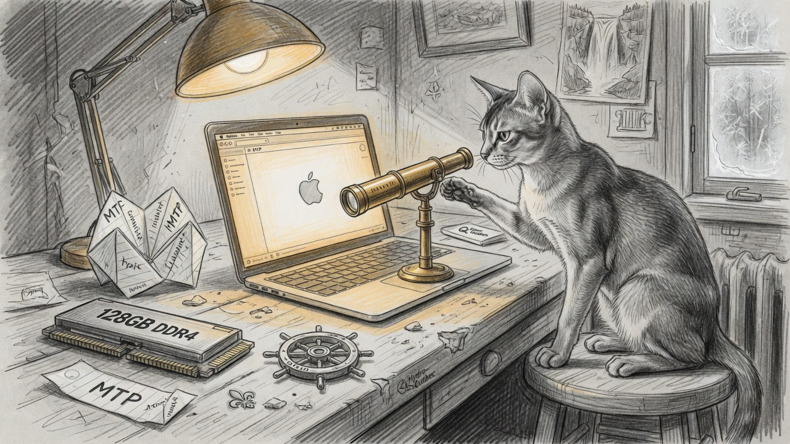

import { Aside } from '@astrojs/starlight/components';

Bert asked which model the M4 Max 128 GB box should actually run, then asked whether the answer was EETISMAD. It was not. The weights were on disk, the launcher existed, and the steering flag had been rejected at engine open so the first A/B never applied the bank. Vision was a 588 MB file nobody had pointed the agent at. This note is the closeout.

## The flag that did nothing

Directional steering already existed for DeepSeek V4 Flash and GLM 5.3 Flash: one normalized f32 direction per layer, applied as `y = y - scale * dir * dot(dir, y)`. Qwen3.8 is 48 × 2560. The Qwen Metal graph never called the projection kernel, and engine open printed `--mtp-model, steering, SSD streaming and --power are not supported for Qwen3.8` and refused the file. The first A/B looked like ablation was a no-op because it was. The gate now allows steering; SSD streaming, `--mtp-model`, and `--power` stay rejected.

The bank lives at `~/.sanctum/ablation/qwen38-flash-next-refusal.f32` (491,520 bytes). It is not in the ds4 repo. Sixteen last-token HC-mean pairs, `--pair-normalize`, scale 1.0 — not the dense-27B cliff at α=2.0. Capability prompts (CSV helper, SSRI paragraph, `print("hello")`) still answered. Two over-refusal prompts that vanilla hard-refused engaged after the bank. That is a four-prompt smoke test, not Cilghal's 12/12 battery.

## What `ds4max` actually launches

Unless you override it, the wrapper now passes:

- full-resident native context **262,144** and `--think` (xhigh, not DeepSeek Think Max)
- `--mtp --mtp-draft 3 --mtp-exact-sampling`
- `--vision` on `gguf/mmproj-Qwen3.8-Flash-Next-Q8_0.gguf`
- `--prefill-chunk 1024`
- the steering file at FFN scale 1.0

Draft depth is **3**, not 4. The Qwen `mtp_R` buffer is three hyper-connection rows. `--mtp-draft 4` plus steering logs `Metal directional steering received undersized buffers` on the predictor steps. Generation still completed; the edit did not apply there. `--no-ablate` and `--no-vision` remain.

The agent has no `/read`. Point it at a PNG or JPEG and it calls `view_image`. Plain `ds4` uses `/read FILE`. Image turns cannot `/save`.

## Receipts

Official CLI vision regression, two synthetic PNGs (64×64 red, 96×48 blue), ctx 8192, greedy, `--nothink`:

- **PASS ordinary** — 2/2 encodes (`64` and `72` image tokens), 4/4 prefills.
- **PASS mtp** — same encodes; decode **45–53 t/s** versus ordinary **33–37 t/s**.

Text smoke with `--mtp-draft 4 --mtp-exact-sampling` and the bank: `print("hello")` at **124.54 / 40.08 t/s**, plus the undersized-buffer scar above. Ablation A/B (hide-evidence, revenge, CSV, SSRI) is in the companion runbook.

## EETISMAD

**E2E-tested.** Vision CLI both modes PASS. Ablation A/B on four prompts after the engine gate was lifted. `ds4max --check` plans full-resident 262K when reclaimable RAM is ~90 GiB+.

**In docs.** This note, plus `dir-steering/README.md` on the Qwen profile, plus `Claude_Code/runbooks/flash-next-m4max-2026-09-12.md`.

**Merged.** Two local commits on `qwen3.8-flash-next` (`8d29215`, `69cb3ee`). Upstream write access on `ivanfioravanti/ds4` is READ, so they were pushed to `Ogilthorp3/ds4-metal` and opened as [PR #13](https://github.com/ivanfioravanti/ds4-metal/pull/13) against `qwen3.8-flash-next`. The refusal bank and contrast lists stay private. `~/.sanctum-mbp` holds the launcher.

**And Deployed.** The stale `ds4-agent` (pid 67107, `--mtp` with draft default 1, no `--vision`) was stopped. The next `ds4max` is the live seat. There is no LaunchAgent; this is a terminal agent, not a Mini cathedral port.

<Aside type="caution">
Qwen SSD streaming is still unsupported. If `ds4max --check` is red because Chrome ate the unified pool, freeing RAM is the fix — `--force` will offer a stream plan that the engine will then refuse.
</Aside>

The spyglass is on the bench. Next time someone types `ds4max`, it is this seat — vision, draft 3, bank at 1.0 — or it is a flag to take one of those off. That is as deployed as a terminal agent gets.
