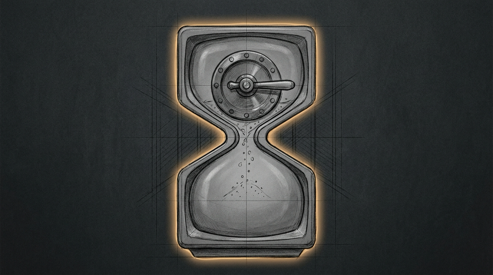

import { Aside } from '@astrojs/starlight/components';



Bert asked what time the Den Room Apple TV's curfew kicked in. Two fields answered him at once — 21:00 in one, 23:00 in the other. Neither was the 22:00 he actually wanted for a school night.

## Two clocks, one screen

`devices.yaml` carries a precedence stack for every curfewed screen: `study_mode` beats `holiday`, which beats `weekend`, which beats `weekday`. Den Room's `study_mode` block was still `enabled: true` from an end-of-spring study crunch, `until: '2026-06-25'`. Three months gone. That should have made the block inert, and it did — technically. An expired override doesn't announce itself, though. It just loses, silently, to whatever sits underneath it. Nobody had checked what that was.

What sat underneath was `weekday: { curfew: '23:00' }` — an hour later than the family's actual school-night line. The Playroom's two screens already held 22:00. One screen had drifted an hour out of step with its own siblings, and the only field anyone read when they asked "what time" was the stale one on top, not the live one actually governing that night.

The fix was one field, `23:00` to `22:00`, in the file the `devices.yaml` symlink points at. Force Flow doesn't watch that file. It loads it once, at process start, into memory, and never again — editing it live and hoping is a bad habit, so the config carries its own reload endpoint instead of a restart mid-evening (the rest of that precedence stack is in [Screen Time Enforcement](/operations/screen-time-enforcement/)):

```bash
curl -s -X POST http://127.0.0.1:4077/screen/reload
# {"status": "reloaded", "family": 4, "shared": 0, "screens": 15}
curl -s http://127.0.0.1:4077/screen/status | jq '.screens[] | select(.name=="Den Room Apple TV")'
# "curfew": "22:00", "schedule_type": "weekday", "curfew_active": true
```

That second line is the part worth keeping: the number that stuck, read back from the running process. Not the number written to disk a moment earlier.

<Aside type="tip" title="Reload, don't restart">
`/screen/reload` calls the same config loader the enforcement loop runs once at boot. A `devices.yaml` edit takes effect the moment you hit that endpoint — no `launchctl kickstart`, no dropped curfew mid-evening while the daemon comes back up.
</Aside>

## The MAC that wasn't Albert's phone

Two screens over, the Basement Apple TV was running a softer curfew than everything else in the haus: `mode: services`, a DNS block against a named list of streaming domains, instead of `mode: pause`, the full disconnect every other screen gets. A note next to its MAC explained why, written back in August: that address might also belong to Albert's phone, and cutting the television's network could mean cutting his along with it.

That note was exactly the kind of claim this haus is supposed to distrust — a plausible story sitting next to the evidence, unread. The other half of it lived four lines up in the same file: Albert's actual phone MAC, pinned in early August after a rotating address had briefly left his real phone uncurfewed. A different address. Not a shared one. The worry the August note carried had already been settled the week it was written, and nobody had gone back to delete the sentence once the question closed. It sat there for a month, quietly keeping a screen on a weaker leash than it needed.

Reading that field before touching the one beside it took under a minute. The television moved to `mode: pause`, reloaded the same way as Den Room, verified the same way: a status read against the running process, not an edit taken on faith. Four screens now share one curfew mechanism. Only the note that used to excuse the difference is gone — the same instinct behind [the last screen that slipped a curfew nobody could see failing](/operations/2026-08-04-quest-that-wore-unknown/): check the log, not the story sitting next to it.

## The buffer outlasts the block

`mode: pause` is not a soft rule with an escape hatch. The bridge that executes it builds a block that, in its own comment, drops all packets, including existing connections — not new connections only, which is the weaker and more common shape a firewall rule takes. There is no stricter setting left to reach for. Every curfewed screen in the haus already sits at the network's ceiling.

None of that touches what a screen pulled down before the rule landed, though. A streaming app keeps a short runway of video in memory ahead of what's actually on screen. Once those frames are local, a router a hundred milliseconds away can't reach in and unwrite them. Apple doesn't publish a number for how deep that runway runs on tvOS, and it isn't fixed even within one app — it depends on how fast the connection was in the seconds before the cutoff, and how far ahead that particular app likes to fetch. Some apps buffer aggressively enough that seeking feels instant; that's a longer runway to burn through once the network stops. Most nights, on most apps, it's a handful of seconds. No more.

Two curfews agree with each other now, and the screen that used to run on a softer leash runs on the same one as the rest of the haus. What's left standing after that isn't a gap in the config. It's a few seconds of video that had already arrived before the block did, and no YAML file was ever going to promise that away.
