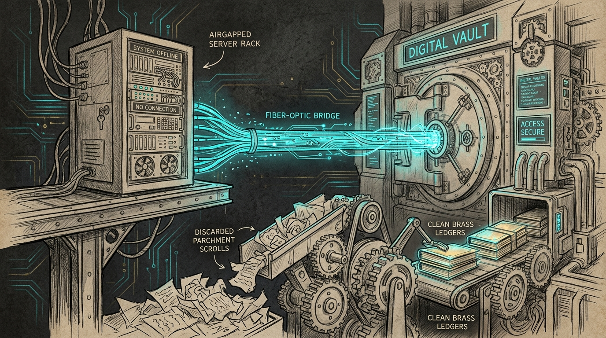

import { Aside } from '@astrojs/starlight/components';



An airgap is only as reliable as the bridge that carries its history. When the morning alerts fired across the haus, Neo flagged a warning from Force Flow: `VM has 1237 uncommitted changes; not fast-forwarding by 1 commits. Operator: commit/stash and rerun.` The airgapped Ubuntu VM (`sanctum-vm`), holding the council agents and offline tools, had halted synchronization. Tommy stood watch as we traced how over a thousand ephemeral sandbox artifacts and a live SQLite database had silently become trapped in git tracking, permanently wedging the daily synchronization loop.

## The airgap bridge architecture

Because `sanctum-vm` operates on an isolated host-only network (`10.10.10.10`) with zero direct internet egress, it cannot reach GitHub over HTTPS or SSH. Instead, synchronization is bridged daily by `~/.sanctum/scripts/vm-sync.sh`:

1. **Pull (Step 1)**: The Mac Mini fetches `origin/main` from GitHub in the host repository, packages it as a git bundle, SCPs it across the vmnet bridge, and updates the VM's `refs/remotes/origin/main`.
2. **Push (Step 2)**: The VM bundles its local `main` branch, sends it to the Mac, and the Mac merges and pushes to GitHub.
3. **Pull (Step 3)**: The newly created merge commit is pulled back to the VM's `origin/main`.
4. **Fast-Forward (Step 4)**: The VM executes `git merge --ff-only origin/main` to advance local `main` to `origin/main`.

## The 1,237-file blockage

Step 4 contained a defensive check:

```bash
DIRTY=$(ssh "$VM_SSH" 'cd ~/.openclaw && git status --porcelain | wc -l' 2>/dev/null | tr -d ' ')
BEHIND=$(ssh "$VM_SSH" 'cd ~/.openclaw && git rev-list --count HEAD..@{u} 2>/dev/null' 2>/dev/null || echo "0")

if [[ "$BEHIND" == "0" ]]; then
  log "  VM already at origin/main; no fast-forward needed."
elif [[ "$DIRTY" != "0" ]]; then
  log "  VM has $DIRTY dirty file(s); skipping fast-forward to avoid conflicts."
  _alert "VM has $DIRTY uncommitted changes; not fast-forwarding by $BEHIND commits. Operator: commit/stash and rerun."
...
```

When commit `af74c74b` landed on GitHub (retiring obsolete Home Assistant configurations), the VM was 1 commit behind. But the check aborted immediately: `DIRTY` was 1,237.

Inspecting `git status --porcelain` revealed the root cause:
- **1,042 files in `sandboxes/`**: Months prior, an automated commit (`96c7f60`) ran a sweep that accidentally tracked `sandboxes/`. As OpenClaw agents dynamically spawned, modified, and cleaned up ephemeral execution sandboxes, 933 files were deleted on disk while remaining tracked in the git index, and 109 were modified.
- **`state/openclaw.sqlite*`**: The active 40MB database and its write-ahead log (`wal`/`shm`) were committed. Every database write by the running gateway instantly dirtied the tree.
- **Workspace attestations & container metadata**: Ephemeral runtime stamps in `workspace-attestations/` and `sandbox/containers/` were deleted on disk but tracked in git.

Because the git index tracked these ephemeral paths, `DIRTY` could never return to zero. The daily sync was indefinitely deadlocked.

## The permanent remediation

We resolved the deadlock across both sides of the bridge:

1. **Purged Ephemeral Paths from Index**:
   Ran `git rm -r --cached` on `sandboxes/`, `workspace-attestations/`, `sandbox/containers/`, `devices/pending.json`, and `state/openclaw.sqlite*` across both the host repo and `~/.openclaw` without altering the live database or disk state.
2. **Comprehensive `.gitignore` Hardening**:
   Updated `.gitignore` in the repository to permanently ignore:
   - `sandboxes/` and `sandboxes-*/`
   - `sandbox/` and `workspace-attestations/`
   - `*.sqlite*` across the repository (safeguarding `backup/**`)
   - `state/resilience-test.*` daily markers, `session-sqlite-*`, and `tmp/`
3. **Committed Legitimate VM Changes**:
   Staged and committed all genuine configuration, prompt doctrine, and documentation improvements from the VM:
   - Gateway upgraded to OpenClaw `2026.9.4` and Node paths aligned.
   - Spoken counsel formatting directives incorporated into agent identities (`IDENTITY.md`, `HOUSE-BIBLE.md`).
   - Mundi's deal packs and Mothma's roster additions.
4. **Hardened `vm-sync.sh` Pipeline**:
   - Updated Step 2 to pass `--commit "auto-sync $(date +%Y-%m-%d)"` to `vm-push.sh`, ensuring legitimate operator modifications on the VM are continuously tracked and shipped to GitHub.
   - Refined the dirty evaluation in Step 4 to use `git status --porcelain --untracked-files=no`, ensuring untracked scratch files never block clean fast-forwards.

Following the repair, `vm-sync.sh` executed cleanly across all four stages. Both the Mac repository and the VM clone now stand at commit `c027e89` with clean working trees: `ahead=0 behind=0`. The airgap bridge flows freely once more.

<Aside type="tip" title="Durability Invariant for Airgapped Repositories">
Never allow dynamic runtime databases or ephemeral sandbox directories into a git tracking envelope. When `.gitignore` lacks wildcard coverage for active databases (`*.sqlite*`), a single indiscriminate `git add -A` permanently binds volatile process memory to version control, breaking automated fast-forwarding.
</Aside>
