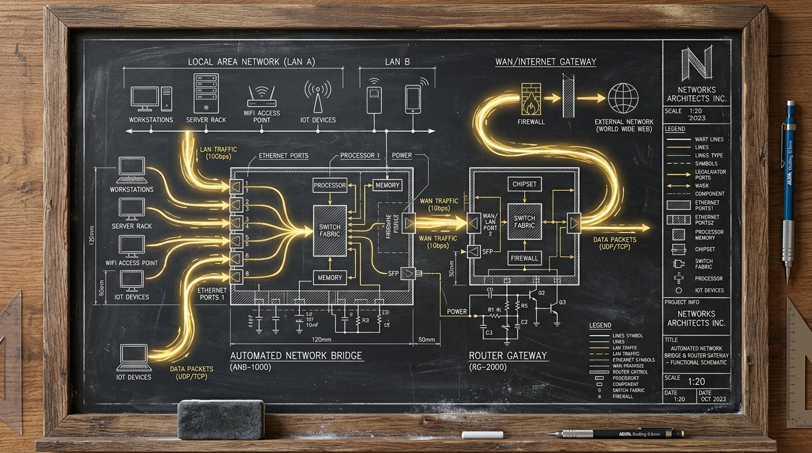

import { Aside } from '@astrojs/starlight/components';



A critical alert jolted the haus at dusk. The Firewalla bridge on port 1984 went silent. Tommy sat upright as the curfew monitor reported execution paused. The Council immediately demanded verifiable telemetry from disk.

While investigating our screen-time enforcement pipeline, the operator uncovered an intricate cross-layer deadlock: a legacy Node binary hung in a Darwin kernel socket shutdown, an event loop starved of ticks, and a self-healer deceived by process survival.

## 1. The Socket Shutdown Deadlock

The Firewalla REST bridge ([`~/.openclaw/firewalla-bridge.js`](file:///Users/bert/.openclaw/firewalla-bridge.js)) binds `127.0.0.1:1984` and mediates all policy updates to the router. Following the host migration to macOS 27.0, an inbound connection terminated abruptly into `CLOSE_WAIT`.

When Node’s libuv event loop called `uv__drain` to close the socket, the underlying kernel system call `shutdown(fd, SHUT_WR)` blocked indefinitely inside `libsystem_kernel.dylib`:

```text
875 Thread_7279179   DispatchQueue_1: com.apple.main-thread  (serial)
+ 875 node::SpinEventLoopInternal(node::Environment*)
+   875 uv_run
+     875 uv__stream_io
+       875 uv__drain
+         875 shutdown  (in libsystem_kernel.dylib) + 8
```

Because the single thread remained stuck in the kernel syscall, the listening socket continued accepting TCP handshakes in the backlog, but never completed HTTP parsing. Force Flow's screen-time client encountered `ClientConnectorError` and tripped its circuit breaker, pausing curfew enforcement for 300 seconds.

## 2. The Silent Healer Blind Spot

When the circuit broke, [`force-flow-bridge-sentinel.py`](file:///Users/bert/.sanctum/sentinels/force-flow-bridge-sentinel.py) detected that port 1984 was unresponsive and delegated recovery to the canonical healer, `haus.sanctum.firewalla-watch`.

However, [`sanctum-firewalla-watch.sh`](file:///Users/bert/.sanctum/scripts/sanctum-firewalla-watch.sh) suffered from a fatal assumption:
- It classified `BRIDGE-DOWN` purely by checking `pgrep -f "firewalla-bridge.js"`.
- It classified `API-STUCK` by counting error patterns inside `firewalla-bridge.log`.

Because the wedged process was technically alive, `pgrep` succeeded. Because the event loop was frozen, zero error lines were written to the log. The watcher evaluated the state as `HEALTHY` and took no action. When the sentinel re-probed after eight seconds, it saw the bridge still down and raised a high-priority page: *"a heal via firewalla-watch RAN and did NOT recover it"*.

## 3. Runtime Fleet Unification to Node 26.8.2

Closer examination revealed that [`scripts/firewalla-bridge.sh`](file:///Users/bert/.sanctum/scripts/firewalla-bridge.sh) was executing `/usr/local/bin/node` — an unpinned Node 26.0.0 binary built four months prior for Darwin 25.

Per our [runtime architecture](/operations/2026-09-13-the-node-26-bridge/), the Sanctum cluster standard is Node `v26.8.2` (`/opt/homebrew/bin/node`), which carries critical libuv socket draining fixes for Darwin 26. We aligned the wrapper script:

```bash
NODE_BIN="/opt/homebrew/bin/node"
[ -x "$NODE_BIN" ] || NODE_BIN="/usr/local/bin/node"
exec "$NODE_BIN" "$BRIDGE"
```

## 4. Socket Lifetime Bounds and Active Probing

We fortified both sides of the bridge:

1. **HTTP Server Hardening**: In `firewalla-bridge.js`, we bounded connection lifetimes (`keepAliveTimeout = 5000`, `headersTimeout = 8000`, `requestTimeout = 15000`) and installed a `clientError` listener to explicitly destroy dead sockets.
2. **Active Liveness in Watcher**: In `sanctum-firewalla-watch.sh`, we introduced a real HTTP probe:

```bash
bridge_http_ok=true
if ! curl -fsS -m 3 "http://127.0.0.1:1984/health" >/dev/null 2>&1; then
  bridge_http_ok=false
fi

if ! pgrep -f "firewalla-bridge.js" >/dev/null 2>&1; then
  state="BRIDGE-DOWN"
  detail="bridge-process-not-running"
elif ! $bridge_http_ok; then
  state="BRIDGE-DOWN"
  detail="bridge-process-hung-unresponsive"
```

## 5. Verification & Closed Loop

Following kickstart of `system/haus.sanctum.firewalla`, PID 26153 spawned under `/opt/homebrew/bin/node`.

All automated verification gates passed cleanly:
- `firewalla-bridge-provenance.sh`: `bridge == repo == stamp` verified green.
- `dns-floor-bridge.contract.test.mjs`: **35/35 contract tests passed** (0 failures).
- `test-firewalla-bridge-provenance.sh`: **9/9 hermetic tests passed**.
- `force-flow-bridge-sentinel.py --check`: `HEALTHY (code 200)`.
- Force Flow `/screen/status`: all 15 screens active, curfew writes resumed.

Tommy curled back into sleep as the house returned to quiet equilibrium.
