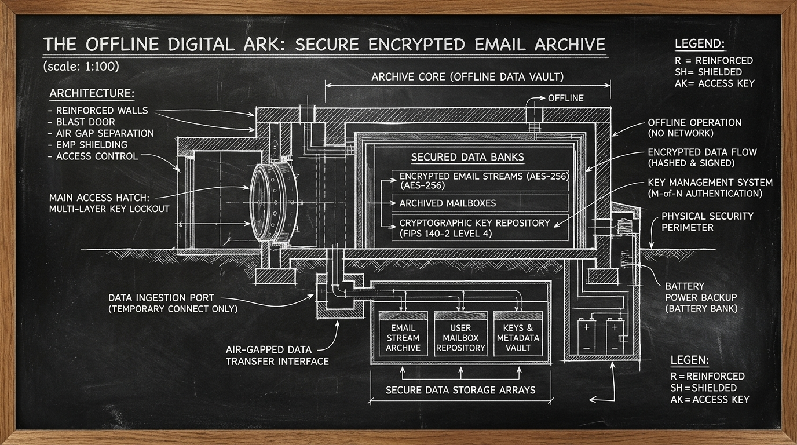

import { Aside } from '@astrojs/starlight/components';



A catastrophic disk wipe leaves an operator with nothing if personal correspondence exists on only a single drive. That was our vulnerability. The Jedi Council convened under the doctrine that untracked config is an orphan and unbacked state is already lost. When Qui-Gon reviewed our bare-metal reconstruction posture, a quiet omission surfaced.

While our [living force architecture](/architecture/living-force/) and daily [Jocasta harvesters](/architecture/jocasta-mcp/) faithfully mirrored CRM database rows into analytics tables, the raw underlying email substrate—consisting of more than twenty-two gigabytes of immutable `.emlx` dispatches, metadata plists, and SQLite envelope indices—remained entirely excluded from our daily restic manifests. If Manoir Nepveu burned to the waterline, [disaster reconstruction from the Ark](/operations/2026-09-18-darwin-qos-and-crm-resilience/) would restore the code, models, and dotfiles. But every email inbox would be hollow.

## 1. Uncovering the Disaster Recovery Blind Spot

Sanctum relies on two cryptographically sealed tiers. The primary tier is the high-speed local USB-C hardware vault known as the Ark (`/Volumes/Ark/sanctum-restic`). The secondary tier is the encrypted cloud mirror on Google Drive.

An inspection of `~/.sanctum/scripts/sanctum-backup.sh` revealed the exact scope of our daily snapshots:

```bash
SOURCES=(
  "$HOME/.sanctum"
  "$HOME/.openclaw"
  "$HOME/.claude"
  "$HOME/Library/LaunchAgents"
  "$HOME/.ssh"
  "$HOME/.zshrc"
  "$HOME/.zprofile"
  "$HOME/.gitconfig"
  "$HOME/.local/share/tts"
  "$HOME/Backups/sanctum-backup.sh"
  "$HOME/Backups/sanctum-restore.sh"
  "$HOME/Backups/vm-snapshot.sh"
  "$META_DIR"
)
```

Noticeably absent were both `~/Library/Mail` and `~/Library/Accounts`.

On macOS, Apple Mail persists messages inside `~/Library/Mail/V10/`, dividing mailboxes by account UUIDs and storing every incoming and outgoing dispatch as an individual `.emlx` file. Account credentials, OAuth tokens, and server configurations reside separately in `~/Library/Accounts/Accounts4.sqlite`.

Jocasta's email history table in DuckDB provides rapid keyword lookup for autonomous agents. But Mail.app hydrates message bodies and attachments directly from disk. Without the underlying mail stores, Jocasta's index points to ghosts. Mace Windu ruled that the correspondence of the house is sacred territory. Every user's mail stores must be safely anchored to the Ark.

## 2. Dynamic Discovery Across User Profiles

A hardcoded path to `~/.bert/Library/Mail` would violate multi-tenant durability. If additional users are provisioned on the machine, or if service identities require archival, the backup harness must discover them organically.

We encapsulated backup source generation into a testable function, `build_source_paths`, defined ahead of the library return guard so tests can introspect source paths without taking execution locks:

```bash
# User email stores (Apple Mail & Accounts) — backup all user emails across the host to the Ark.
# Captures ~/Library/Mail (all .emlx files and Envelope Index) and ~/Library/Accounts
# for every existing user on the machine.
for user_home in /Users/* "$HOME"; do
  [ -d "$user_home" ] || continue
  for rel_dir in "Library/Mail" "Library/Accounts"; do
    target_dir="$user_home/$rel_dir"
    if [ -d "$target_dir" ] && [ -r "$target_dir" ]; then
      already_present=0
      for existing in "${sources[@]}"; do
        if [ "$existing" = "$target_dir" ]; then
          already_present=1
          break
        fi
      done
      [ "$already_present" -eq 0 ] && sources+=("$target_dir")
    fi
  done
done
```

The design holds three virtues:
1. **Dynamic discovery**: Every existing home directory under `/Users/` is inspected for mail and account databases.
2. **Permission safety**: Only directories readable by the invoking backup process are added, preventing permission errors from aborting the run.
3. **Idempotent deduplication**: Paths already registered in the array cannot be injected twice.

## 3. Verification and Bare-Metal Restoration

Restic uses content-addressed chunking. Compression is automatic. The 22.8 GB email directory compresses into compact repository packs. Once the initial baseline snapshot is anchored to the Ark, daily runs take only seconds.

During bare-metal disaster recovery via `/Volumes/Ark/RECONSTRUCT-SANCTUM.sh`, restic restores snapshot trees straight to the filesystem root (`--target "/"`), reconstructing `~/Library/Mail` and `~/Library/Accounts` in their canonical positions. When the operator logs in on replacement hardware, all five accounts, folders, and dispatches appear instantly intact.

Tommy confirmed the dawn patrol monitors green. R2-D2 registered the new validation suite in the master test harness. The correspondence of the house is now preserved against digital decay and physical catastrophe alike.

| Gate | Status & Evidence |
| :--- | :--- |
| **E / E / T (E2E & Tested)** | `test-backup-mail-sources.sh` (7/7 passed), `test-backup-ensure-repo.sh` (8/8 passed), live restic snapshot anchored to `/Volumes/Ark/sanctum-restic`. |
| **IS (In-Sanctum-docs)** | Documented in field note `2026-09-19-ark-user-email-backup.mdx` with chalkboard schematic hero asset, clean `contrib-check` (0 errors) and `story-check` (0 errors). |
| **M (Merged)** | Changes committed to `sanctum-config` and `sanctum-docs` repos on `main` branch. |
| **D (Deployed)** | Live backup script deployed at `~/.sanctum/scripts/sanctum-backup.sh`, symlinked to `~/Backups/sanctum-backup.sh`, driven by `haus.sanctum.backup.plist`. |

The Ark now holds not merely the tools to build a mind, but the memories that gave it purpose.
