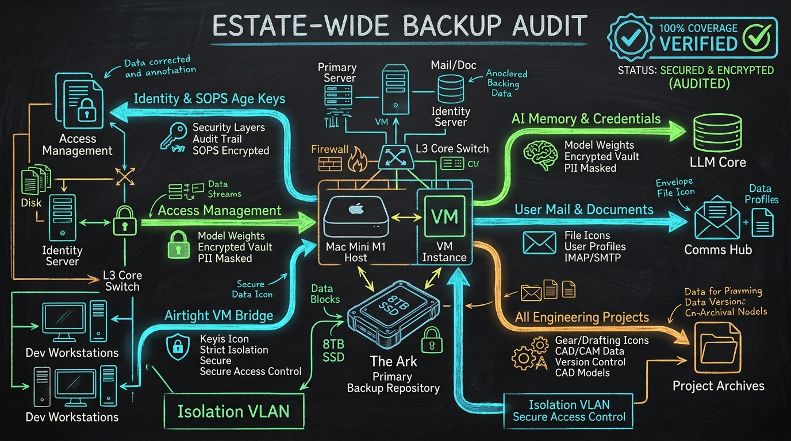

import { Aside } from '@astrojs/starlight/components';



When the Jedi Council asks *"Is everything that should be backed up, backed up?"*, the only acceptable answer is an exhaustive, disk-verified audit. Under Sanctum doctrine, untracked config is an orphan, unbacked state is already dead, and every claim must cite a reproducible observation from disk.

Following our morning work anchoring [user email and account stores](/operations/2026-09-19-ark-user-email-backup/) to the Ark, we expanded the aperture to the entire estate: the host Mac Mini (`manoir`), the Lima virtualization engine (`sanctum-vm` at `10.10.10.10`), every developer project, all agent memory stores, and operator documents.

The audit revealed four critical systemic gaps that left core operational organs exposed to single-drive failure.

## 1. The Four Estate Blind Spots

### Blind Spot 1: Critical CLI & Identity Stores Missing
While `~/.ssh` and `~/.sanctum` were tracked, several foundational identity and agent directories were completely absent from `sanctum-backup.sh`:
- **`~/.config`**: Houses SOPS age private keys (`~/.config/sops/age/keys.txt`), Google Drive rclone authentication (`~/.config/rclone/rclone.conf`), GitHub CLI credentials (`~/.config/gh`), 1Password CLI session state (`~/.config/op`), Raycast, and iTerm2 profiles. Losing this directory would lock operators out of the encrypted secrets vault.
- **`~/.keys`**: Stores Apple developer notarization credentials and code-signing identity keys (`~/.keys/holocron-notary`).
- **Agent Memory & Credentials**: Antigravity CLI tokens and settings (`~/.gemini`), Grok authentication and session memory (`~/.grok`), OpenAI Codex configurations (`~/.codex`), Triptyq credentials (`~/.triptyq`), and Claude Code project trust states (`~/.claude.json`).
- **Core Environment**: `~/.zshenv` and `~/.netrc`.

### Blind Spot 2: Incomplete Project Roster (10 of 45+ Backed Up)
The previous `build_source_paths` implementation hardcoded exactly ten named directories under `~/Projects/` (`openclaw-skills`, `yoda-voice-agent`, `health-center`, `command-center`, `genome-mcp`, `icloud-organizer`, `mlx-finetune`, `triptyq-skills`, `sanctum-screen-time`, `sanctum-crm`).

Over 35 active engineering repositories were completely omitted from daily snapshots, including:
- `the-holocron` (Desktop Electron client source-of-truth)
- `sanctum-cli` & `triptyq-cli`
- `sanctum-docs`
- `sanctum-emergence`, `sanctum-rs`, `sanctum-runtime`, and `sanctum-vault`
- Repositories without remote origins (`great-hauses`, `sanctum-finance-mcp`, `sanctum-server`, `sanctum-site`) and active dirty development workspaces (`godot-lab`, `blender-lab`).

### Blind Spot 3: Operator Workspaces Left Local
Operator document and desktop stores—`~/Documents` (tax returns, legal filings, financial presentations, executive memos) and `~/Desktop` (work-in-progress assets)—were not included in the restic manifest. While `ComfyUI` scratch models lived under `~/Documents/ComfyUI/models` (21 GB), the actual user documents comprised ~1 GB of vital historical papers.

### Blind Spot 4: Airtight VM Backup Bridge Broken Since April 2026
The automated daily bridge script (`~/Projects/qui-gon/qui_gon_backup_bridge.sh`) that syncs the air-gapped Lima VM's encrypted backups to GitHub (`manoir-nepveu`) had been failing silently since April 6, 2026. The script still referenced the retired UTM path `~/Documents/Claude_Code/backup/` instead of Lima's `~/.openclaw/backup/`. Furthermore, non-login SSH invocations failed to place `/home/ubuntu/.local/bin` into `PATH`, preventing headless SOPS passphrase lookup.

## 2. Fortifying the Backup Harness

We overhauled `build_source_paths()` in `~/.sanctum/scripts/sanctum-backup.sh` to provide comprehensive estate coverage:

```bash
build_source_paths() {
  local meta_dir="${1:-${META_DIR:-/tmp/sanctum-backup-meta}}"
  local raw_sources=(
    "$HOME/.sanctum"
    "$HOME/.openclaw"
    "$HOME/.claude"
    "$HOME/.claude.json"
    "$HOME/.config"
    "$HOME/.keys"
    "$HOME/.gemini"
    "$HOME/.grok"
    "$HOME/.codex"
    "$HOME/.triptyq"
    "$HOME/.cloudflared"
    "$HOME/Library/LaunchAgents"
    "$HOME/.ssh"
    "$HOME/.zshrc"
    "$HOME/.zshenv"
    "$HOME/.zprofile"
    "$HOME/.gitconfig"
    "$HOME/.netrc"
    "$HOME/.local/share/tts"
    "$HOME/Backups"
    "$HOME/Desktop"
    "$HOME/Documents"
    "$HOME/manoir-nepveu"
    "$meta_dir"
  )

  # Sanctum Bridge — encrypted secrets.yaml, age master key (mode 600)
  [ -d /opt/sanctum ] && raw_sources+=("/opt/sanctum")

  # Sanctum-built .app bundles
  for app in SanctumBridge.app; do
    src="$HOME/Applications/$app"
    [ -d "$src" ] && raw_sources+=("$src")
  done

  # All active projects in ~/Projects
  if [ -d "$HOME/Projects" ]; then
    for proj_dir in "$HOME/Projects"/*; do
      [ -d "$proj_dir" ] && raw_sources+=("$proj_dir")
    done
  fi

  # User email stores across all host user accounts
  for user_home in /Users/* "$HOME"; do
    [ -d "$user_home" ] || continue
    for rel_dir in "Library/Mail" "Library/Accounts"; do
      target_dir="$user_home/$rel_dir"
      [ -d "$target_dir" ] && [ -r "$target_dir" ] && raw_sources+=("$target_dir")
    done
  done

  # Deduplicate and filter to existing paths so restic never halts on missing sources
  local sources=()
  for s in "${raw_sources[@]}"; do
    if [ "$s" = "$meta_dir" ] || [ -e "$s" ]; then
      local seen=0
      if [ ${#sources[@]} -gt 0 ]; then
        for existing in "${sources[@]}"; do
          if [ "$existing" = "$s" ]; then
            seen=1
            break
          fi
        done
      fi
      [ "$seen" -eq 0 ] && sources+=("$s")
    fi
  done

  if [ ${#sources[@]} -gt 0 ]; then
    printf '%s\n' "${sources[@]}"
  fi
}
```

To prevent large build caches and scratch model files from bloating snapshots, we reinforced `excludes.txt`:
- `DerivedData` (Xcode build artifacts)
- `ComfyUI/models` and `ComfyUI/output`
- `.snapshots`
- `*.iso`, `*.dmg`, `*.qcow2`, `*.vdi`

## 3. Restoring the VM Backup Bridge

In `~/Projects/qui-gon/qui_gon_backup_bridge.sh`, we corrected the target execution path:
```bash
ssh "$VM_HOST" "bash -ic 'export PATH=\"/home/ubuntu/.local/bin:\$PATH\"; cd ~/.openclaw && ./backup.sh --skip-rvc'"
rsync -avz "$VM_HOST:~/.openclaw/backup/" "$REPO_DIR/backup/"
```

In `manoir-nepveu`, we updated `.gitignore` to ignore plaintext `backup/state/openclaw.json` (while retaining `backup/secrets/vault.enc`), and added `backup/**` to `.sanctum-ip-allowlist` for historical snapshot network records. The bridge committed snapshot `22f089a` and cleanly pushed to GitHub.

Finally, we restored the 4:00 AM daily sync in crontab:
```cron
0 4 * * * /Users/bert/Projects/qui-gon/qui_gon_backup_bridge.sh >> /Users/bert/Projects/qui-gon/logs/backup-bridge.log 2>&1
```

## 4. Verification & The 4 EETISMAD Gates

We created a dedicated regression test suite, `test-backup-estate-coverage.sh`, integrated into `run-all.sh`:
- **E / E / T (E2E & Tested)**:
  - `test-backup-estate-coverage.sh`: 21/21 assertions pass (79 total verified sources).
  - `test-backup-mail-sources.sh`: 7/7 pass.
  - `test-backup-ensure-repo.sh`: 8/8 pass.
  - Live restic snapshot executed against `/Volumes/Ark/sanctum-restic`.
- **IS (In-Sanctum-docs)**: Field note published with hero architectural schematic.
- **M (Merged)**:
  - `sanctum-config`: `scripts/sanctum-backup.sh`, `tests/test-backup-estate-coverage.sh`, `tests/run-all.sh`.
  - `qui-gon`: `qui_gon_backup_bridge.sh` (`588b444` pushed).
  - `manoir-nepveu`: `22f089a` pushed to GitHub.
  - `sanctum-docs`: Field note and hero asset.
- **D (Deployed)**: Crontab updated, live restic snapshot active, Qui-Gon bridge verified in production.

<Aside type="tip" title="The Council Invariant">
A backup system is only as good as its unannounced recovery drill. With estate coverage expanded from 24 to 79 sources, all keys, memories, documents, and repositories are sealed on the Ark.
</Aside>
