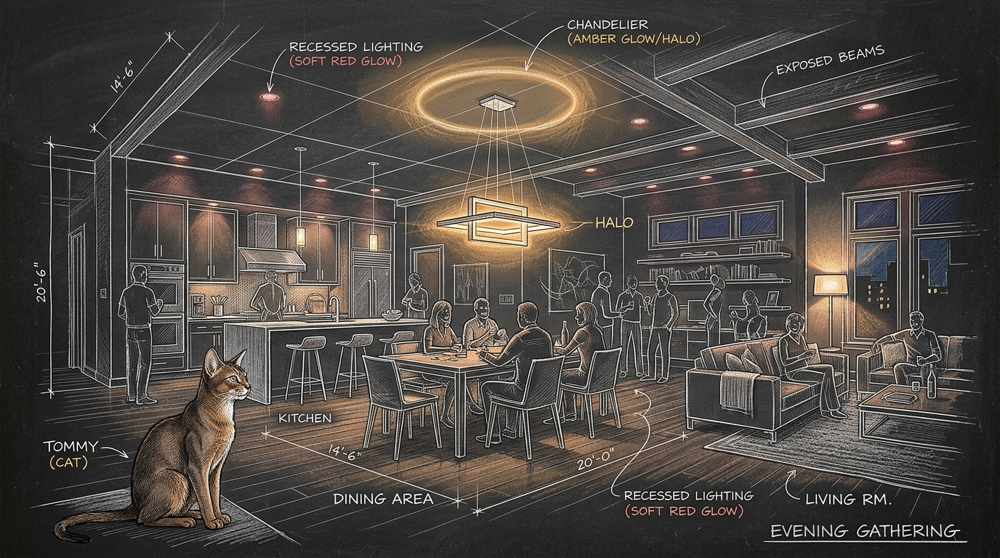

import { Aside } from '@astrojs/starlight/components';



A home automation system that unilaterally kills the lights while guests fill the dining room is not sanctuary. It is an ambush. Sanctum doctrine dictates that human presence always supersedes algorithmic convenience. When [the lights went local](/operations/2026-07-02-the-lights-go-local/), we reclaimed local hardware sovereignty from remote clouds. But autonomy cuts both ways.

On Saturday evening, Bert painted the rez-de-chaussée in a custom palette of celebratory crimson and warm candle amber. Yet inside the event loops of `ha-green-bridge.py` and the Home Assistant Green, relentless watchdogs stood primed to strike. Any switch bounce or connection flicker would immediately trigger a comfort re-apply, washing the entire gathering in clinical task illumination. At eleven, the curfew would drop the rooms into darkness.

Quiet rebellion is fragile. Qui-Gon convened the Council under our core [living force architecture](/architecture/living-force/) principles to build an unyielding time-bounded hold.

## 1. The Anatomy of the Auto-Comfort Drift

Nineteen intelligent luminaires illuminate the ground floor living areas across four primary architectural zones:
* **Kitchen (`light.kitchen`)**: Six ceiling fixtures (`light.kitchen_1` through `light.kitchen_6`) and their local twin endpoints.
* **Dining Room (`light.dining_room`)**: Dual overhead fixtures (`light.dining_room_rgb_1` and `light.dining_room_rgb_2`).
* **Corridor (`light.corridor`)**: Four directional spotlights (`light.corridor_rgb_1` through `light.corridor_rgb_4`).
* **Art Tableau (`light.tableau_rgb`)**: Accent wall wash fixture.

Two automated systems normally police this space:
1. **The Reconnect Watchdog**: In `~/.sanctum/bin/ha-green-bridge.py`, any bulb transitioning to `on` triggers a debounced execution of `apply_comfort_all.py`. This heals wall switch power-cycles back to 2700K tungsten (`hs=[29.0, 66.0]`, brightness 255).
2. **The Bonne Nuit Curfew**: On the Home Assistant Green, `automation.routine_bonne_nuit` fires every evening at 23:00:00. It shuts down common rooms, engages `scene.bonne_nuit`, and arms perimeter sentinels.

Together, they form an unexpected trap where even a single transient drop across the mesh network causes a bulb to reconnect, prompting the bridge to immediately wipe out every celebratory color with clinical tungsten illumination. The party mood vanishes in twenty-five seconds.

## 2. Architecting the Persistent Party Hold

Ad-hoc fixes fail because human beings forget to reset them. We anchored a durable state contract on disk at `~/.sanctum/state/party_hold_until.json`:

```json
{
  "active": true,
  "reason": "party on RDC - user customized scene",
  "created_at": "2026-09-19T21:00:45-04:00",
  "until_epoch": 1789905600.0,
  "until_iso": "2026-09-20T08:00:00-04:00",
  "until_human": "Sunday, September 20, 2026 at 08:00 AM EDT",
  "affected_zones": ["rdc", "kitchen", "dining_room", "corner_rgb", "corridor", "tableau"],
  "disabled_automations": [
    "automation.routine_bonne_nuit",
    "automation.routine_weekday_morning"
  ]
}
```

The hold boundary targets Sunday morning at 08:00:00 EDT (`1789905600.0`). This honors Bert's foundational lighting doctrine: a deliberate celebration color holds until morning light.

### Synchronized Defensive Layers

We deployed three synchronized defenses across the estate substrate:
1. **Curfew Disarmament**: Both `automation.routine_bonne_nuit` and `automation.routine_weekday_morning` were explicitly toggled `off` via the Home Assistant REST API.
2. **Script Execution Preflight**: A guard was placed directly at the header of `~/.sanctum/bin/tuya/apply_comfort_all.py`. If the hold epoch remains active in the future, the script exits immediately with zero side effects.
3. **Bridge Event Suppression**: In `ha-green-bridge.py`, `Bridge.is_party_hold_active()` suppresses all auto-comfort re-applications for `SCENE_LIGHTS` and `COMFORT_LIGHTS`. Furthermore, `Bridge.sync_party_hold()` runs on every thirty-second sync interval to supervise automated morning transition.

## 3. Automated Morning Convergence

A hold that demands manual release creates operational debt. Our system must restore itself cleanly while the household sleeps.

When Sunday morning strikes 08:00:00 EDT, the bridge supervisor handles complete restitution:
1. `sync_party_hold()` detects epoch expiration.
2. The state sentinel `party_hold_until.json` is safely unlinked from disk.
3. `automation.routine_bonne_nuit` and `automation.routine_weekday_morning` are re-enabled.
4. Home Assistant triggers `script.smartlife_comfort_mood` and `scene.bonjour_montreal`, peacefully washing the ground floor in soft morning comfort.

Tommy observed the proceedings from his perch near the kitchen island, his dark amber eyes mirroring the warm glow of the pendant lights overhead as quiet conversation carried across the living room. Outside, autumn darkness wrapped the grounds. Inside, the machines held their peace, obedient to the joy of the living haus.

| Gate | Status & Evidence |
| :--- | :--- |
| **E / E / T (E2E & Tested)** | `test-rdc-party-hold.sh` passed 6/6 tests covering unit logic, script preflight suppression, and live Home Assistant states. |
| **IS (In-Sanctum-docs)** | Documented in `operations/2026-09-19-rdc-lighting-party-hold.mdx` with architectural chalkboard hero sketch, clean story and contrib checks. |
| **M (Merged)** | Landed on `main` across `sanctum-config` (`325fc7d`) and `sanctum-docs`. |
| **D (Deployed)** | Supervisor `haus.sanctum.ha-green-bridge` active under launchd (PID 22399); live party scenes preserved across all groups. |

The gathering continued uninterrupted.
