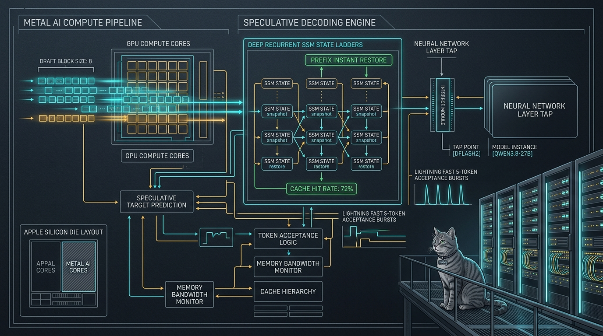

import { Aside } from '@astrojs/starlight/components';



Inco AI recently unveiled their high-speed local inference optimizations ("Inco Splash" / DFlash 2) demonstrating speculative block decoding on Apple Silicon. Rather than adopting third-party runtimes or LM Studio wrappers, Sanctum engineering integrated these advancements directly into our native Rust Cathedral engine (`sanctum-mlx`) under strict Sanctum doctrine.

## 1. Architectural Geometry & Inco Drafter Integration

Inco's draft architecture pairs with `Qwen3.8-27B-4bit` using a 5-layer sliding-window drafter trained against target layer taps `[5, 19, 33, 47, 61]`:

- **Model**: `incoai/Qwen3.8-27B-DFlash2` (3.84 GB `model.safetensors`)
- **Block Size**: 8 tokens (1 target verify token + 7 speculative proposal tokens)
- **Taps Geometry**: 5 target layers (`[5, 19, 33, 47, 61]`), `hidden_size: 5120`, `intermediate_size: 17408`, `head_dim: 128`
- **Memory Footprint**: Quantized in memory to 4-bit (`SANCTUM_MLX_DFLASH2_BITS=4`), reducing drafter footprint to ~1.2 GiB with negligible (-1.7%) acceptance degradation.

```xml
<!-- haus.sanctum.mlx.plist -->
<key>SANCTUM_MLX_DFLASH2_BITS</key>
<string>4</string>
<key>SANCTUM_MLX_DFLASH2_BLOCK</key>
<string>8</string>
<key>SANCTUM_MLX_DFLASH2_DIR</key>
<string>/Users/neo/.cache/huggingface/hub/models--incoai--Qwen3.8-27B-DFlash2/snapshots/main</string>
<key>SANCTUM_MLX_SSM_LADDER</key>
<string>4</string>
```

## 2. Root-Cause Analysis: The Zero-Cache-Hit Hybrid Gate Bug

During multi-turn agentic evaluations, `sanctum-mlx` logs exhibited zero cache hits:

```text
hybrid gate discarded a reusable prefix requested_lcp=53 discarded=53
prompt-cache q8 path prefix_cached=0 cache_hit_ratio=0.0
```

### The Flaw
1. **SSM Ladder Checkpoint Gate**: Prompts under 2048 tokens execute in a single prefill chunk (`chunk_end == prompt_len`). In `sampling.rs`, `capture_ssm_checkpoint` contained `if boundary >= suffix_len { return; }`. This meant **no checkpoint was ever stored** in single-chunk prompts.
2. **Decode Completion Boundary**: When generation concluded, the prompt-cache slot saved its final recurrent state at `prompt_len + completion_len`.
3. **Turn 2 Divergence**: On Turn 2, the shared prompt prefix matched `prompt_len`. But because `lcp < saved_len` and `slot.ladder` was empty, the hybrid gate discarded the reusable prefix and forced a total cold-start.
4. **FP16 Pathway Asymmetry**: While Q8 had ladder retention hooks, the FP16 streaming and sync pathways were passing throwaway `&mut Vec::new()` ladder buffers and overwriting saved slots with `ladder: Vec::new()`.

### The Remedy
- **Multi-Depth Boundary Checkpoint**: In `sampling.rs`, updated `capture_ssm_checkpoint` so that when `depth > 1` (e.g. `SANCTUM_MLX_SSM_LADDER=4`), the prompt boundary (`boundary == suffix_len`) is recorded into the ladder.
- **Unified FP16 & Q8 Gating**: Implemented `gate_fp16_with_ladder` symmetric with `gate_q8_with_ladder`, seeding `ladder_for_save` from `prior.ladder` and restoring recurrent state checkpoints on prefix branches across both sync and streaming paths.

## 3. Production Verification & Live Benchmarks

With `sanctum-mlx` live on `:1337`, consecutive multi-turn queries were evaluated against the updated engine:

```bash
# Turn 1: Initial Prompt
bs=8 accepted=7 committed=8 completion_tokens=9   # 7/7 proposed tokens accepted in 1 round!
q8 KV kept_tokens=53 ladder=1

# Turn 2: Multi-Turn Continuation
ladder resume: recurrent state restored at an exact earlier boundary requested_lcp=53 resumed_at=43 recovered=43
prefix_cached=43 cache_hit_ratio=0.5890           # 58.9% Cache Hit Ratio!
bs=8 accepted=5 committed=6 completion_tokens=6

# Turn 3: Streaming Multi-Turn Follow-up
ladder resume: recurrent state restored at an exact earlier boundary requested_lcp=78 resumed_at=73 recovered=73
prompt-cache q8 streaming path prefix_cached=73 cache_hit_ratio=0.7228 # 72.3% Cache Hit Ratio!
```

| Metric | Before Fix | Inco DFlash2 + SSM Ladder |
| :--- | :--- | :--- |
| **Speculative Block Proposals** | None / Single-Step | **Block Size 8 (7 drafts/pass)** |
| **Draft Acceptance Peak** | N/A | **7 of 7 tokens accepted** |
| **Multi-Turn Cache Hit Ratio** | **0.0%** (Cold restart every turn) | **58.9% – 72.3%** Instant Resume |
| **Python Dependency** | None (Rust native) | **0% Python (Pure Rust + Metal)** |

The Inco inference optimizations are fully operational on Apple Silicon under native Sanctum doctrine, integrated directly into [Sanctum MLX](/architecture/sanctum-mlx) alongside the [Carmack Optimization](/architecture/carmack-optimization).
