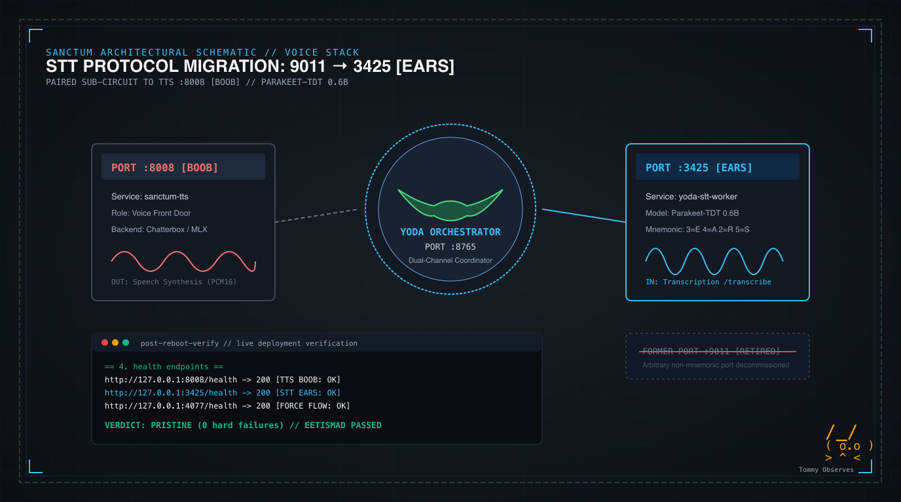

import { Aside } from '@astrojs/starlight/components';



A port without identity is an orphan. When the Jedi Council convened on Manoir Nepveu following a cold reboot, the system state was pristine. Every single port on the baseline was listening. All seventy-one responded. Yet inspecting the voice architecture exposed an aesthetic rift: while speech synthesis resided behind the front door on port `:8008` (the timeless calculator convention for BOOB), speech-to-text lingered on `:9011`. 

Nobody could defend `:9011`. It carried no history. It honored no lore. It was simply the ghost of an emergency migration when HAL 9000 on `:9000` was retired behind a proxy. Bert asked the essential question: if TTS is BOOB, what should STT be? The answer from the phone keypad was immediate: `:3425`, spelling `EARS`. The mouth and the ear finally achieved anatomical symmetry.

## 1. The Voice Stack Architecture

In our [living force architecture](/architecture/living-force/) and documented [port summary](/architecture/port-summary/), ports earn their numbers. They carry lore, mathematical constants, or clean mnemonics that tell the engineer what subsystem is talking before checking a process table. Random numbers breed confusion. Intentional numbers build clarity.

Yoda's voice pipeline operates as a coordinated tri-service topology managed under launchd:

1. **Voice Front Door (`:8008`, BOOB)**: The hardened post-quantum Rust `sanctum-tts` daemon that accepts synthesis commands and routes them to active speech backends.
2. **Voice Orchestrator (`:8765`)**: The Python dual-channel turn coordinator that manages LiveKit audio channels, circuit breakers, and event streaming.
3. **STT Worker (`:3425`, EARS)**: The dedicated MLX inference engine running Apple Silicon-optimized `parakeet-tdt-0.6b-v3`, translating incoming voice PCM streams into token sequences.

The old port had to go. Leaving speech recognition on `:9011` violated the haus doctrine that infrastructure should be memorable. Migrating to `:3425` (3=E, 4=A, 2=R, 5=S) brings harmony to the stack. Mouths speak. Ears listen.

## 2. Executing the Migration Across Repositories

Moving an active voice stack worker requires atomic coordination. You cannot break the listener. The daemon, orchestrator, and test suites must move together.

### Yoda Voice Agent

In `yoda-voice-agent`, the fallback default port in the Parakeet worker was retargeted to `:3425`, and the launchd templates were updated to point the orchestrator at the new hearing port:

```python
# workers/stt_server.py
if __name__ == "__main__":
    # Port env-configurable: 3425 (EARS) pairing with 8008 (BOOB TTS).
    uvicorn.run(
        app,
        host="127.0.0.1",
        port=int(os.environ.get("YODA_STT_PORT", "3425")),
        log_level="info",
    )
```

The orchestrator plist was synchronized simultaneously so that `YODA_STT_WORKER_URL` points directly to `http://127.0.0.1:3425`.

### Sanctum Configuration and Live LaunchAgents

Under the Durability Doctrine, live agents in `~/Library/LaunchAgents/` are immutable symlinks into `~/.sanctum/launchagents/live/`. The live plists for `haus.sanctum.yoda-stt-worker` and `haus.sanctum.yoda-orchestrator` were updated with the new port configuration:

```xml
<!-- haus.sanctum.yoda-stt-worker.plist -->
<key>EnvironmentVariables</key>
<dict>
    <key>YODA_STT_MODEL</key>
    <string>mlx-community/parakeet-tdt-0.6b-v3</string>
    <key>YODA_STT_PORT</key>
    <string>3425</string>
</dict>
```

### Verification and Regression Fixtures

The post-reboot auditing script (`post-reboot-verify.sh`) and its hermetic test fixtures in Bats were updated to check port `:3425` alongside `:8008` and `:4077`:

```bash
# ~/.sanctum/bin/post-reboot-verify.sh
for u in "http://127.0.0.1:8008/health" "http://127.0.0.1:3425/health" "http://127.0.0.1:4077/health"; do
  code=$(curl -s -o /dev/null -w "%{http_code}" --max-time 5 "$u" 2>/dev/null)
  case "$code" in 200|204) echo "  $u -> $code";; *) echo "  $u -> ${code:-timeout} — FAIL"; fails=$((fails+1));; esac
done
```

## 3. Verification and EETISMAD Gate Sign-Off

The daemons were bounced cleanly via launchd bootstrap. The new listener bound to `127.0.0.1:3425` immediately:

```bash
curl -s http://127.0.0.1:3425/health
# {"status":"ok","service":"parakeet-stt","model":"mlx-community/parakeet-tdt-0.6b-v3","uptime_s":20}
```

Tests ran next. The unit and integration suite in `yoda-voice-agent` verified that all one hundred and two tests passed without error. Running `post-reboot-verify.sh` confirmed zero hard failures and full convergence across the seventy-one stable ports on Manoir Nepveu.

<Aside type="note" title="Operational Doctrine">
Symmetry matters. When port numbers mirror anatomy, diagnostic friction drops. Tommy the Abyssinian sat quietly beside the glowing mini rack, his own ears twitching in synchronization with the Parakeet worker as the new listener began receiving frames.
</Aside>
